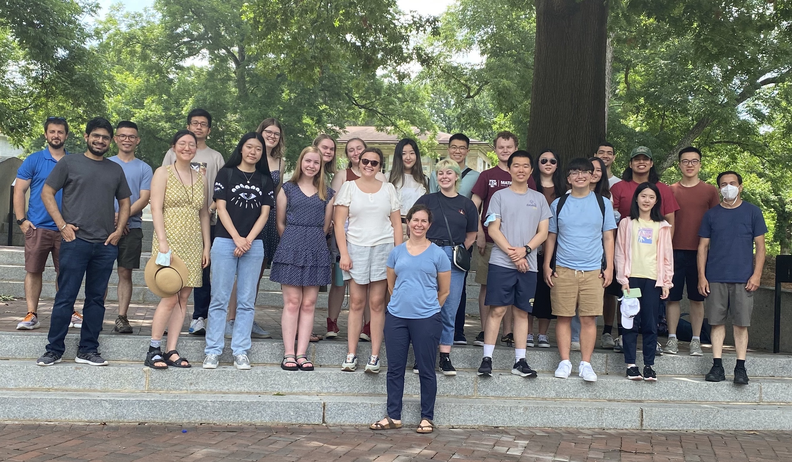

---

title: Emory Welcomes 2022 REU/RET Participants on Campus
date: 2022-06-13
summary: "Today marks the first day of our core REU/RET phase 2022, and we are delighted to welcome our participants from across the country to our beautiful campus. Over the next six weeks, the groups will have several milestones which give opportunities to practice most modes of scientific communication. In addition to working on their research, they will also have many opportunities to learn and network"
authors: [lruthot]

---

Today marks the first day of our core REU/RET phase 2022, and we are delighted to welcome our participants from across the country to our beautiful campus. This year on our site, 22 undergraduate researchers and four teachers will work on eight projects under the theme [*Models meet Data*](../../summer2022). All projects will combine tools from computational mathematics (modeling, differential equations, optimization, linear algebra) with statistical and data science techniques (deep learning, reinforcement learning, data assimilation) to tackle challenging research questions. 

Over the next six weeks, the groups will have several milestones which give opportunities to practice most modes of scientific communication. In their research contracts, the participants will organize their collaboration and develop a timeline for the project. Their midterm presentations give an excellent opportunity to expose synergies and ideas across the teams. The participants will also create a blog post about their work, and there will be a poster session toward the end of the program. Throughout the six weeks, the teams will work on a manuscript that describes their project. 

In addition to working on this packed research schedule, we will have many events to foster learning (e.g., ad-hoc lectures, a weekly seminar), networking (e.g., excursions and other social events organized by the participants), and professional development (e.g., scientific writing workshops, career panels). 

Besides the NSF support, we are also grateful for the support from Emory's [Department of Mathematics](http://math.emory.edu), which provides the top-notch facilities to run this program smoothly and funds to host events such as this morning's breakfast. In addition to one co-working area, a computer pool, and two seminar rooms dedicated to our site, we'll also try out our department's computing facilities and new digital whiteboard.

 
 
 
