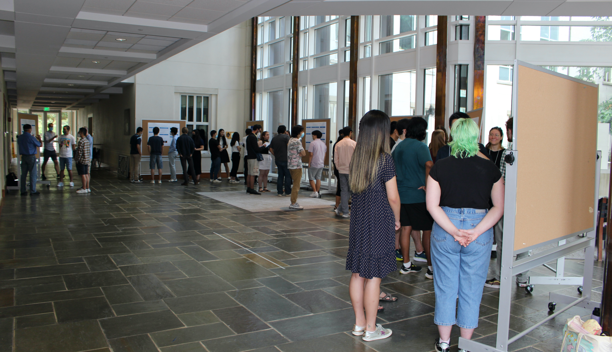
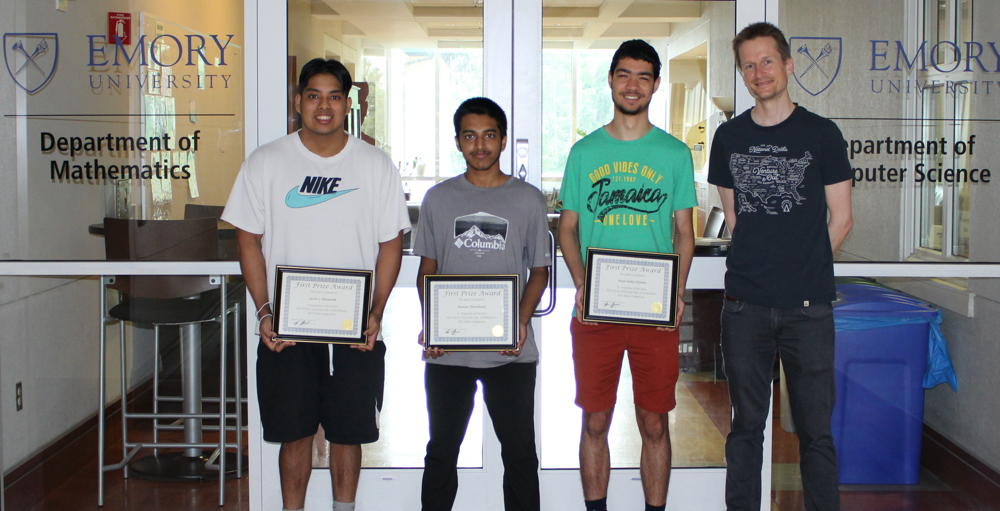
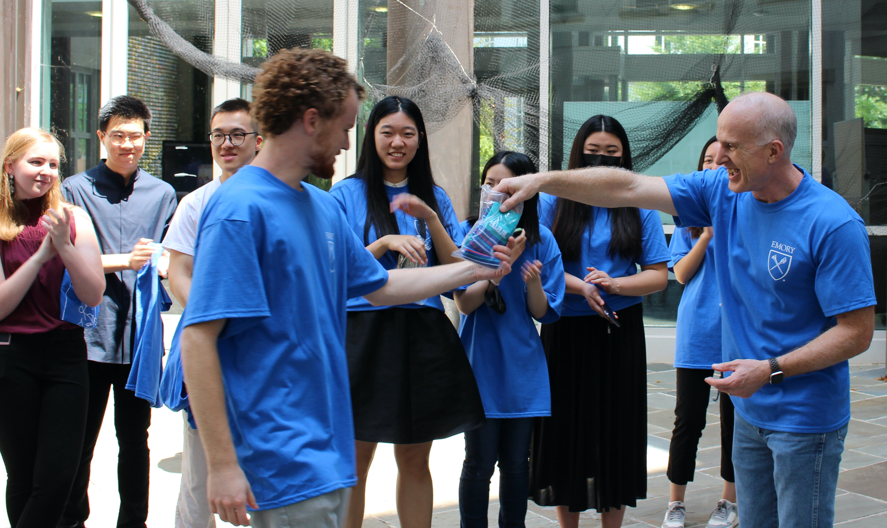

---

title: Participants present their work at the REU/RET Poster Session
date: 2022-06-26
summary: "In their last week on campus, our REU/RET teams presented their work in our annual poster session. The event was held in our beautiful atrium and was a magnet for many students, postdocs, and faculty. More than a dozen judges voted on the posters to determine the winning team."
authors: [lruthot]

---

In their last week on campus, our REU/RET teams presented their work in our annual poster session.
The event was held in our beautiful atrium and was a magnet for many students, postdocs, and faculty from the Departments of Mathematics and Computer Science.

In preparation for the event and to advertise their work, the teams made two-minute Poster Blitz videos. 
Since the videos were full of creativity, we played them during the event using our smart screen. The videos are now hosted at: 

- [Hamiltonian Neural Networks](https://www.youtube.com/watch?v=2hDyfdaM5Es)  
- [Storm Surge modeling](https://www.youtube.com/watch?v=bGeOZ9G6IOc)
- [Mixed Precision Linear Algebra](https://www.dropbox.com/s/139l0u7zi6eloao/mixed-precision.mp4?dl=0)
- [Modeling Neural Firing](https://youtu.be/2uBVgNFRpqI) 
- [Fast Training of Implicit Neural Nets](https://youtu.be/oIwL3E2yULg)
- [Deep Learning for Mental Disorder Analysis](https://youtu.be/DLs1PkO8iJo)  
- [Reinforcement Learning vs Optimal Control](https://youtu.be/i9g6mRNJEHA)

During the event, more than a dozen judges had the difficult task of scoring the quality of the posters, how well the teams presented and explained their work, and the results of the research itself, to determine the winning team.
All teams scored very well on and  with the smallest of margins, the poster on [reinforcement learning vs. optimal control](../projects/2022-rl-vs-oc) won the award.
The team consists of  [Arjun Sethi-Olowin](https://www.linkedin.com/in/arjunso/) (a rising senior at Rice University), [Dewan Chowdhury](https://dewanchowdhury.github.io/) (a rising junior at Rutgers University), and [Jacob Mantooth](https://www.linkedin.com/in/jacob-mantooth-7b262321b) (a rising senior at East Central University). They each received a $50 gift card from a major online retailer.

But no one left empty-handed! Our official REU/RET t-shirts, designed by our outreach committee, arrived just in time. Also, we held a raffle with Emory and SIAM merchandise. Here, Jim Nagy presents one of the main prizes, a pair of SIAM socks, going to Logan Knudsen:

We thank the Department of Mathematics for making the poster session a huge hit and providing the prizes.

 
 
 
