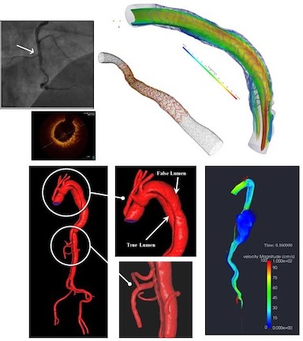
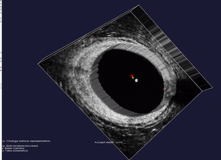
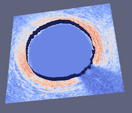
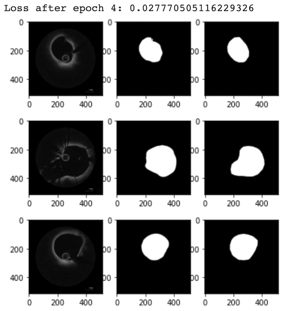
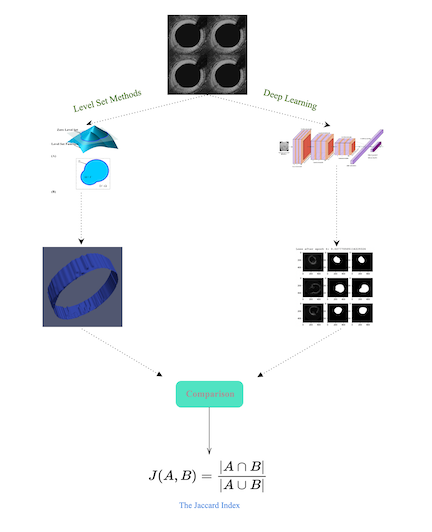
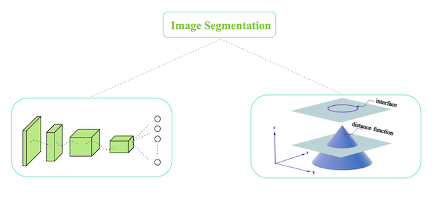

<!--more-->
<!-- --- -->
<!-- # Emory REU Cardiology Project:   -->

<!--Starting new section-->
<!-- --- -->

This post was written by Kai Chang, Allison Dennis, Shannon Lee, Michele Perry, Minxing (Matt) Zhang, and Mohamad Hindawi and published with minor edits. The team was advised by Dr. Alessandro Veneziani.
In addition to this post, the team has also created slides for a [midterm presentation](https://docs.google.com/presentation/d/1__H40Xr_KoQaG3Mfhv9aAjzZYjVIvITDuNCAVpsq1v0/edit?usp=sharing), a [poster blitz video](https://southalabama.zoom.us/rec/play/nMsrAregiBDRSP8QCj2mDVV7halNAvL0_PvuBcyyf20OraB0BAEtdz7schZwF_Afkmc-ODwH8bNWZ2Q.X_Ym7fzfDZKyswHj?startTime=1627247559000), and a [poster](Emory_Poster.pdf).

## Background: Mathematical Modeling from the Heart 
The role of mathematical modeling in clinics is particularly evident in cardiology, as computational mechanics for many historical reasons is a mature field of applied mathematics; on the other hand, many important cardiovascular pathologies have a significant mechanical component, in terms of fluid, structure and their interactions. The clinical impact of mathematical models strongly relies on reconstructing patient geometries to customize and personalize numerical simulations. Advances in medical image processing made over the last two decades have enabled virtual patient-specific models. A key step of the processing pipeline in Cardiology is the extraction of complex vascular geometries like an aortic dissection from medical images (typically, Computed Tomographies, Magnetic Resonance, and Optical Coherence Tomography). Our team evaluated the relation between PDEs and image segmentation/reconstruction through the level set method, and compared this segmentation approach with deep learning ones based on Convolutional Neural Networks. 
<!--Image-->

## Project Overview: Comparison of Segmentation Techniques
Imaging has been revolutionizing medical research and clinical practices for decades. One of the components of medical image processing is “segmentation” which has a wide range of applications. Segmentation is the image processing step to identify a region of interest (an artery, a bone, etc.) in an image. We focused on medical images, specifically coronaries based on Optical coherence tomography (OCT). Using OCT images provided by the Emory School of Medicine, we analyzed two segmentation approaches: the Level-Set Method and Machine Learning based on CNN (Convolutional Neural Networks). Our project aimed at segmenting coronaries based on the OCT images using these two methods. We  then compared the results of deterministic image-segmentation methods vs deep learning ones. 
<!--Image-->

<!--Starting new section-->
## Materials and Methods
### Level Set Methods and VMTK
The Level Set Method utilizes implicit functions to identify the region of interest in an image, where the implicit function is the numerical solution of a Partial Differential Equation (PDE) that is defined on the image that is being segmented. The basic idea of the Level Set is to correlate the velocity to the gray level of the image in such a way that the gray level of the image is driving the evolution of the phi close to the boundary. The Level Set is a very powerful method that extracts the border of a region or image, and it can handle changing topology well. It is also a great tool because it utilizes physical concepts, such as velocity, mean curvature, and elastic energy for image segmentation problems. We used the image segmentation software, Vascular Modeling ToolKit (VMTK), that is based on the Level Set. VMTK is a collection of tools and libraries for image-based modeling of medical images. This segmentation method is model-driven, meaning that the technique is established on physical concepts of the problem.
<!--Image-->

### FEniCS and MATLAB
The FEniCS Project is a research and software project aimed at creating mathematical methods and software for automated computational mathematical modeling. As the implicit function, the numerical solution of a PDE, is involved in our project, we tried to use FEniCS in Python for solving PDEs using finite element methods. For MATLAB, our group used Image Segmenter App under Image Processing Toolbox and applied Thresholding, Active Contours, Graph Cut, Auto Cluster, etc. to segment 2-D images. For 3-D volumetric images, we used Volume Segmenter to create and refine binary or semantic segmentation masks to segment the images by means of automated, semi-automated, and manual techniques.
<!--Image-->

### Convolutional Neural Networks (CNNs)
Convolutional Neural Networks are a deep learning algorithm for image classification. The CNN's convolutional layer parameters comprise of filters, where the values of the filters are learned during the training phase. The layers are for feature learning and classification, specifically for classifying the pixels in an image with respect to a background or vessel. We used the image processing software, PyTorch. The deep learning (DL) based method involves using training data from a database of images to train the algorithm in PyTorch. 
<!--Image-->

## Our Activities & Experiences 
### Weeks 1 and 2
Using CNNs, we generated OCT segmentation maps in PyTorch on the original data provided by Dr. Molony.  The same data were used in VMTK slice by slice. 

### Week 3
We added 15 new images to our OCT data set in PyTorch. With more training data, the loss value went down, and the accuracy increased. We worked to find the most accurate segmentation process in VMTK to  extract the level set for the boundary of the coronary. We cleaned a sample image using GIMP. To create a 3D stack of images, each slice was replicated 30 times. After extracting the surface in VMTK, ParaView extracted the outline of the region. We were then in a good position to start comparing the contours from the two methods.

### Research Week 4:
We  explored different metrics for comparing the results visually and numerically. One option is the Jaccard Index, which quantifies the percent overlap between the segmented images. Another option was to extract the VMTK and PyTorch contour lines and boundary points in ParaView and then use Python or Matlab code to plot the x and y coordinates of the results as overlapping figures. Then, we could use integration to calculate the difference between the two curves (L^2 metrics) .
<!--Image-->

<!--Starting new section-->
---
## Comparison 
### Which method was faster?
The deep learning method was much faster than VMTK, but it still required a waiting period to complete the epochs. This might be because our training data and development data was relatively small. We came to recognize that a limitation of the deep learning approach was that labeled and large data sets are required for preventing CNN overfitting and increasing accuracy.

### Which method required more human intervention?
VMTK segmentation required far more human intervention than the DL method.  With VMTK, we had to initialize the image by selecting an initialization type, identifying a lower and upper threshold of pixel values, and placing seeds that identified the region we planned to segment. We also selected the numerical values for the level set conditions, including number of iterations, propagation, curvature, and advection. We actively supervised the segmentation and chose whether to accept or reject the results.  On the other hand, the DL method required much less decision making. With the DL algorithm, we empirically set a few parameters associated with training the CNN, such as training rate and number of epochs. Then, the DL algorithm trained itself and segmented the OCT images without user participation. 

### Other advantages and limitations?
PyTorch is better at handling noise suppression than VMTK. On the other hand, VMTK handles the data normalization, contrast enhancement, and conversion of color images to grayscale better.
<!--Image-->

## Our Results & Conclusions 
After evaluating the benefits and limitations of both methods, we have come to the conclusion that instead of preferring one over the other, we can combine the two for better results. We could train a neural network with an optimal parameter selection to use in VMTK segmentation for setting the parameters. We can have a CNN trained on the OCT data to tell us what the correct parameter set is. This could prove to be useful, especially since we encountered a set-back in determining the initialization type, thresholds, and parameters to set for the best segmentation result in VMTK. We should not have a competition over the two techniques, rather, we should combine the strengths and benefits of both model-driven and data-driven approaches. 

Future works should focus on improved segmentation using unsupervised Deep Learning where the machine uses image-derived features, or supervised learning that requires Gold Standard (GS) segmentation to train it. The deep learning-based algorithm demonstrated high accuracy based on Jaccard Index. We should look into Edge-based deformable models, and approaches using blood vessel tracking algorithms and seeding points to find the minimum path according to image-derived metrics. 
<!--Insert Image Here-->

<!--Starting new section-->

<!--Starting new section-->
## More About The Team
- **Allison Dennis** is a rising junior at Texas A&M University majoring in Applied Mathematics with a minor in Cybersecurity.  Her interests are scientific computing and linear algebra, and her dream career is to be a Calculus 1 and 2 professor.  Besides doing math, she loves to read, hike, watch Gilmore Girls, and spend time with her family and friends. 
- **Dr. Mohamad Hindawi** teaches AP Calc in Tucker High school. He is certified to teach AP Physics, AP Chem, AP Stat, and AP Comp Sc. His interest is in Mathematical Modeling and Differential Eq specially Navier-Stokes Equation. Outside academia, He enjoys swimming long distances, deep sea water fishing in Alaska for Halibut and King Salmon.
- **Shannon Lee** is a rising junior at Southern Methodist University majoring in accounting, applied mathematics, and statistics.  Her interests are learning new computational math and statistical modeling techniques in all areas. Outside of school, she enjoys playing tennis, traveling, and spending time with friends and family.
- **Michele Perry** is a rising senior at University of South Alabama majoring in Math/Statistics and minoring in music.  Her dream career is to utilize math in astronomical research at NASA or a university. Outside of academics, she spends her time practicing for band, reading, traveling, and hanging out with her cat and dogs.
- **Minxing(Matt) Zhang**
- **Kai Chang** 

<!--Starting new section-->
# References
1. https://www.ncbi.nlm.nih.gov/pmc/articles/PMC3785070/
1. Moccia, Sara, et al. "Blood vessel segmentation algorithms—review of methods, datasets and evaluation metrics." Computer methods and programs in biomedicine, 158 (2018): 71-91.
1. https://fenicsproject.org

