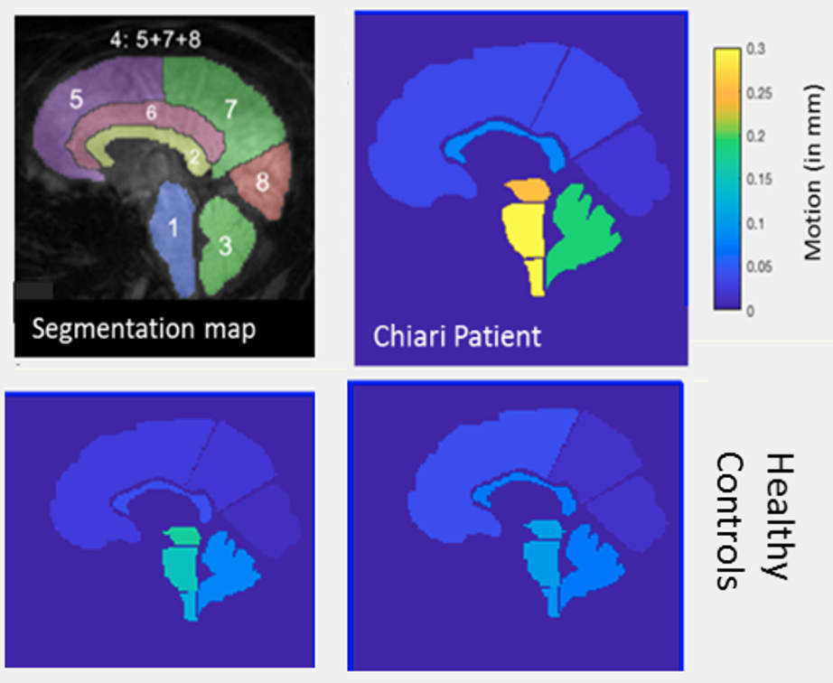

Image-Based Diagnosis of Chiari Disease
---

### Overview
Chiari malformation is a condition in which brain tissue extends into the spinal canal.  While it can be difficult to diagnose Chari  from  anatomical  images,  a  promising  direction  is  a  novel  functional  Magnetic Resonance Imaging (MRI) technique developed by Dr.  Oshinsky’s group (Dept.  of Radiology).  However,the large number of manual processing steps prohibit its use as a wide-spread screening tool.This  project  aims  at  exploring  the  use  of  machine  learning  algorithms  to  automize  parts  of the image processing pipeline,  most critically the segmentation of the image into different brain regions.  The teams will work with image data that has been collected and labeled by Dr.  Oshinski’s group in a previous research study.  The project is accessible to the team members since we can build  upon  recent  progress  and  software  made  in  image  processing  and  computervision and the image data is two-dimensional and of limited resolution, which enablesfast experimentation.  Despite this simplicity, the project allows us to investigate ML in a realistic setting and investigate the generalization properties and robustness of the approach.

### Symptoms of Chiari Malformation 
Some of the symptoms include: 

- dizziness

- neck pain                 

- poor hand coordinatins                  

- severe headaches

- vision and speech problems 

### Segmentation Approaches for Chiari Malformation Type I 

### Atlas-Based Segementation
   The development of the atlas based image registration method involved primarily working with magnitudinal images. The final tool uses 51 of the magnitudinal images in a bank of templates to which a new reference can be compared to generate a mask for the template. In development of the method, references with known masks were used and similarity measures between known and predicted masks were calculated to inform the methods and parameters chosen.
   

### Dice/Jaccard
The image registration was run with one reference against all template images to see how well the SSD works as an initial prediction. Note that a lower SSD is desirable since that means that the two images are more similar. Drawing a least squares line shows a rough correlation between the SSD and how well the image registration performed. It is far from a linear correlation, but at least the top SSD correctly indicated the best similarity in this case. One option to help with this inaccuracy is to take the top 20 patients and average the result together. This way it is less dependent on the outliers.

### What is Machine Learning?
 The study of computer algorithms that improve automatically through experience and by the use of data.
  ### U-Net: A Convolutional Neutral Network 
   - CNNs are a type of neural network which process data that have a ``grid like topology," such as image data (a 2D grid of pixels), and typically are used for classification problems. This kind of network utilizes a convolution operator.
  ### Cross-Entrophy Loss
    - In order to find the error between predicted masks and the corresponding known masks, a loss function is defined to show how far the model is from the expected output.
 ### IBFGS Optimiztion
  - 
  ### Experimental Setups 
 

---
### Background

[Lars' Homepage](https://www.mathcs.emory.edu/~lruthot/)

