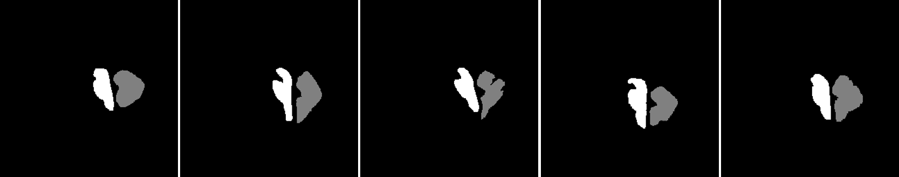

This post was written by  Justin Smith, Elle Buser, Emma Hart, and Ben Hueneman and published with minor edits. The team was advised by Dr. Lars Ruthotto. 
In addition to this post, the team has also created slides for a [midterm presentation](https://github.com/EmoryMLIP/emory-reu-ret-website/blob/main/content/projects/2021-chiari/Chiari_Disease_Presentation.pdf), a [poster blitz](https://youtu.be/tdjXj3JdpQU) video, [code](https://github.com/lruthotto/ChiariProject), and a [paper](https://arxiv.org/abs/2109.14116).

## Collaboration Never Sleeps.
 During our summer research at Emory University 2021 REU/RET program, our group focused on the algorithmic diagnosis of Chiari malformation from DENSE MRIs.  We created an algorithm that can accurately and efficiently segment the cerebellum and brain stem from a magnitude image and use displacement data to classify whether or not a patient has the Chiari malformation.  In doing so, we investigated two approaches; one that segments the given image by aligning and comparing the image to a known atlas and another that segments through deep learning.
 
 
 
## Did Somebody Say Chiari Malformation?
Chiari malformation is a condition in which brain tissue extends into the spinal canal.  While it can be difficult to diagnose Chari  from  anatomical  images,  a  promising  new direction for diagnosis is by looking at brain movement .  Using an MRI technique called DENSE (shown below) that records how the brain moves, [Dr.  Oshinsky’s group (at Emory's Dept.  of Radiology)](https://link.springer.com/article/10.1007/s10439-020-02695-7) collected data about how Chiari patients have more brain movement in the cerebellum and brainstem than controls.

This method may be more accurate in diagnosing Chiari, however, the large number of manual processing steps may limit its use as a wide-spread screening tool.  This  project  aims  at  exploring  the  use  of  machine  learning  algorithms  to  automize  parts  of the image processing pipeline, most critically the segmentation of the image into different brain regions.  The teams worked with image data that has been collected and labeled by Dr.  Oshinski’s group in a previous research study.  The project is accessible to the team members since we can build  upon  recent  progress  and  software  made  in  image  processing  and  computer vision and the image data is two-dimensional and of limited resolution, which enables fast experimentation.  Despite this simplicity, the project allows us to investigate ML in a realistic setting and investigate the generalization properties and robustness of the approach.

## Leave the SEGMENTATION to US!

We develop this project to solve the problem of identifying where the brain stem and cerebellum are in a given MRI.  By finding or, in the language of the field, by segmenting the brain stem and cerebellum, we find the most relevant regions to look at brain movement.  Using the DENSE MRI data, we can then average the movement over those regions to produce a biomarker that can help predict whether or not a patient has the Chiari Malformation.  By producing these segmentations (examples above) automatically with the machine learning or atlas-based approaches, the diagnosis process could become much cheaper and more efficient.

## Atlas Based Image Registration vs Machine Learning. 
We first looked into  atlas-based image registration as a way to produce automatic segmentations of the brain stem and cerebellum. Using the FAIR toolbox in MATLAB, the idea behind this method was to have a bank of MRI images with manually drawn segmentations that we could compare a new MR image to. Once we find a transformation (example below) between the known and new images, we can use the same transformation to produce a new segmentation from the know one.

We also looked into a machine learning approach. The goal here was to find a relationship between the DENSE images and their corresponding manual segmentations by training a model using convolutional neural networks (CNN). The network \"learns\" to identify images features, and, if successful, DENSE images can be used as inputs and the model will automatically segment the brain stem and cerebellum.

Our project implemented a CNN called U-Net, you can find out more about this network and the code we used here: [U-Net: A PyTorch Implementation in 60 lines of Code](https://amaarora.github.io/2020/09/13/unet.html)

Overall, we found that the machine learning method produces better results, both in terms of segmentations of the brain stem and cerebellum, and in terms of how accurate the biomarkers calculated from those segmentations are.  Results were very close to the manually produced target results, and we have ideas for further work that could make them even closer!

Additional information: to learn about atlas-based image registration and machine learning, check out these links!
[What is Image Registration?](https://www.sicara.ai/blog/2019-07-16-image-registration-deep-learning) 
[What is Machine Learning?](https://youtu.be/QghjaS0WQQU)

## Time Management is Everything!
Here's an outline of our process, as it evolved with time.

**Week 1:**
During our first week, we created a working atlas-based image registration example, using FAIR: a MATLAB image registration toolset.  We also began to look at the at a machine learning method, called U-Net, that we began setting up using PyTorch.  We also set up GitHub, that we used throughout the project to collaborate on and publish codes.
 
**Week 2:**
 One of the first things we noticed when we began working with our data set the first week was the variability in the brightness and contrast of our images.  In week two, we explored some different methods to help enhance the images.  We decided to use a tool in MATLAB's Image Processing Toolbox to normalize the images in a process called [histogram normalization](http://www.sci.utah.edu/~acoste/uou/Image/project1/Arthur_COSTE_Project_1_report.html), which made our images much more consistent. 
 
 
 
 With this process complete, we began working on other atlas-based examples, and setting up the neural network with default parameters.
 
**Week 3:**
 We spent most of the third week preparing for our midterm presentation.  It was helpful to practice presentation skills and get familiar using [Beamer](https://www.overleaf.com/learn/latex/Beamer) - a math presentation tool we weren't yet familiar with that is the gold standard for mathematic presentations - and also to reflect on the progress we made, and talk through next steps with others after we presented.  After our presentation, we started refining the machine learning method to use a new optimizer that automatically chooses the algorithm's [learning rate](https://machinelearningmastery.com/understand-the-dynamics-of-learning-rate-on-deep-learning-neural-networks/) using a [line search](https://machinelearningmastery.com/line-search-optimization-with-python/#:~:text=The%20line%20search%20is%20an,with%20one%20or%20more%20variables.&text=Linear%20search%20is%20an%20optimization%20algorithm%20for%20univariate%20and%20multivariate%20optimization%20problems).  This produced much better results! 
 
 
       
**Week 4:**
 In the fourth week, we began working on our paper manuscript.  Although there was still much of the research left to be done, coding in MATLAB and PyTorch, starting on this process of outlining our problem and explaining our methods helped us clarify next steps.  At the end of the week, we turned back to our codes.  On the atlas-based side, we explored ways to choose the images to compare to each other, because it can make a big difference in how good the outputted segmentation is.  We also began devising a way to compare a new image we want to segment to more than one images we already have segmentations before, hoping that by averaging those results together, we could produce even better segmentations.  On the machine learning side, we looked at ways to figure out the ideal number of iterations to use, so that we were neither overfitting nor underfitting our model to training data.
        
**Week 5:**
Week five progressed very similarly to week four, as we continued working on our paper and developing better methods.  We also began working on a poster to present our final results more broadly - and on this website!
    
**Week 6:**
In the last week of the program, we had a lot left to do, finishing up our poster, website, and paper manuscript.  We finalized every parameter in each method before finally looking at the testing set for the first time and analyzing our final results.

## Poster Blitz Video

<iframe width="560" height="315" src="https://www.youtube.com/embed/tdjXj3JdpQU" title="YouTube video player" frameborder="0" allow="accelerometer; autoplay; clipboard-write; encrypted-media; gyroscope; picture-in-picture" allowfullscreen></iframe>

## More About the Team

- **Elle Buser** is a rising senior at the University of Wyoming majoring in mathematics and minoring in physics. At UWyo, she has worked as a tutor/supplemental instructor for Calc II and as a research assistant in the physics and astronomy department.   Outside of school, she spends her time reading, doing arts & crafts, hiking, running, or just enjoying the great outdoors.

- **Emma Hart** is a rising senior at Colgate University, double majoring in applied mathematics and educational studies. She enjoys combining these interests in math and education by volunteering as a math tutor and also by working for Colgate as a Writing Center peer consultant and computational mathematics grader. Outside of school, she enjoys crafting and spending time outside with friends and family.

- **Ben Huenemann** is a rising junior at the University of Utah majoring in mathematics and computer science. He loves all things math, but is mainly interested in pure mathematics and plans to go on studying algebra or something similar in graduate school. Outside of school, he enjoys playing piano, evening bike rides, and board games with friends/family.

- **Justin Smith**  is an Early Childhood educator in Atlanta, Georgia, where he is in his 10th year of teaching.  He is certified in Early Childhood Education and holds a Gifted Endorsement in the state of Georgia. He currently holds the Teacher of the Year award at his school.  He is very active in his community and school, where started an organization called Obama Gentlemen with the primary duty to improve academics  and address behavioral concerns of young men by instilling morals and values that will help transition young adolescent males into young adulthood.  During his leisure time, he enjoys traveling, shopping, listening to music, and spending time with his family. 

