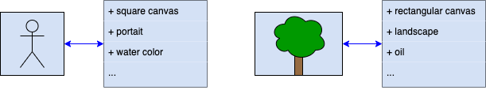

This post was written by Jonathan Valyou, Edward Shao, Lauren Proctor, and Stephen Stern. The project was advised by Dr. Yuanzhe Xi. 

## Introduction

Imagine that somehow, you've recently come to own a massive collection of paintings by famous painters, but none of these works are known to the world. You also happen to be a starving, yet incredibly talented artist, so you wonder about passing off some of your own paintings as part of the collection. You realize that you don't quite have the skills, but you have a friend, a docent at the local museum, that's willing to help you learn. 

After some weeks of thinking the two of you come up with the following plan: each week you present your friend with a randomly chosen painting, either one that you've painted or one from the real collection. Then they do their best to authenticate it, telling you if they think it is real or a fake, and then you let them know whether or not they were correct. 

Over the course of many weeks you both become better at your jobs because you both get feedback from each other. Each week you try something new, maybe a new technique, brushstroke, or type of paint. So, over time, your skills get better because you learn which combinations work well to trick your friend into thinking your painting is real. On the other hand, each time your friend makes a guess, they learn if they were right or not and learn from their mistakes and successes! 

<a href="https://www.flickr.com/photos/37848681@N05/6972527877">"Delaware Art Museum"</a> by <a href="https://www.flickr.com/photos/37848681@N05">-Jeffrey-</a> is licensed under <a href="https://creativecommons.org/licenses/by-nd/2.0/?ref=ccsearch&atype=html" style="margin-right: 5px;">CC BY-ND 2.0</a>

Now, at this point you may be wondering why you're reading some hypothetical story about a painter when this is supposed to be about mathematical research, so we'll start getting to the point. The process above is actually the structure of a machine learning technique called Generative Adversarial Network, or GAN for short. In the story, you served the role as a "generator" by generating new paintings, and your friend serves the role as a "discriminator" discriminating between the real and fake. In practice GANs work just like the painting scenario, just over the course of what would be equivalent to thousands or millions of weeks. GANs turn out to be incredibly powerful tools which can be used in various ways like deep fakes that you may have seen in the news, or even theorizing new pharmaceutical drugs. 

## Background

Our work does not involve GANs, but it does lie within the the broader field of generative modeling; more specifically our work is in the category of Normalizing Flows. These are also generative models that do not require a discriminator like GANs, but do have some other interesting properties. One essential property is that they are invertible, which has a specific mathematical definition but can more easily be reframed back into our painting example. In this context, invertibility means that there is an exact correspondence between a painting you created and the choices that you made in painting it (e.g. the technique, brushstroke, type of paint, and millions of other small decisions that you made.) This correspondence means that just by looking at your painting I can write down a list of all of the decisions you made. Then if I give you that list I wrote down as a set of instructions you would create the exact same painting! 

It turns out that this setup allows us a way to replace your friend's method of determining if a painting is real or fake. In this context fake means something slightly different: now a fake painting means one that doesn't belong in your collection. If we're given a painting, it's pretty difficult to know whether or not it belongs to your collection by just looking at it, but we can translate that painting into the list of choices that you would have made to paint it. Since you know your style choices pretty well, you can look at that list and tell us how likely it was that you'd make that combination of choices. If there's a low probability that you would have made that combination, then the painting probably doesn't belong! This new setup describes how Normalizing Flows work. 

Our work extends [a paper by Huang et al.](https://arxiv.org/abs/2012.05942) by applying more computationally efficient algorithms for the learning and invertible transformation process they developed. If you are not familiar with neural networks or could use a brush up, we'd suggest checking out some or all of these videos by 3 blue 1 brown[link here]. They are a great resource for learning about and getting excited about mathematics and we highly recommend them as a resource. If you are comfortable with neural networks this would be great point to skim the paper that is central to our work, with specific emphasis on section 3. 
<iframe width="560" height="315" src="https://www.youtube.com/embed/videoseries?list=PLZHQObOWTQDNU6R1_67000Dx_ZCJB-3pi" title="YouTube video player" frameborder="0" allow="accelerometer; autoplay; clipboard-write; encrypted-media; gyroscope; picture-in-picture" allowfullscreen></iframe>

## Problem Formulation

Normalizing flows require an invertible function, like the correspondence between a painting and its list of choices. In general, constructing such a function is not a straightforward process. Huang et al. make use of a property of a special type of functions called convex functions. It turns out that a the gradient of a convex function is invertible, so they propose training an Input Convex Neural Network, which is a convex function, and using its gradient as our normalizing flow. 

In order to transform probabilities from the latent space (our list of choices) and the learning space (paintings) we need to find the determinant of the Jacobian of our normalizing flow. If you are familiar with multivariate calculus, this comes from the change of variable formula. If you are familiar with single variable calculus, it is a higher dimensional analogue of changing dx to du when performing u-substitution. If you were keeping track, this is the Hessian of our convex neural network. In other words, we need the determinant of a matrix that unfortunately takes a lot of computer memory to store, and is impossibly expensive to compute. 

To estimate the determinant without forming the matrix, Huang et al. utilize a tool called a Hutchison Trace Estimator and Stochastic Lanzcos Quadrature (SLQ). This works by deducing (spectral) information about the matrix by randomly sampling a bunch of vectors and measuring how much the matrix changes them through multiplication. This multiplication, called the Hessian vector product, can be performed without explicitly forming the matrix, but is still relatively expensive to compute. This process is required in the forward propagation through the network. 

Another essential part of training neural networks is the loss function. In the first painting story about GANs, the loss function for you was whether or not you fooled your friend, and you learned each week by trying to minimize this function. Your friend learned each week by trying to maximize this function. (This is where the "adversarial" in the name GAN comes in, you have opposite goals!) The loss function for our work is a bit more complicated, but ultimately is a comparison of true probabilities, and the ones we estimated with the forward transform. This means that classically training our normalizing flow would require backpropogating with the gradient of the forward transform process. Unfortunately this turns out to be highly unstable. Instead, Huang et al. uses a surrogate loss function that combines some algebraic manipulation and another Hutchison Trace Estimator in tandem with an algorithm called the Conjugate Gradient method (CG). This process results in an estimate for the gradient of the loss function required for back propagation. Just like SLQ, CG requires computing a hessian vector product each iteration that it takes to converge on a solution.

## Our Contribution

By using information we can deduce from the Stochastic Lanzcos Quadrature, we reduced the number of iterations that CG requires to converge. Specifically, CG approximately solves a linear system of equations, *Ax = b*. The number of iterations it takes for the algorithm to converge is related to the condition number of A, the smaller this number is the faster it converges. We apply a pre-conditioner, M, that instead solves the system *MAx = Mb*, which is designed to reduce the condition number of MA. Behind the scenes, we can find such a preconditioned because SLQ results in providing the smallest and largest eigenvalues and corresponding eigenvectors of A and the condition number of A is given by the ratio of the largest and smallest eigenvalues. 

## More About the Team

## Jonathan Valyou

Jonathan Valyou is a senior at Emory University majoring in Applied Mathematics with a minor in Physics.  His primary research areas of interest include scientific computing, data science, and optimization.  Aside from this project, he has worked on neural network research.  He is currently writing an honors thesis as part of the Emory Mathematics Honors Program.  When not tinkering with computational models, he enjoys traveling, listening to classical and pop music, playing the euphonium, and trying new foods.

## Lauren Proctor

Lauren Proctor is a junior at the University of Tennessee Majoring in Mathematics and Computer Science. She is a part of the Mathematics Honors program at her university, and has previously worked on natural language processing research. Outside of school, she enjoys hiking, baking, and spending time with friends. 

