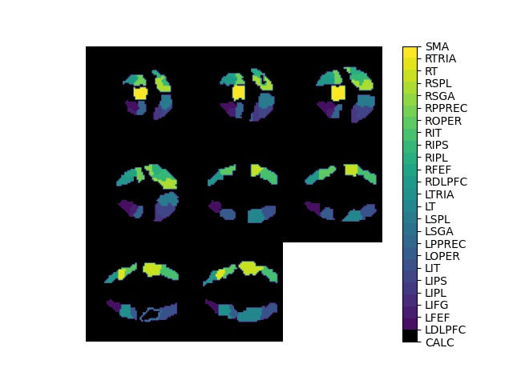

---
# A Demo section created with the Blank widget.
# Any elements can be added in the body: https://wowchemy.com/docs/writing-markdown-latex/
# Add more sections by duplicating this file and customizing to your requirements.

widget: blank  # See https://wowchemy.com/docs/page-builder/
headless: false  # This file represents a page section.
weight: 30  # Order that this section will appear.
title: "Background"
subtitle: ""
design:
  # Choose how many columns the section has. Valid values: 1 or 2.
  columns: '1'
advanced:
  css_style:
  css_class:
---

A tensor is a multidimensional array of data. We denote tensors with a capital script letter $\mathcal{A} \in \mathbb{R}^{n_1\times \dots \times n_d}$.
There are many products associatedd with tensors including the mode
\begin{equation}
\mathcal{A} \times_k \mathbf{M} = \mathbf{M} \mathcal{A}_{(k)}
\end{equation}

Functional Magnetic Resonance Imaging (fMRI) gives us pictures of the brain like the following:

  

This image depicts the Regions of Interest (ROI) of the [StarPlus fMRI data](http://www.cs.cmu.edu/afs/cs.cmu.edu/project/theo-81/www/) from Carnegie Mellon University.
(There is a way to caption an image, but it does not seem to be working right now.  You can scroll over the image to get a description.)
