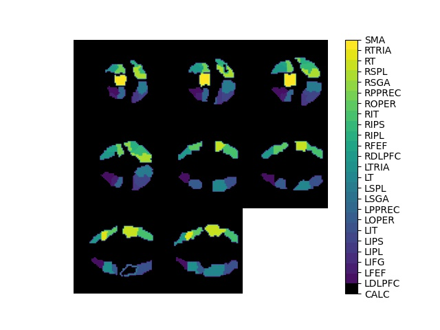

<!--more-->

### Overview
Can we look at a brain scan and know what the brain's owner is thinking?

We use brain scans called functional MRIs (fMRIs) that show us which parts of the brain are using more oxygen and are therefore most active. [We have fMRIs of test subjects](http://www.cs.cmu.edu/afs/cs.cmu.edu/project/theo-81/www/)  who, as they are being scanned, are also shown either a picture or a sentence. If computers can classify these study subjects into one of these two categories by only studying their scans, then in a sense we can read their minds.

Image classification is using a computer to figure what what an image represents.  For example, we can train a computer to classify an image as a numerical digit.  Computers learn  by training on many images, for example [using the MNIST database of handwritten images](http://yann.lecun.com/exdb/mnist/).  MNIST contains a wide variety of images that can represent a 0 or a 1:

By learning from a training set of images a computer can examine the data in a new image and figure out which class of digits it most resembles.  

We are training our computer to learn how to use the data in an fMRI to classify our study subjects into those who are shown an image and those who are shown a sentence.  Unlike static MRIs which take a scan at one point in time, fMRIs are repeated every few seconds creating a series of images for each trial. 

Here is an example of an fMRI of one brain during one trial.  The different images are of different slices of the brain.  The abbreviations on the right refer to brain regions, for example "SMA" stands for "Supplementary Motor Area" located at the top center of the organ.  

Images like these consist of 3-dimensional pixels called voxels.  Typically, large data sets like this are stored in matrices, which have some powerful tools for extracting the most relevant components.  This makes it easy for   [computers to learn from data stored in matrices.](https://youtu.be/LlKAna21fLE)

If we have 3-dimensional fMRI brain voxel data for many patients, multiple scans in sequence, then we need to analyze a quantity of data unwieldy even for modern computers.  

When we store fMRI data in a matrix we also lose important relationships between the data points.  For example a computer may not know that a particular voxel representing a part of the brain is that same part of the brain a few seconds later.    

Fortunately we can also store our data in a mathematical structure called a tensor.  A tensor is like matrix but with more than 2 dimensions.  Our tensor of fMRIs have a total of 5 dimensions, shown in the figure below.  The green slices consist of voxels of the brain in 3 dimensions: x,y,z in yellow.  For each trial multiple images are taken over several seconds (blue arrow), and there were multiple trials (red arrow).  

When we store our voxel data in tensors instead of matrices, we retain all the information about the 3 dimensional location in the brain, the sequence of the image in time, and the trial.  Now we want to decompose our tensor data using a method analogous to the way [matrices can be decomposed](https://www.youtube.com/watch?v=DG7YTlGnCEo), so we can use far less data and still extract an accurate prediction of what the subject is thinking.  In matrices this is called Singular Value Decomposition; we call our approach tensor-SVD or tSVD.  

Here is a diagram of matrix decomposition using SVD:

This what we imagine a tensor SVD would be:

You'll notice that we use matrix multiplication in working with matrix SVDs.  What would tensor multiplication look like?  This is what we are trying to figure out.  

Our research is not only useful for fMRIs; many datasets have multiple dimensions.  Streaming entertaining companies have data on thousands of viewers and what movies they've watched.  Hospitals track thousands of patients, each of whom has had multiple lab tests and other studies.  If our research enables us to classify our fMRI subjects, then we may also be able to predict whether someone will want to watch Terminator, or whether a patient is likely to have cancer.  

---
### Background

Functional Magnetic Resonance Imaging (fMRI) gives us pictures of the brain like the following:



