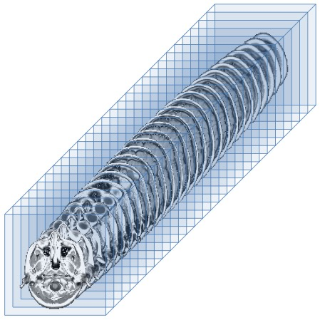

Understanding the human brain by extracting multidimensional information.

 

<!--more-->

### Overview
Can we look at a brain scan and know what the brain's owner is thinking?

We use brain scans called functional MRIs (fMRIs) that show us which parts of the brain are using more oxygen and are therefore most active. We have fMRIs for hundreds of patients who, as they are being scanned, are also shown either a picture or a sentence. If computers can classify these study subjects into one of these two categories by only studying their scans, then in a sense we can read their minds.

Unlike static MRIs which take a scan at one point in time, fMRIs are repeated every few seconds creating a series of images for each trial. 

***Insert fMIR image***

We store each fMRI image digitally as individual voxels which are 3 dimensional pixels. If we have fMRI voxel data for hundreds of patients, multiple scans, 3-dimensional brain data, over time, then we need to analyze an unwieldy amount of data even for modern computers. Storing that data in traditional matrices is useful because we can use techniques like singular value decomposition to streamline the data without losing important information.

But when we store fMRI data as matrices we lose important relationships which are maintained in a tensor.  A tensor is like matrix but with more than 2 dimensions.  The tensors we study have a total of 5 dimensions.  Three dimensions correspond to the physical 3 dimensions of the brain itself.  The fourth dimension represents the sequence of brain images taken over time.  The fifth dimension represents the many trials of test subjects that are studied.  You can see how the number of data points is very large.  

***how large?***

We are looking for a way to decompose our tensor data in a way analogous to the way matrices can be decomposed, so we can use far less data and still extract an accurate prediction of what the subject is thinking.

We wish to demonstrate that tensors are superior to matrices in classifying fMRI data of study subjects who are shown either an image or a sentence.  We do so by extending the t-product into a class of tensor-tensor products called the star-M product.  

The t product tells us to divide each 3rd order tensor into frontal faces, multiply the corresponding faces, then reform the tensor with those face products.  

The mode-$k$ product of a tensor $\Acal$ with a matrix $\bfM$ results in a tensor whose mode-$k$ unfolding is $\bfM$ times the mode-$k$ unfolding of $\Acal$. In other words, 
    $
    \mathcal{A] \times_k \mathbf{M}= \text{fold}(\mathbf{M} \mathcal{A}_{(k)})  
    $
The facewise product multiplies each of the $n_1\times n_2$ and $n_2\times \ell$ frontal slices of two tensors in the transform domain in parallel to create a set of $n_1\times\ell$ new slices.

Advances in the neuroimaging technology of functional Magnetic Resonance Imaging (fMRI) have provided large amounts of digital data, which can be used to study the complex functionality of the human brain. A whole-brain fMRI image sample consists of a discrete-time series of 3D image scans, where each scan consists of hundreds of thousands of voxels. The size of the dataset and additional problems such as measurement noise render fMRI analysis very challenging computationally. The team will investigate the use of tensor representations to represent and analyze the fMRI data. Here, an fMRI brain image sample can be organized as a fourth-order tensor, with three space and one time dimension. This viewpoint allows for extracting information using various tensor decomposition methods.

---
### Background

A tensor is a multidimensional array of data. We denote tensors with a capital script letter $\mathcal{A} \in \mathbb{R}^{n_1\times \dots \times n_d}$.
There are many products associated with tensors including the mode-$k$ product
\begin{equation}
\mathcal{A} \times_k \mathbf{M} = \mathbf{M} \mathcal{A}_{(k)}
\end{equation}

Functional Magnetic Resonance Imaging (fMRI) gives us pictures of the brain like the following:



\begin{itemize}
        \item \textbf{Higher-Order Tensors:} The original algorithm was written for and applied to gray-scale images (two-dimensional data).  
        We apply the algorithm to fMRI data (four-dimensional data).  
        
        \item \textbf{Family of Tensor-Tensor Products:} The original algorithm only considered a specific tensor-tensor product, the $t$-product.  
        Our work considers a general class of tensor-tensor products called the $\starM$-product~\cite{KernfeldKilmerAeron2015}.  
        
        \item \textbf{Data-Dependent Products:} We not only consider the general family of tensor-tensor products, we seek to develop the products based on the data itself.  
        This consists of two considerations: (1) different transformations along the spatial dimensions and time dimensions and (2) developing the product via, e.g., a matrix SVD of an unfolded tensor. 
        Additionally, we can define a different product per class; consistent normalization will need to be considered. 
        
        \item \textbf{New Distance Metrics:} The original paper only consider the Frobenius norm as a distance metric.  
        However, there are many other choices such as different norms and the cosine distance that we explore. 

    \end{itemize}
    
    \begin{definition}[lateral slices, frontal slices, and tubes]\label{def:slices}

A \emph{slice} of a third-order tensor $\Acal$ is a two-dimensional array defined by fixing one index. For a third-order tensor, the terms \emph{lateral and frontal slices} are used to specify which two indices are fixed. Using MATLAB notation, $\Acal$(;,k,:) corresponds to the kth lateral slice, and $\Acal$(;,:,k,) corresponds to the kth frontal slice.  A \emph{tube} of a tensor is a one-dimensional section defined by fixing all indices but one.  The fibers $\Xcal$(:,i,j), $\Xcal$(i,:,j), $\Xcal$(i,j,:) denote mode-1, mode-2, and mode-3 tubes respectively.  

\end{definition}

\begin{definition}[vectorize/reshape]\label{def:vectorize}

Vectorization is the process of converting an algorithm from operating on a single value at a time to operating on a set of values at one time. 
Vectorization describes the absence of any explicit looping, indexing, etc., in the code.
Vectorized programs can run multiple operations from a single instruction, whereas scalar can only operate on pairs of operands at once.

\end{definition}

\begin{definition}[twist/squeeze]\label{def:twist}

\end{definition}

\begin{definition}[mode-$k$ unfolding/folding]\label{def:modekUnfold}

Unfolding a tensor consists of reading its elements in such a way as to obtain a matrix instead of a tensor. mode-k unfolding is obtained by considering the kth mode as the first dimension of a matrix and collapsing the other into the other dimension of that matrix. 

Unfolding is the process of reordering the elements of an N-way array into a matrix. For instance, a 2×3×4 tensor can be arranged as a 6×4 matrix or a 3 × 8 matrix, and so on. 

\end{definition}

\begin{definition}[mode-$k$ product]\label{def:modekProduct}

The k-mode product of a tensor $\Acal$ with a matrix M results in a tensor whose k-mode unfolding is M times the k-mode unfolding of $\Acal$. 

\end{definition}

\begin{definition}[Kronecker product]\label{def:kronecker}
 The Kronecker product, sometimes denoted by $\otimes$,is an operation on two matrices of arbitrary size resulting in a block matrix. 
\end{definition}

\begin{definition}[Frobenius norm]\label{def:frobenius}

The \emph{Frobenius norm}, sometimes also called the Euclidean norm, is matrix norm of an m×n matrix A defined as the square root of the sum of the absolute squares of its elements. $\lVert \mathbf{A}  \rvert \rvert _{F}=\sqrt{\sum_{i=1}^{m} \sum_{j=1}^{n} |a_{ij}|^2}$

\end{definition}

