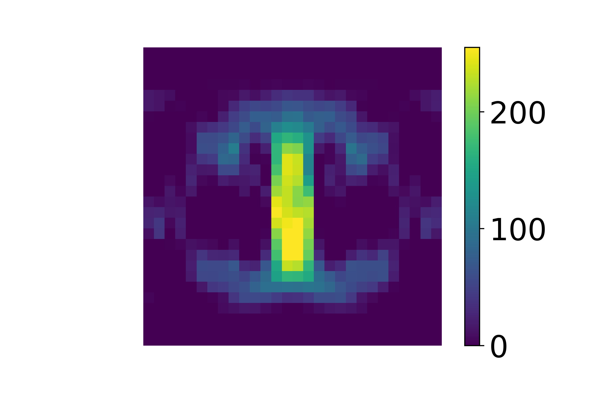
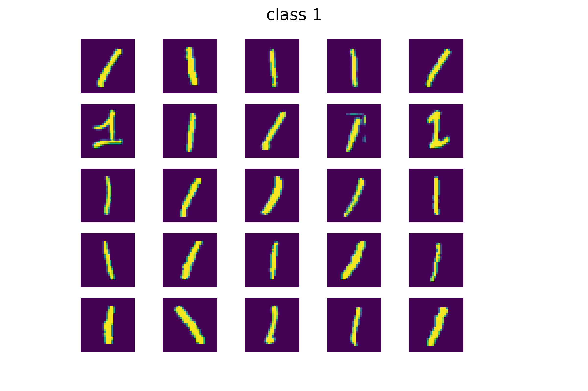

Understanding the human brain by extracting multidimensional information.

 

<!--more-->

### Overview
Can we look at a brain scan and know what the brain's owner is thinking?

We use brain scans called functional MRIs (fMRIs) that show us which parts of the brain are using more oxygen and are therefore most active. We have fMRIs for hundreds of patients who, as they are being scanned, are also shown either a picture or a sentence. If computers can classify these study subjects into one of these two categories by only studying their scans, then in a sense we can read their minds.

Unlike static MRIs which take a scan at one point in time, fMRIs are repeated every few seconds creating a series of images for each trial. 

***Insert fMIR image***

We store each fMRI image digitally as individual voxels which are 3 dimensional pixels. If we have fMRI voxel data for hundreds of patients, multiple scans, 3-dimensional brain data, over time, then we need to analyze an unwieldy amount of data even for modern computers. Storing that data in traditional matrices is useful because we can use techniques like singular value decomposition to streamline the data without losing important information.

If you aren't sure how matrices can help computers to learn, [watch this video](https://youtu.be/LlKAna21fLE).

If you are not familiar with Singular Value Decompositon,  [watch this video](https://www.youtube.com/watch?v=DG7YTlGnCEo).  

But when we store fMRI data as matrices we lose important relationships which are maintained in a tensor.  A tensor is like matrix but with more than 2 dimensions.  The tensors we study have a total of 5 dimensions.  Three dimensions correspond to the physical 3 dimensions of the brain itself.  The fourth dimension represents the sequence of brain images taken over time.  The fifth dimension represents the many trials of test subjects that are studied.  You can see how the number of data points is very large.  

***how large?***

We are looking for a way to decompose our tensor data in a way analogous to the way matrices can be decomposed, so we can use far less data and still extract an accurate prediction of what the subject is thinking.

Advances in the neuroimaging technology of functional Magnetic Resonance Imaging (fMRI) have provided large amounts of digital data, which can be used to study the complex functionality of the human brain. A whole-brain fMRI image sample consists of a discrete-time series of 3D image scans, where each scan consists of hundreds of thousands of voxels. The size of the dataset and additional problems such as measurement noise render fMRI analysis very challenging computationally. The team will investigate the use of tensor representations to represent and analyze the fMRI data. Here, an fMRI brain image sample can be organized as a fourth-order tensor, with three space and one time dimension. This viewpoint allows for extracting information using various tensor decomposition methods.

---
### Background

Functional Magnetic Resonance Imaging (fMRI) gives us pictures of the brain like the following:



