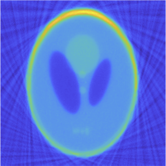

Portable Medical Machinery Powered by Mathematics

<!--more-->

Computed tomography (CT) is well known for its ability to produce high-quality images needed for medical diagnostic purposes. Unfortunately, standard CT machines are extremely large, heavy, require careful and regular calibration, and are expensive, limiting their availability in many parts of the world. An alternative approach is to use portable machines. Still, parameters related to the geometry of these devices (e.g., the distance between source and detector, the orientation of the source to the detector) cannot always be precisely calibrated in point-of-care situations. These parameters may change slightly when the machine is adjusted during the image acquisition process, which causes severe degradations in the resulting image. The team working on this project will develop a numerical method to jointly estimate the geometry parameters of the portable device and to reconstruct the image.

---
# Background

# Point-of-Care Tomographic Imaging
