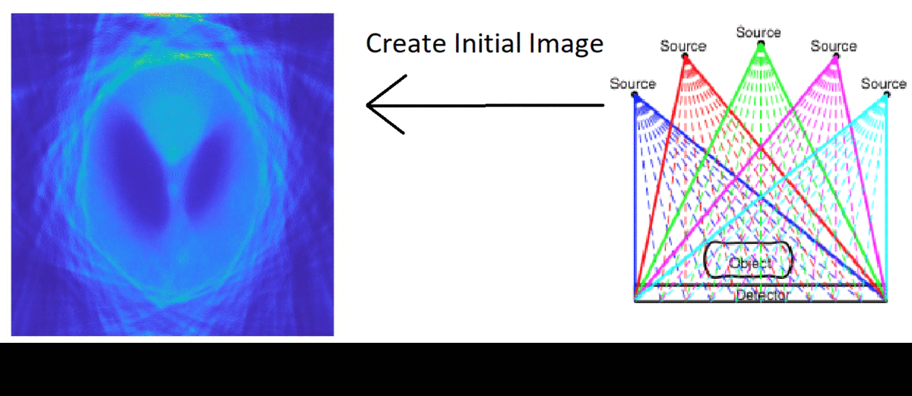

**REU/RET Emory University**
# New algorithm helps make portable CT machine images clearer.
*Mathematics: Undergraduate college students studied at the Emory REU a new, better way of improving image resolution with mathematical methods.* 

Research work done at the 2021 REU/RET summer program at Emory University has devised a way to make medical diagnoses more effectively. The work behind this new algorithm relies heavily upon mathematical techniques that connect numerical linear algebra with optimization methods. 

The 2021 REU/RET Emory program focuses this year on computational mathematics and its applications in data science. The research work is a collaborative effort between a group of undergraduate students and math teachers, led by mathematics faculty from Emory University. Four different research groups worked together on different projects following this year’s program theme, “Learning from Images.” This provided undergraduate students and math teachers from around the nation numerous learning opportunities and a chance to conduct research in this area.  Teachers were involved in research and able to create teaching materials that they can use in their classroom. 
The REU/RET Emory Program’s research groups include: 1) Image-Based Diagnosis of Chiari Disease, 2) Images to Patient Specific Models in Cardiology, 3) Tensors and Data Modeling in Neuroimaging, and 4) Point-of-Care Tomographic Imaging.  The project on Point-of-Care Tomographic Imaging research focused on exploring new mathematical approaches for image reconstruction.   

Some of the most important aspects of this work link branches of mathematics like calculus, statistics, algebra and geometry. The different contributions by mathematicians to these branches of mathematics were complementary and accelerated research in the area of image reconstruction. The results obtained from their work have offered other student mathematicians a different way to study these problems and shown that this is an effective way for radiology doctors to accurately diagnose illnesses and keep saving patients' lives. The goal of the Point-of-Care Tomographic Imaging research group is to develop numerical methods that would estimate the geometry parameters of a portable CT scanning device and to reconstruct the image.  CT images in portable devices are a lot clearer. This work has been one of the most interesting pieces of work ever accomplished. 

# COVID-19 Imaging 
The mathematical ideas involved in the Point-of-Care Tomographic Imaging project are of great importance. With these mathematical methods, imaging becomes a possibility with patients in all parts of the world, allowing them to live a healthy and happy life. To get better reconstructed images, the group considers a regularized linear least squares problem, to which the solution is approximated  by using  an alternating descent scheme known as block coordinate descent or (BCD). Each iteration of BCD has two steps. One step of the BCD steps solves a linear least square problem, and the next step solves the nonlinear problem.  

By the 1900’s mathematicians had already found ways to use these iterative reconstruction techniques to reconstitute an image. In 1917, Johann Radon introduced the Radon Transform, followed by Stefan Kaczmarz in 1937. Scientists Allan McLeod Cormack and Godfrey Newbold Hounsfield developed the first scanning device. These innovations each contributed to modern medical scanning technology.

The medical field has greatly depended on these iterative reconstruction methods. In  medical  imaging,  computed  tomography  (CT)  techniques  are  becoming  more and  more  popular  for  their ability to produce high quality images of the human body. CT methods use a combination of computer processes and mathematics to reconstruct images. The COVID-19 pandemic brought many challenges and setbacks to many doctors around the world  and imaging played a vital role in helping diagnose the virus. Doctors have been able to use CT scans to diagnose and treat COVID-19 by examining the lungs of patients who are potentially infectious, or in recovery.

# Point-of-Care Tomographic Imaging

Since the first CT scanner was developed, CT scanning technology has evolved significantly. Now, there are portable CT scanners that can be transported anywhere without trouble. The idea of transporting huge heavy CT scanners to remote locations was always a difficult task for many doctors.  Point-of-care tomographic imaging has allowed radiologists to add portable CT scanners to their departments to increase patient satisfaction and improve medical outcomes. Portable CT scanners can be used to do scans of a patient without moving the patient out of bed.

A CT scanner is a device that is composed of a scanning gantry, x-ray generator, computer system, console panel and a physician’s viewing console. The scanning gantry is the part that will produce and detect x-rays. In a typical CT scan, a patient lays on a bed that moves through the gantry. An X-ray source rotates around the patient and shoots X-ray beams through the human body at different angles. These X-ray measurements are then processed on a computer using mathematical algorithms to create tomographic (cross-sectional) images of the tissues inside the body.[How Does a CT Scan Work?](https://youtu.be/l9swbAtRRbg)

Limitations arise when using these portable CT scanners for medical procedures since these devices require extensive care, such as regular calibration for effective performance. This is where the point-of-care tomographic imaging problem begins. 

# The Beginning of the Problem

  

Two parameters that relate to the geometry of portable CT scanning devices are: 

1. R - distance between source and detector and 
2. θ - orientation of source to detector. 

During the CT acquisition process, the x-ray source rotates around the patient. Each time the x-ray source moves to a new position, these parameters change. In point-of-care imaging, these parameters are essential during the data imaging process. Imprecise data (unknown parameters) result in the reconstruction of poor quality images, while precise data (known parameters) yield a well reconstructed image.

*How were these geometry parameters estimated to obtain better reconstructed images?* 

  

The group considered solving a regularized linear least squares problem. The solution to this problem is approximated by using an alternating descent scheme known as block coordinate descent or (BCD). They used this alternating algorithm to solve a linear least squares problem in one iteration and the nonlinear least squares problem. An alternate form of this algorithm was also studied as a fixed point iteration, with acceleration techniques used to improve convergence. Implementation and numerical examples were done using MATLAB to obtain results. To understand the background behind this problem, the connection between Beer’s Law and linear algebra needs to be studied.   

# Beer’s Law & Linear Algebra 
The Beer-Lambert Law or Beer’s Law was first developed in 1729 by Pierre Bouguer, and in 1852, Beer added to the law. Beer’s law states that as an x-ray source emits an x-ray beam and it passes through an object, the beam loses energy exponentially.  To create a 2-D image, an imaginary grid of pixels is placed atop the object, and an x-ray beam is then shot through the object. Beer’s Law is used to create a system of linear equations. 

  

From Algebra, it is known that a system of equations has three types of solutions, infinitely many, exactly one, or no solution. When there is no solution, the system is called inconsistent, as opposed to consistent when there exists a solution. When there are more equations (x-rays)  than unknowns (pixels), then the system is overdetermined. This is what happens in computed tomography. When there are more unknowns (pixels) than equations (x-rays), then the system is underdetermined. 
In each equation, every unknown represents a physical property, called attenuation, for each  pixel value. Pixels that have the same amount of material have the same attenuation. An image is then created from the pixels. The images obtained based on the attenuation values allow doctors to make more accurate diagnoses. For example, bones have a different attenuation than lungs. 

A system of linear equations can be solved in Precalculus by the Gauss-Jordan elimination method. In linear algebra, a matrix equation of the form Ax=b is solved to find x. Ideally, this can easily be done. Unfortunately, for this project, this might not be possible for several reasons: 1) b has noise in it,  and 2) the exact matrix A may not be known because the parameters R and θ may be perturbed (for example, the CT machine may not be calibrated correctly). Matrix A may also be a huge matrix containing millions of rows and columns. Typical approaches learned in Pre-Calculus or a linear algebra class cannot be used to solve this problem. The tomographic imaging research group uses other methods to solve these large problems, referred to as ill-posed. 

An ill-posed problem is often referred to as one that is not well-posed. In the 20th Century, French mathematician Jacques Hadamard defined a well-posed problem as one having three properties: 1) a solution exists, 2) the solution is unique, 3) the solution depends on initial values. An ill-posed problem needs to be approached differently, e.g. -regularization. Tikhonov regularization is a common form of regularization for ill-posed problems. 

# The Linear & NonLinear Least Squares Problem 
Throughout the 1800s, mathematicians such as Legendre, Gauss, and Laplace contributed ideas to the method of least squares. The method of least squares finds the line that minimizes the distance to the line and the data points. 
In computed tomography, a problem arises that involves least squares, a regularized linear least squares problem. This regularized linear least squares problem is composed of x, the image, A(p), a matrix that is constructed by the geometry parameters, R and θ, b, the measured data, and a parameter α, called the regularization parameter. The nonlinear least squares problem does not include the regularization parameter. 

The solution to this problem is found by the block coordinate descent (BCD). The BCD algorithm is an optimization algorithm that solves this problem iteratively. BCD works by minimizing the parameters R and θ and x one at a time.  The linear least squares problem is considered first. It takes the initial parameters R and θ, generate matrix A, to get x, the image. Here the parameters, R and θ are known and x is approximated. Then, the nonlinear least squares problem is considered. Once x is known, then x is used to approximate the parameters, R and θ. In this latter phase, x is known and the parameters R and θ are approximated. The pattern continues until a good image is produced.  

# Filter - Based Regularization 
Since it is impossible to get data exactly from the detector due to numerous reasons, regularization is needed to lower the noise levels. Tikhonov regularization is one of the most common ways to handle these noise levels. The method is named after mathematician Andrey Tikhonov. Tikhonov worked in numerous topics and different fields of mathematics. His best contributions are in topology. 

Singular value decomposition (SVD) plays an important role in understanding the basic idea behind Tikhonov Regularization. The singular values of the matrix A are significant. To achieve good reconstructed images with small noise large singular values need to be considered to minimize the error produced. 

# MATLAB Toolboxes & Implementation

MATLAB was used in the project, including the optimization, signal processing, and image processing toolboxes. The IR Tools, AIR Tools II, and Imfil packages were also used. 

To simulate a problem, the IR tools package is used. IR tools also provide regularized linear square solvers. Three of these linear least squares solvers are: 1) hybrid-LSQR algorithm, 2) IRN, 3) FISTA. To approximate the solution of the non-linear least squares problem two methods are used: 1)lsqnonlin, 2) imfil.  

The implementation of BCD used the IR Tools package and naming conventions. In the base IRtools package, the function PRsetis used to set up options for computed
tomography problems, where PRset is updated to accept values related to the BCD (inital guess for parameters). To simulate a CT problem with unknown geometry parameters PRtomo_var is used with the image size being n×n. PRtomo_var generates all the data necessary to simulate the inverse problem. IRset updates to include parameters for BCD, such as which acceleration technique to use, and IRbcd computes the BCD. 

The steps above permit the simulation and solving of a CT reconstruction experiment. With n=64 and perturbations added to the parameters R and θ, the test problem is generated. The image used is the Shepp-Logan image. 

  

After solving the problem with the BCD algorithm, it can be seen that the solution with the BCD resembles that of the true parameters solution.

  

# Acceleration Techniques: Tests & Results

Other mathematicians continue their work in these fields. Some of them introduced ideas on acceleration techniques to speed up the convergence rate of fixed point iteration problems. One of them is Donald G. Anderson, famous for his work on the Anderson Acceleration, also called Anderson mixing. In the tomographic imaging project, estimation of the geometry parameters can be viewed as a fixed point iteration technique. The research group used three fixed point acceleration schemes in their numerical experiments: 1) Irons-Tuck method, 2) Crossed - second method, 3) Anderson Acceleration. All these acceleration tests were performed and seemed to improve image resolution. 

  

From  tests performed, the  acceleration  techniques  provided  slightly  better  convergence,  with  the crossed  secant  method  and  Anderson  Acceleration  performing  the  best. The  Irons-Tuck method converged much better in the angle parameters, but took much longer.  The Irons-Tuck image seems to have the least background noise.

  

# Project Activities
- [Bios](./Bios.md)
- [Presentation Slides](https://github.com/EmoryMLIP/emory-reu-ret-website/files/6874766/_REU2021__Tomo_Presentation.pdf)
- [Poster Blitz Video](https://youtu.be/qdcGe9MKCoI)
- Virtual Poster
- Manuscript
- [Math Lesson](https://github.com/EmoryMLIP/emory-reu-ret-website/files/6888967/Tomography.Lesson.pdf)
