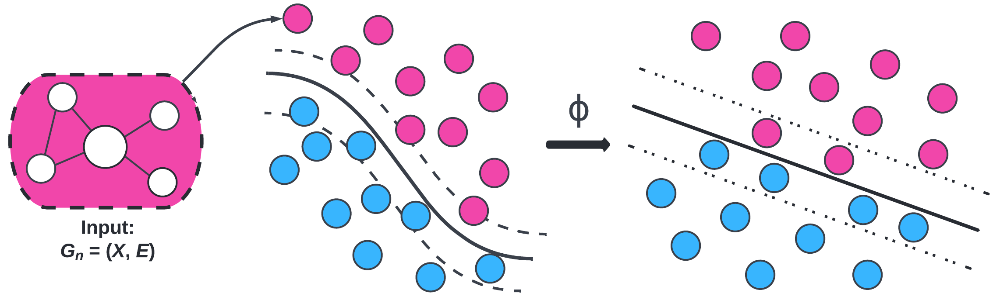
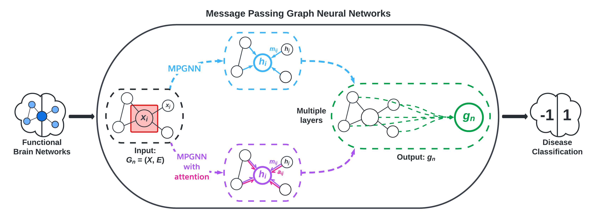
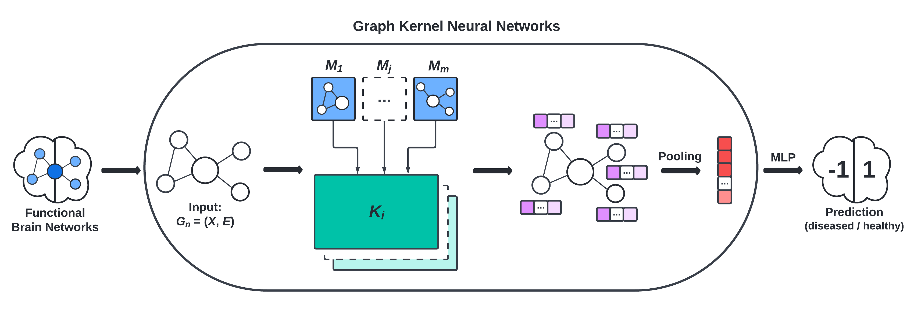
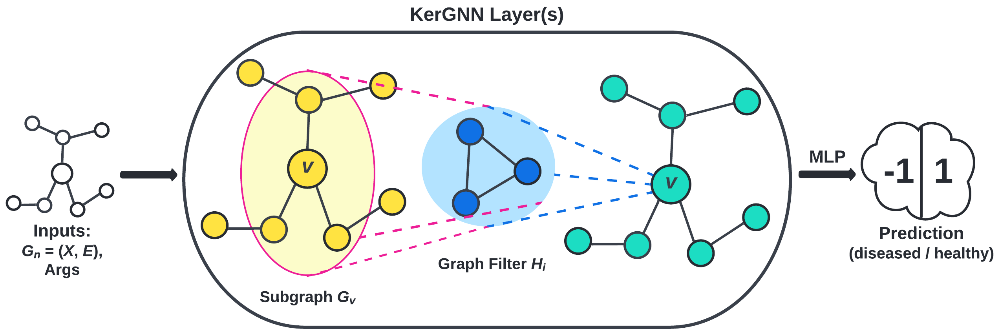

This post was written by Erica Choi, Sally Smith, and Ethan Young and published with minor edits. The team was advised by Professor Carl Yang.
In addition to this post, the team has also created slides for a [midterm presentation](REU_Midterm_Presentation.pdf), a [poster blitz video](https://youtu.be/DLs1PkO8iJo), and a [poster](REU_Poster.pdf).

# Comparing Shallow vs. Deep Brain Network Models

Our shallow models use graph kernels to compare structural similarity of brain network data. Plugging those kernels into support vector machines allows us to classify patients' brain scans. These kernel methods are called "shallow" because they do not require many layers of computation, unlike their "deep" model counterparts. Our deep models are graph neural networks, machine learning (ML) models that can exploit the local information of nodes in graph data to perform classification. In this project, our models are classifying brain scans as either diseased or healthy. We are comparing the two types of models, shallow and deep, to further determine which might be more useful in analyzing neuroimaging data, as well as working on using the models in conjunction with one another to leverage the strengths of both.

For useful background and definitions refer to [Preliminaries](#preliminaries).

# Datasets

We are working with 2 datasets, one documenting human immunodeficiency virus (HIV) patients and one documenting bipolar disorder (BP) patients. Each dataset consists of functional magnetic resonance imaging (fMRI) scans, diffusion tensor imaging (DTI) scans, and classification labels in the form of integers, where 1 indicates a healthy patient and -1 indicates an unhealthy patient. Both datasets have been processed for us, as detailed in [Section 3](https://arxiv.org/abs/2204.07054) of the paper authored by Cui et al.

# Problem Formulation
The DTI and fMRI brain scans of each patient $i$ are represented as weighted adjacency matrices $\mathbf{W}_i \in \mathbb{R}^{M \times M}$. The adjacency matrix is constructed from the brain scan and is a natural way of mathematically representing graph data. Nodes in the brain network represent regions of interest (ROIs), and edge links between nodes indicate the strength of the connection between the two regions. In general, fMRI scans are considered to be more robust than DTI scans; specifically, fMRI scans are less affected by noise caused by data collection. Thus, our experiments prioritize working with the fMRI scans.

## Classification Task

The standard graph classification task considers the problem of classifying graphs into two or more categories. The goal is to learn a model that maps graphs in the set of graphs $G$ to a set of labels $Y$. In this project, our set of graphs $G$ is the set of brain scans from patients and our set of labels $Y$ consists of two labels: diseased and healthy. The goal of our models is to classify brain scans accurately and improve model interpretability.

## Implementation

For implementation of support vector machines (SVM) with graph kernels, we utilized threshold rounding to remove edge weights and sparsify the adjacency matrices. This means that values in the adjacency matrices were rounded to make the matrices simpler. While this results in information loss, it preserves the overall structure of the adjacency matrices and makes them usable for this particular method. It also makes the computation less expensive. Further manipulation creates a list of graph objects that are compatible with the Python package [GraKel](https://ysig.github.io/GraKeL/0.1a8/). 

For implementation of graph convolutional networks (GCNs), we followed [BrainGB](https://github.com/HennyJie/BrainGB)'s code to create a data type that can be used with the Python package [PyG](https://pytorch-geometric.readthedocs.io/en/latest/).

For implementation of kernel graph neural networks (i.e., KerGNN), we followed [KerGNN](https://www.aaai.org/AAAI22Papers/AAAI-6564.FengA.pdf)'s code and implemented threshold rounding to run experiments. The motivation for threshold rounding is the same as for implementing SVM.

# Methods

## 1. Graph Kernels

<figcaption align = "center"><b>Fig.1 - Support Vector Machines with Kernels</b></figcaption>
 

We computed three kernels to plug into SVM: Weisfeiler-Lehman (WL), Weisfeiler-Lehman Optimal Assignment (WLOA), and propagation (Prop). The choice of these kernels is motivated by exploiting structural information (i.e., subgraphs) in the brain networks. We tested these graph kernels to find which ones were most effective. On average, the propagation kernel classified HIV best and the WLOA kernel classified bipolar disorder best. 

## 2. Graph Convolutional Networks (GCNs)

<figcaption align = "center"><b>Fig.2 - BrainGB Framework </b></figcaption>
 

The deep model that we experimented with in this project is graph convolutional networks (GCNs). This is a "deep" model because GCNs are under the umbrella of "deep learning". GCNs are modern ML algorithms that pass information through several layers and do more extensive computations than shallow models. Note that our GCNs (and GNNs in general) are shallow in the sense that the models have few layers. Machine learning is still a very active field of research, and recent interest in graph data has led to major strides in graph-based ML.

We implement message passing GNNs (MPGNN)—a type of GCN—using the BrainGB Python package,
which is built on the Pytorch and Pytorch Geometric libraries. MPGNNs involve what are called message passing schemes to aggregate information from a node's neighbors. Figure 2, adapted from [Cui et al.](https://arxiv.org/abs/2204.07054), visualizes the MPGNN architecture.

## 3. Merging Graph Kernels and GNNs

To leverage the higher order structural information given by graph kernels and local information given by GCNs, we implement GNNs that incorporate various graph kernels (WL, WLOA, etc.) and benchmark their performance on our dataset. The frameworks of particular interest to us are:
* the graph convolution layer (GKC) proposed by [Cosmo et al.](https://arxiv.org/abs/2112.07436), visualized in Figure 3, and
* the kernel graph neural network (KerGNN) proposed by [Feng et al.](https://www.aaai.org/AAAI22Papers/AAAI-6564.FengA.pdf), visualized in Figure 5.

<figcaption align = "center"><b>Fig.3 - GKNN Framework</b></figcaption>
 

<figcaption align = "center"><b>Fig.5 - KerGNN Framework</b></figcaption>
 

# Results

Our most successful model was a graph attention network (GAT) model that used a node concatenation message passing scheme. This model was able to classify HIV patients as healthy or diseased with 81% accuracy on average. In general, our highest performing models were classifying HIV data, particularly using deep models. 

Our highest performing model for bipolar disorder prediction used support vector classifiers (SVCs) with propagation WLOA kernels and had average accuracy of 63%. The differences in performance are minor; furthermore, all kernels' mean performance had high standard deviation.

Our preliminary results from using a combination of kernel methods and GNNs are not outperforming our HIV-GAT(node) model, but we are seeing some improvements in classifying bipolar disorder with the hybrid model, particularly with KerGNN.

# Discussion

In general, we found that our models were better able to classify HIV patients than BP patients. [Cui et al.](https://arxiv.org/abs/2204.07054) observes that HIV affects both the visual network (VN) and default mode network (DMN), while bipolar disorder mainly affects the bilateral limbic network (BLN). It is possible that HIV was easier to model because it significantly affected multiple networks in the brain, while BP was more elusive with only one major network significantly affected.

For more details and discussion of our results, see our manuscript (coming soon).

## Limitations

Due to our datasets consisting of less than 100 patients each, our results may not generalize well beyond our specific dataset. If this study were to be replicated, a larger dataset would be ideal, but the expensive nature of brain imaging data and its processing requirements will pose some degree of limitation to any study that uses it. Additionally, brain imaging data is a highly protected data type due to the right to privacy of the patients whose brain scans are used in these experiments. This means that much of the information about the patients is kept private, so it can be challenging to find confounding variables or alternative explanations for statistical results from this data.

Another notable limitation is that of structure of the brain networks themselves. Specifically, it remains unclear what subgraphs and higher-order information are relevant in classifying brain scans as belonging to diseased or healthy individuals. GNNs also have limitations. For example, GNNs are prone to overfitting, especially with datasets as small as our own. This is an issue that could potentially be alleviated with access to a larger dataset.

## Future Work

There are many avenues with which we may take future research in brain network classification. There are many ways of incorporating graph kernels into GNNs that improve the interpretability of the model, which in turn gives insights into the key underlying structures that help to classify brain networks.

# Preliminaries

For technical details of implementing support vector classifiers (SVC) using the Python package [sklearn](https://scikit-learn.org/stable/), see this [link](https://scikit-learn.org/stable/modules/generated/sklearn.svm.SVC.html).

For the mathematical theory underlying SVC, see this [blog post](https://towardsdatascience.com/support-vector-machine-introduction-to-machine-learning-algorithms-934a444fca47).

For a survey of graph kernels, see this [paper](https://arxiv.org/abs/1903.11835).

For an introduction to graph neural networks (GNNs), see this [blog post](https://distill.pub/2021/gnn-intro/).

# References

[BrainGB: A Benchmark for Brain Network Analysis with Graph Neural Networks](https://arxiv.org/abs/2204.07054)

[BrainNNExplainer: An Interpretable Graph Neural Network Framework for Brain Network based Disease Analysis](https://arxiv.org/abs/2107.05097)

[Deep Graph Kernels](https://dl.acm.org/doi/abs/10.1145/2783258.2783417)

[Graph Kernel Neural Networks](https://arxiv.org/abs/2112.07436)

[KerGNNs: Interpretable Graph Neural Networks with Graph Kernels](https://www.aaai.org/AAAI22Papers/AAAI-6564.FengA.pdf)