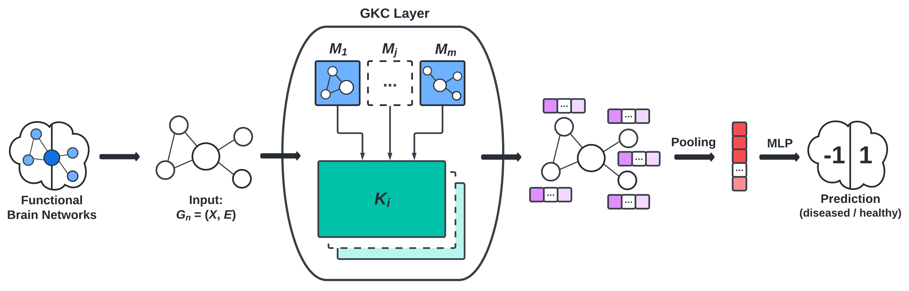

## Overview: Comparing Shallow vs. Deep Brain Network Models

We are comparing and benchmarking the performance of graph kernels and graph neural networks applied to disease classification based on neuroimaging data.
For useful backgraounds and definitions refer to the [definitions](#definitions) section.

## Datasets

We are working with 2 datasets, one classifying human immunodeficiency virus (HIV) and one classifying bipolar disorder (BP). Each dataset consists of functional magnetic resonance imaging (fMRI) scans, diffusion tensor imaging (DTI) scans, and classification labels in the form of integers, where 1 indicates a healthy patient and -1 indicates an unhealthy patient. Both datasets have been cleaned for us and consist of less than 100 patients each. The DTI and FMRI brain scans of each patient $i$ are represented as weighted adjacency matrices $\mathbf{W}_i \in \mathbb{R}^{M \times M}$. FMRI scans are considered to be more robust than DTI scans, so our experiments prioritize working with them. Nodes in the brain network represent regions of interest (ROI), and edge links between nodes indicate the strength of the connection between the two regions. We implemented a rounding scheme to remove edge weights in order to sparsify the adjacency matrices. While this results in a small amount of data loss, it preserves the overall structure of the adjacency matrix and is less computationally expensive than using the original unrounded matrices. 

We further manipulate the data using [BrainGB](https://github.com/HennyJie/BrainGB)'s code to obtain a list of graph objects that can be used with the Python packages [GraKel](https://ysig.github.io/GraKeL/0.1a8/) and [PyG](https://pytorch-geometric.readthedocs.io/en/latest/).

## Classification Task

The standard graph classification task considers the problem of classifying graphs into two or more categories. The goal is to learn a model that maps graphs in the set of graphs $G$ to a set of labels $Y$. In our specific case, we aim to accurately classify patients into categories of either diseased or healthy based on graphs constructed from their brain scan data.

## Methods

methods

### Graph Kernels

<figcaption align = "center"><b>Fig.1 - Support Vector Classifiers with Kernels</b></figcaption>
 

<figcaption align = "center"><b>Fig.2 - Example Architecture of Graph Kernel GNN</b></figcaption>
 

### Graph Neural Networks (GNN's)

<figcaption align = "center"><b>Fig.3 - BrainGB Framework</b></figcaption>
 

## Benchmarks

### BrainGB Benchmark

| Dataset   | Accuracy            | F1                  | AUC                 |
|-----------|---------------------|---------------------|---------------------|
| HIV - GCN | $51.43_{\pm 17.73}$ | $50.61_{\pm 12.87}$ | $49.23_{\pm 17.97}$ |
| BP - GCN  | $61.74_{\pm 11.15}$ | $65.72_{\pm 7.84}$  | $61.06_{\pm 11.24}$ |
| HIV - GAT | $57.14_{\pm 12.78}$ | $59.18_{\pm 21.87}$ | $51.43_{\pm 18.00}$ |
| BP - GAT  | $55.63_{\pm 9.52}$  | $59.03_{\pm 9.54}$  | $55.49_{\pm 9.51}$  |
 

### SVC Benchmark (Weisfeiler-Lehman)

| Dataset         | Threshold = 0.5     | Optimal Threshold*  |
|-----------------|---------------------|---------------------|
| HIV-dti (0.85*) | $51.43_{\pm 17.73}$ | $51.43_{\pm 17.73}$ |
| BP-dti (0.5*)   | $51.43_{\pm 17.73}$ | $51.43_{\pm 17.73}$ |
| HIV-fmri (0.2*) | $51.43_{\pm 17.73}$ | $51.43_{\pm 17.73}$ |
| BP-fmri (0.2*)  | $51.43_{\pm 17.73}$ | $51.43_{\pm 17.73}$ |
 

### SVC Benchmark (Graphlet Sampling, $k=3$)

| Dataset         | Threshold = 0.5     | W-L Optimal Threshold* |
|-----------------|---------------------|------------------------|
| HIV-dti (0.85*) | $51.43_{\pm 17.73}$ | $51.43_{\pm 17.73}$    |
| BP-dti (0.5*)   | $51.43_{\pm 17.73}$ | $51.43_{\pm 17.73}$    |
| HIV-fmri (0.2*) | $51.43_{\pm 17.73}$ | $51.43_{\pm 17.73}$    |
| BP-fmri (0.2*)  | $51.43_{\pm 17.73}$ | $51.43_{\pm 17.73}$    |
 

### Kernel Performance

  
   
  

## Limitations and Discussion

Limitations: data set size, lack of specific understanding of intermediate steps in machine learning processes such as neural networks, extremely limited patient data (size and characteristics) prevents certain controls being implemented and also prevents examining cross-correlations between potential confounding variables, so we have no way of knowing that our model is actually measuring what it is supposed to be measuring other than classification accuracy percentage, which is only locally relevant and may not be generalizable.

Discussion: future research and improvements to study design

## Definitions

defdef

## References

[BrainGB: A Benchmark for Brain Network Analysis with Graph Neural Networks](https://arxiv.org/abs/2204.07054)

[Deep Graph Kernels](https://dl.acm.org/doi/abs/10.1145/2783258.2783417)

[KerGNNs: Interpretable Graph Neural Networks with Graph Kernels](https://www.aaai.org/AAAI22Papers/AAAI-6564.FengA.pdf)