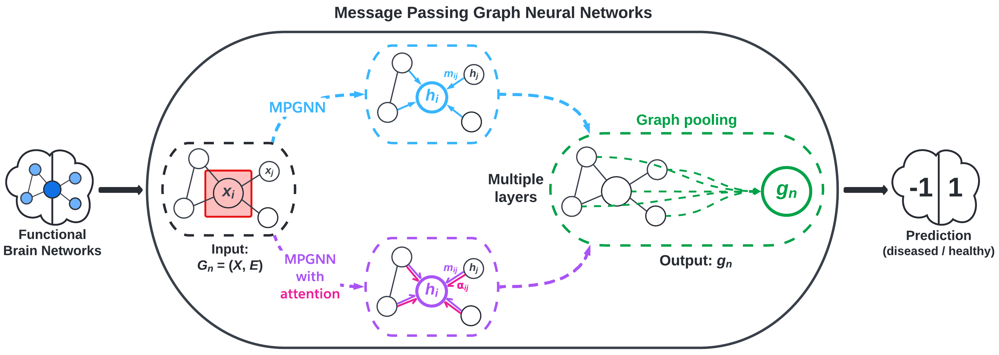

This post was written by Erica Choi, Sally Smith, and Ethan Young and published with minor edits. The team was advised by Professor Carl Yang.
In addition to this post, the team has also created slides for a [midterm presentation](REU_Midterm_Presentation.pdf), a [poster blitz video](https://youtu.be/DLs1PkO8iJo), and a [poster](REU_Poster.pdf).

# Comparing Shallow vs. Deep Brain Network Models

We are comparing and benchmarking the performance of graph kernels and graph neural networks applied to disease classification based on neuroimaging data.
For useful background and definitions refer to [Preliminaries](#preliminaries).

# Datasets

We are working with 2 datasets, one classifying human immunodeficiency virus (HIV) and one classifying bipolar disorder (BP). Each dataset consists of functional magnetic resonance imaging (fMRI) scans, diffusion tensor imaging (DTI) scans, and classification labels in the form of integers, where 1 indicates a healthy patient and -1 indicates an unhealthy patient. Both datasets have been processed for us, as detailed in [Section 3](https://arxiv.org/abs/2204.07054) of the paper authored by Cui et al.

# Problem Formulation
The DTI and FMRI brain scans of each patient $i$ are represented as weighted adjacency matrices $\mathbf{W}_i \in \mathbb{R}^{M \times M}$. FMRI scans are considered to be more robust than DTI scans, so our experiments prioritize working with them. Nodes in the brain network represent regions of interest (ROI), and edge links between nodes indicate the strength of the connection between the two regions.

## Classification Task

The standard graph classification task considers the problem of classifying graphs into two or more categories. The goal is to learn a model that maps graphs in the set of graphs $G$ to a set of labels $Y$. In this project, we aim to accurately classify patients into either diseased or healthy based on graphs constructed from their brain scan data.

## Implementation

For implementation of support vector machines (SVM) with graph kernels, we utilized threshold rounding to remove edge weights and sparsify the adjacency matrices. While this results in information loss, it preserves the overall structure of the adjacency matrices and makes them usable for this particular classification method. Further manipulation creates a list of graph objects that are compatible with the Python package [GraKel](https://ysig.github.io/GraKeL/0.1a8/). 

For implementation of graph convolutional networks (GCN's), we followed [BrainGB](https://github.com/HennyJie/BrainGB)'s code to create a data type that can be used with the Python package [PyG](https://pytorch-geometric.readthedocs.io/en/latest/).

# Methods

## 1. Graph Kernels

<figcaption align = "center"><b>Fig.1 - Support Vector Machines with Kernels</b></figcaption>
 

For SVM, we computed three kernels: Weisfeiler-Lehman (WL), Weisfeiler-Lehman Optimal Assignment (WLOA), and propagation (Prop). The choice of these kernels is motivated by exploiting structural information (i.e., subgraphs) in the brain networks.

### Model Training

To account for the small number of obervations in our datasets, we averaged classification accuracy over 20 different train-test splits. For threshold rounding, we began arbitrarily with a threshold of 0.5. 

We picked an optimal threshold (one that maximized mean classification accuracy) by comparing the performance of thresholds ranging from 0.05 to 0.95 and incrementing by 0.05. We found that for the HIV fMRI data, a threshold of 0.2 was optimal for all graph kernels tested; for the BP fMRI data, a threshold of 0.4 was optimal for all graph kernels tested.

To further improve the model, we also optimized the main parameter for the GraKel graph kernels: the number of iterations. We varied this parameter (ranging from 1 to 20 and incrementing by 1) and ran tests on each value to observe the performance of our classifier.

## 2. Graph Convolutional Networks (GCN's)

<figcaption align = "center"><b>Fig.2 - BrainGB Framework </b></figcaption>
 

We implement message passing GNNs (MPGNN) using the BrainGB Python package,
which is built on the Pytorch and Pytorch Geometric libraries. Figure 2, adapted from [Cui et al.](https://arxiv.org/abs/2204.07054), visualizes the MPGNN architecture.

## 3. Merging Graph Kernels and GNN's

To leverage the higher order structural information given by graph kernels and local information given by GCN's, we implemented GNN's that incorporated various graph kernels (WL, WLOA, etc.) and benchmarked their performance on our dataset. The frameworks of particular interest to us are:
* the graph convolution layer (GKC) proposed by [Cosmo et al.](https://arxiv.org/abs/2112.07436), visualized in Figure 3, and
* the kernel graph neural network (KerGNN) proposed by [Feng et al.](https://www.aaai.org/AAAI22Papers/AAAI-6564.FengA.pdf), visualized in Figure 5.

<figcaption align = "center"><b>Fig.3 - GKNN Framework</b></figcaption>
 

<figcaption align = "center"><b>Fig.5 - KerGNN Framework</b></figcaption>
 

# Benchmarks

## BrainGB Classification Accuracy (Test Set)

| Dataset   | Accuracy            | F1                  | AUC                 |
|-----------|---------------------|---------------------|---------------------|
| HIV-GCN (concat)      | $0.64_{\pm 0.15}$ | $0.59_{\pm 0.20}$ | $0.77_{\pm 0.20}$ |
| HIV-GAT (concat)      | $0.73_{\pm 0.16}$ | $0.71_{\pm 0.17}$ | $0.81_{\pm 0.19}$ |
| HIV-GCN (edge concat) | $0.71_{\pm 0.11}$ | $0.69_{\pm 0.12}$ | $0.77_{\pm 0.17}$ |
| HIV-GAT (edge concat) | $0.69_{\pm 0.18}$ | $0.67_{\pm 0.19}$ | $0.73_{\pm 0.24}$ |
| BP-GCN (concat)       | $0.53_{\pm 0.13}$ | $0.51_{\pm 0.14}$  | $0.54_{\pm 0.16}$ |
| BP-GAT (concat)       | $0.53_{\pm 0.13}$  | $0.50_{\pm 0.13}$  | $0.57_{\pm 0.19}$  |
| BP-GCN (edge concat)  | $0.63_{\pm 0.12}$ | $0.61_{\pm 0.13}$  | $0.61_{\pm 0.17}$ |
| BP-GAT (edge concat)  | $0.52_{\pm 0.17}$  | $0.51_{\pm 0.16}$  | $0.59_{\pm 0.19}$  |

Both HIV and BP datasets were tested using GCN and GAT as labeled in the table. "Concat" and "edge concat" denote the message passing mechanism that was used in the experiment.

 

## SVC Classification Accuracy (Test Set)

| Dataset         | Threshold = 0.5     | Optimal Threshold*  | 
|-----------------|---------------------|---------------------|
| HIV-WL (0.2*)   | $0.59_{\pm 0.18}$   | $0.65_{\pm 0.17}$   |
| HIV-WLOA (0.2*) | $0.59_{\pm 0.18}$   | $0.64_{\pm 0.15}$   |
| HIV-Prop (0.2*) | $0.63_{\pm 0.18}$   | $0.66_{\pm 0.15}$   |
| BP-WL (0.4*)    | $0.53_{\pm 0.14}$   | $0.63_{\pm 0.19}$   |
| BP-WLOA (0.4*)  | $0.54_{\pm 0.15}$   | $0.63_{\pm 0.18}$   |
| BP-Prop (0.4*)  | $0.54_{\pm 0.13}$   | $0.60_{\pm 0.17}$   |
 

## Kernel Parameter Tests

   
  
  

# Discussion

## Limitations

Due to our datasets consisting of less than 100 patients each, our results may not generalize well beyond our specific dataset. If this study were to be replicated, a larger dataset would be ideal, but the expensive nature of brain imaging data and its processing requirements will pose some degree of limitation to any study that uses it. Additionally, brain imaging data is a highly protected data type due to the right to privacy of the patients whose brain scans are used in these experiments. This means that very little demographic data is available to researchers in conjunction with brain imaging data, if any is included at all.

Another notable limitation is that of structure of the brain networks themselves. Specifically, it remains unclear what subgraphs and higher-order information are relevant in classifying brain scans as belonging to diseased or healthy individuals.

## Future Work

There are many avenues with which we may take future research in brain network classification. There are many ways of incorporating graph kernels into GNN's that improve the interpretability of the model, which in turn gives insights into the key underlying structures that help to classify brain networks.

# Preliminaries

For technical details of implementing support vector classifiers (SVC) using the Python package [sklearn](https://scikit-learn.org/stable/), see this [link](https://scikit-learn.org/stable/modules/generated/sklearn.svm.SVC.html).

For the mathematical theory underlying SVC, see this [blog post](https://towardsdatascience.com/support-vector-machine-introduction-to-machine-learning-algorithms-934a444fca47).

For a survey of graph kernels, see this [paper](https://arxiv.org/abs/1903.11835).

For an introduction to graph neural networks (GNN's), see this [blog post](https://distill.pub/2021/gnn-intro/).

# References

[BrainGB: A Benchmark for Brain Network Analysis with Graph Neural Networks](https://arxiv.org/abs/2204.07054)

[BrainNNExplainer: An Interpretable Graph Neural Network Framework for Brain Network based Disease Analysis](https://arxiv.org/abs/2107.05097)

[Deep Graph Kernels](https://dl.acm.org/doi/abs/10.1145/2783258.2783417)

[Graph Kernel Neural Networks](https://arxiv.org/abs/2112.07436)

[KerGNNs: Interpretable Graph Neural Networks with Graph Kernels](https://www.aaai.org/AAAI22Papers/AAAI-6564.FengA.pdf)