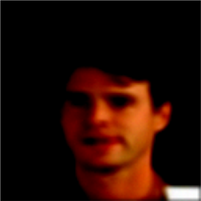
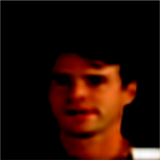

This post was written by Linghai Liu, Allen Tong, and Lisa Zhao and published with minor edits. The team was advised by Dr. Samy Wu Fung. In addition to this post, the team has also given a [midterm presentation](Midterm_Presentation_TeamJFB.pdf), filmed a [poster blitz video](https://youtu.be/oIwL3E2yULg), created a [poster](REURET_Poster_Team_JFB.pdf), published [code](https://github.com/lliu58b/Jacobian-free-Backprop-Implicit-Networks), and written a paper. 

## What are Inverse Problems?
Inverse problems consist of recovering a signal $x^\ast$ (e.g. an image, a parameter of a PDE, etc.) from indirect, noisy measurements $d$. These problems arise in many applications such as medical imaging, computer vision, geophysical imaging, etc. 

This measurement process is usually modeled as an operator $\mathcal{A}$, satisfying the following equation: 
$$ d = \mathcal{A} x^\ast + \varepsilon, $$
Since our project deals with image deblurring, we have the following variables:
- $d \in \mathbb{R}^{n \times n}$: blurred image with noise
- $x^\ast \in \mathbb{R}^{n \times n}$: original image
- $\varepsilon \in \mathbb{R}^{n \times n}$: random **unknown** noise 

## Solving Inverse Problems from a Classical Approach
Using direct inverse we have:
$$ d = \mathcal{A} x^\ast + \varepsilon \Longrightarrow x^\ast =  \mathcal{A}^{-1} d - \mathcal{A}^{-1} \varepsilon $$
However, since $\varepsilon$ is unknown, directly inverting may end up amplifying this noise factor⁠. Because of this noise corruption, the reconstructed image ends up being unrecognizable. 

To better visulaize this, we have the following set of pictures: 

  

In order to minimize the noise factor, we want to formulate an optimization problem as follows:
$$ x^\ast = \underset{x \in \mathbb{R}^{n \times n}}{\arg\min} \ \frac{1}{2}|| \mathcal{A}x - d ||^2_{L^2} + \lambda R(x)$$

This equation is essentially finding the minimium distance between the reconstructed image and the observed blurred image, plus a regularizer $R(x)$. 

This regularizer is chosen based on prior knowledge of the data; this can often lead to inaccuracies—meaning the reconstructed image will be a bit blurry. 

For example, using a gradient descent scheme where $R(x) = \frac{\lambda}{2} ||x||_{L^2}^2$ (this helps stabilize the reconstruction), we have the following set of pictures: 

  

We see that the reconstructed image using gradient descent is a huge improvement from direct inverse; however, there are still blurry areas we can improve on. In search of a better method, we turn towards implicit learning.  

## Implicit Deep Learning
The issue with the classical approach is that the regularizer is chosen heristically. To combat this, our approach now is to utilize data to **learn** and **train** the regularizer.

To do this we mimic gradient descent, but replace the gradient of the regularizer, $\lambda \nabla_x R$, with a trainable network. 

<!-- $$x^{k}_i - \eta \left(\nabla_x ||\mathcal{A}x^k_i - d_i||_{L^2}^2 + S_\Theta (x^k_i) \right)$$

where we have the following variables: 
- $\eta >0$ is step size
- $T_\Theta(\cdot)$ is a layer of our neural network $\mathcal{N}_\Theta(\cdot)$
- $K$ is the number of layers -->

However, this creates some problems concerning memory cost and the number of layers, $K$, in our neural network. The memory grows linearly as $K$—chosen heuristically—increases. 

With implicit deep learning we send $K \to \infty$ until we find a fixed point of a single layer $T_\Theta(\cdot)$. 

<!-- In other words, $x_i^\ast = T_\Theta (x_i^\ast)$. The output is given the image $d_i$, $\mathcal{N}_\Theta (d_i) := x_i^\ast$  -->

## Implicit Backpropagation 
Suppose now we have found a fixed point $x^\ast$ for a single layer. Then, $$ x^\ast = T_\Theta (x^\ast) $$

With implicit differentiation, 
    
$$ \frac{d x^\ast}{d \Theta} = \frac{d T_\Theta (x^\ast)}{d x^\ast} \frac{d x^\ast}{d \Theta} + \frac{\partial T_\Theta (x^\ast)}{\partial \Theta}$$

$$\Longrightarrow \left( I - \frac{d T_\Theta (x^\ast)}{d x^\ast}\right) \frac{d x^\ast}{d \Theta} =  \frac{\partial T_\Theta (x^\ast)}{\partial \Theta}$$ 

<!-- So the update rule of trainable parameters becomes: 
$$ \Theta \leftarrow \Theta - \alpha \frac{d \ell}{d x^\ast} \left( I - \frac{d T_\Theta (x^\ast)}{d x^\ast}\right) ^{-1} \frac{\partial T_\Theta (x^\ast)}{\partial \Theta}$$
where $\alpha > 0$ is the learning rate. 

However, solving this is highly nontrivial, which is a potential problem.  -->

However, solving for $$\left( I - \frac{d T_\Theta (x^\ast)}{d x^\ast}\right)^{-1} \frac{\partial T_\Theta (x^\ast)}{\partial \Theta}$$ is very expensive.

To circumvent this issue, we use a recently proposed method called Jacobian-Free Backpropagation.

## Jacobian-Free Backpropagation (JFB)
The goal of JFB is to alleviate memory requirement and avoid high computational cost in implicit networks. 

The key idea is to replace the problematic Jacobian $$\left( I - \frac{d T_\Theta (x^\ast)}{d x^\ast}\right)$$ with the identity matrix $I$. 

To calculate the true gradient using implicit networks we have the following equation: 

$$\nabla_\Theta \ell = \frac{d \ell}{d x^\ast} \left( I - \frac{d T_\Theta (x^\ast)}{d x^\ast}\right) ^{-1} \frac{\partial T_\Theta (x^\ast)}{\partial \Theta}$$

But if we use JFB to approximate the gradient we get: 
$$p_\Theta = \frac{d \ell}{d x^\ast} \frac{\partial T_\Theta (x^\ast)}{\partial \Theta}$$ 
which is a descent direction for the loss $\ell$. 

Utilizing JFB, we avoid computing the Jacobian term. As a result, implicit networks are trained faster and more easily implemented.  

Note: the JFB approach relies on a set of conditions to be true:
- $T_\Theta$ is contraction mapping with Lipschitz constant $\gamma$
- $T_\Theta$ is continuously differentiable w.r.t. $\Theta$
- $M := \frac{\partial T_\Theta}{\partial \Theta}$ has full column rank 
- $M$ is well-conditioned, i.e., $\kappa (M^T M) < \frac{1}{\gamma}$

<!-- ## Proximal Gradient Descent 
Given: dataset $\{(d_i, X_i)\}_{i=1}^{N}$, where $\{d_i\}$ is the set of blurred images and $\{X_i\}$ is the set of ground truths. All images are RGB $n \times n$. 

Our goal is to design a weight-tying neural network, where each layer is a map $T_{\Theta}: \mathbb{R}^{n^2} \mapsto \mathbb{R}^{n^2}$. 

Given an input pair $(d, X)$, we start with an initial guess $x_0$. 

Define $x_{k+1} = T_\Theta (x_k)$

We find a fix point $x^*$ satisfying 
$$ x^\ast = T_\Theta (x^\ast ; d) \quad \cdots (\ast)$$

Then use $\mathcal{N}_\Theta(d) := x^\ast=T(x^\ast)$ as the output of our neural network. 

For DE-GRAD, we choose $$T_\Theta (x) = x - \eta [\mathcal{A}^T (\mathcal{A} x - d) + R_\Theta (x)]$$
where $\eta > 0$ is chosen step size and $R_\Theta (\cdot)$ is to be trained. 
Suppose we would like to train this neural network using loss function $\ell$. 

Then using implicit differentiation on $(\ast)$, 
$$\frac{d x^\ast}{d \Theta} = \frac{d T_\Theta}{d \Theta} = \frac{d T_\Theta}{d x^\ast} \frac{d x^\ast}{d \Theta} \Longleftrightarrow \frac{d x^\ast}{d \Theta} = \left( I - \frac{d T_\Theta (x^\ast; d)}{d x^\ast}\right) ^{-1} \frac{\partial T_\Theta (x^\ast; d)}{\partial \Theta}$$

The architecture that we use for $R_\Theta (\cdot)$ is Denoising Convolutional Neural Network (DnCNN), proposed by _Zhang, Kai, et al. (2017)_. 

Based on the equation above we have, 
$$\frac{d \ell}{d \Theta} = \frac{d \ell}{d \mathcal{N}_\Theta} \frac{d \mathcal{N}}{d \Theta} = \frac{d \ell}{d \mathcal{N}_\Theta} \frac{d x^\ast}{d \Theta} = \frac{d \ell}{d \mathcal{N}_\Theta} \left( I - \frac{d T_\Theta (x^\ast; d)}{d x^\ast}\right) ^{-1} \frac{\partial T_\Theta (x^\ast; d)}{\partial \Theta}$$ -->

## Numerical Experiments
In our project we used the CelebA dataset, which consist of annotated celebrity faces. The images are categorized into various sections based on specific features that the celebrities have. For example, whether or not they have bangs, wear glasses, have a pointy nose, etc. 

<!-- Training with JFB we have the following results:

  

where the the blurred noisy image has PSNR = 21.57, SSIM = 0.80 and the reconstructed image has PSNR = 25.69, SSIM = 0.86. -->

## Results
The results are as follows

Note: Two metrics are commonly used for assessing the quality of reconstructed images: the peak-signal-to-noise ratio (PSNR, a positive number, best at $+\infty$) and the structural similarity index measure (SSIM, also positive, best at $1$).

## Acknowledgements
We sincerely thank the guidance of our mentor, Dr. Samy Wu Fung, and other mentors at Emory University for the opportunity. This work is supported in part by the US National Science Foundation awards DMS-2051019 and DMS-1751636.