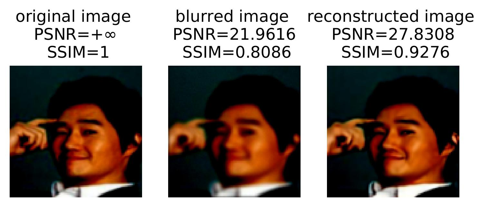

This post was written by Linghai Liu, Shuaicheng Tong, and Lisa Zhao and published with minor edits. The team was advised by Dr. Samy Wu Fung. In addition to this post, the team has also given a [midterm presentation](Midterm_Presentation_TeamJFB.pdf), filmed a [poster blitz video](https://youtu.be/oIwL3E2yULg), created a [poster](REURET_Poster_Team_JFB.pdf), published [code](https://github.com/lliu58b/Jacobian-free-Backprop-Implicit-Networks), and written a [paper](Manuscript_JFB.pdf). 

## What are Inverse Problems?
Inverse problems consist of recovering a signal $x^\ast$ (e.g. an image, a parameter of a PDE, etc.) from indirect, noisy measurements $d$. These problems arise in many applications such as medical imaging, computer vision, geophysical imaging, etc. 

This measurement process is usually modeled as an operator $\mathcal{A}$, satisfying the following equation: 
$$ d = \mathcal{A} x^\ast + \boldsymbol{\varepsilon}$$
where $\mathcal{A}$ is a mapping from signal space $\mathbb{R}^n$ of original images to measurement space $\mathbb{R}^m$.
Since our project deals with image deblurring, we have the following variables:
- $d \in \mathbb{R}^{n}$: blurred image with noise
- $x^\ast \in \mathbb{R}^{n}$: original image
- $\boldsymbol{\varepsilon} \in \mathbb{R}^{m}$: random **unknown** noise

## Solving Inverse Problems from a Classical Approach
Using direct inverse we have:
$$ d = \mathcal{A} x^\ast + \boldsymbol{\varepsilon} \Longrightarrow x^\ast =  \mathcal{A}^{-1} d - \mathcal{A}^{-1} \boldsymbol{\varepsilon} $$
However, since $\boldsymbol{\varepsilon}$ is unknown, directly inverting may end up amplifying this noise factor⁠. Because of this noise corruption, the reconstructed image ends up being unrecognizable. 

To better visulaize this, we have the following set of pictures: 

  

In order to minimize the noise factor, we want to formulate a regularized optimization problem.

We essentially want to find the minimium distance between the reconstructed image and the observed blurred image, plus a regularizer $R(x)$. 

This regularizer is chosen based on prior knowledge of the data; this can often lead to inaccuracies—meaning the reconstructed image will be a bit blurry. 

For example, using a gradient descent scheme where we handpick a regularizer to help stabilize the reconstruction, we have the following set of pictures: 

  

We see that the reconstructed image using gradient descent is a huge improvement from direct inverse; however, there are still blurry areas we can improve on. In search of a better method, we turn towards implicit learning.  

## Implicit Deep Learning
The issue with the classical approach is that the regularizer is chosen heristically. To combat this, our approach now is to utilize data to **learn** and **train** the regularizer.

To do this we mimic gradient descent, but replace the gradient of the regularizer, $\lambda \nabla_x R$, with a trainable network. 

However, this creates some problems concerning memory cost and the number of layers, $K$, in our neural network. The memory grows linearly as $K$—chosen heuristically—increases. 

With implicit deep learning we send $K \to \infty$ until we find a fixed point of a single layer $T_\Theta(\cdot)$. 

## Implicit Backpropagation 
Suppose now we have found a fixed point $x^\ast$ for a single layer. Then, $$ x^\ast = T_\Theta (x^\ast) $$

Using implicit differentiation on the equation above we have, 

$$\frac{d x^\ast}{d \Theta} = \left( I - \frac{d T_\Theta (x^\ast)}{d x^\ast}\right)^{-1} \frac{\partial T_\Theta (x^\ast)}{\partial \Theta}$$ 

However, solving this is very expensive because of the inverse term.

To circumvent this issue, we use a recently proposed method called Jacobian-Free Backpropagation.

## Jacobian-Free Backpropagation (JFB)
The goal of JFB is to alleviate memory requirement and avoid high computational cost in implicit networks. 

The key idea is to replace the problematic Jacobian $$\left( I - \frac{d T_\Theta (x^\ast)}{d x^\ast}\right)$$ with the identity matrix $I$. 

For a comparison, if we were to calculate the true gradient using implicit networks we have the following equation: 

$$\nabla_\Theta \ell = \frac{d \ell}{d x^\ast} \left( I - \frac{d T_\Theta (x^\ast)}{d x^\ast}\right) ^{-1} \frac{\partial T_\Theta (x^\ast)}{\partial \Theta}$$

Using JFB to approximate the gradient we only need to solve: 
$$p_\Theta = \frac{d \ell}{d x^\ast} \frac{\partial T_\Theta (x^\ast)}{\partial \Theta}$$ 
which is a descent direction for the loss $\ell$. 

Utilizing JFB, we avoid computing the Jacobian term. As a result, implicit networks are trained faster and more easily implemented.  

Note: the JFB approach relies on a set of conditions to be true:
- $T_\Theta$ is contraction mapping with Lipschitz constant $\gamma$
- $T_\Theta$ is continuously differentiable w.r.t. $\Theta$
- $M := \frac{\partial T_\Theta}{\partial \Theta}$ has full column rank 
- $M$ is well-conditioned, i.e., $\kappa (M^T M) < \frac{1}{\gamma}$

## Numerical Experiments
In our project we used the CelebA dataset, which consist of annotated celebrity faces. The images are categorized into various sections based on specific features that the celebrities have. For example, whether or not they have bangs, wear glasses, have a pointy nose, etc. 

## Results
The results are as follows

From the graph we see that the loss is decreasing as the number of epochs increases. An epoch is one complete pass of the entire dataset through our algorithm. 

Note: Two metrics are commonly used for assessing the quality of reconstructed images: the peak-signal-to-noise ratio (PSNR, a positive number, best at $+\infty$) and the structural similarity index measure (SSIM, also positive, best at $1$).

## Acknowledgements
We sincerely thank the guidance of our mentor, Dr. Samy Wu Fung, and other mentors at Emory University for the opportunity.

## More About the Team
**Linghai Liu** is a rising senior at Brown University, double concentrating in applied mathematics - computer science and mathematics. His main interests lie at the intersection of statistical theory, machine learning, and optimization. Outside of work, he enjoys reading novels and watching animes. 

**Shuaicheng Tong** is a rising junior at the University of California, Los Angeles, majoring in applied mathematics and minoring in statistics. He is interested in optimization and machine learning. He volunteers at the UCLA Statistics Club where he tutors mathematics and statistics. Outside of school, he enjoys working out, hiking, and watching Star Wars shows.

**Lisa Zhao** is a rising sophomore at the University of California, Berkeley, double majoring in statistics and economics. She is interested in learning  about how statistics is used as a powerful tool in finance. Outside of work, she enjoys swimming, drawing, and watching TV shows.