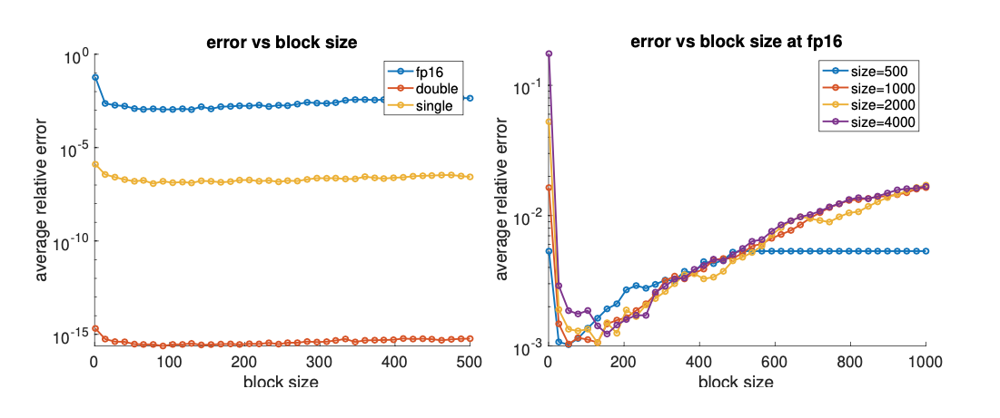

This post was written by Xiaoyun Gong, Yizhou Chen, and Xiang Ji and published with minor edits. The team was advised by Dr. James Nagy. In addition to this post, the team has also created slides for a [midterm presentation](REUmidterm_presentation.pdf
), a [poster blitz]() video, [code](), and a [paper]().

## In One Sentence:
Our group works on experimenting with iterative methods for solving inverse problems at different precision levels. 

 

Figure 1: screenshot from <em>the Legend of Zelda - Breath of the Wild</em>

## Background: Why Low Precision?
What is the most important aspect for an excellent gaming experience? A lot of people would answer real-time! Everyone want their games to be fast, and it is always a bummer that the screen freezes during a critical combat. This is why we are investigating low precision arithmetic: to decrease the computation time and speed things up.

Nowadays, most computer systems operate on double precision (64-bit) arithmetic. However, if we decrease the number of bits for each number to 16 bits or even lower, the processing time can be much significantly reduced, although the benefit comes at the cost of a loss of accuracy.

 

Figure 1: screenshot from <em>the Legend of Zelda - Breath of the Wild</em>

## Simulating Low Precision

### Matlab function chop
To simulate low precision arithmetic on our 64-bit computers, we have imported a MATLAB package called chop. The toolbox allows us to explore single precision, half precision, and other customized formats. Each input needs to be transformed, but the real work comes from chopping each operation. The code below is a toy example of how to calculate $x + y \times z$ in half precision with chop.

 

### Blocking
When the number is being chopped from double precision to half precision, a lot of bits are dropped (from 64 bits to 16 bits). This would certainly cause a level of inaccuracy, so in order to reduce the errors a method called blocking is used. Blocking is the same as breaking a large operation into smaller chunks, where each is computed independently and the result is summed. 

For example, there are two vectors of 6 elements:

x = [x1, x2, x3, x4, x5, x6], y = [y1, y2, y3, y4, y5, y6].

If we want to calculate the inner product between these two, instead of calculating them directly, we could break them into different groups, 2 in this case. Then, we have: 

x1 = [x1, x2, x3], y1 = [y1, y2, y3];
x2 = [x4, x5, x6], y2 = [y4, y5, y6].

We calculate the inner product between x1 y1, and x2 y2, and at last we sum them up. The result we get is more accurate, and we plot the error diagram of inner product of tow random vectors. We do the inner product for each precision and block size for 20 times and calculate the average. The diagrams are the following, and the error are computed as the difference between the result of using chopped version of inner product function and using the function in matlab. 

 

In the graph on the left hand side, the errors of half precision is the lagrgest, which makes sense because it has the least bits. If we take a closer look at only half precision, we get the right-hand-side graph. The errors decrease sharply when blocking method is introduced. However, the larger block size doesn't necessarily mean lower errors, as the graph suggested: the errors increase as the block size keeps growing. That's because when the block size is large, it's the same as doing no blocking at all. For example, for the size-500 vector, as long as the block size reaches 500, it means just putting the whole vector into the first block, the same as when block size is 0. Therefore, the line becomes flat staring from block size is 500. It is reasonable to say that which block size is better depends on the problem size, so we use 258 as our default block size in our codes, because the matrix dimension is rather large in our problem.

## Inverse Problems and Iterative Methods
Inverse problems are problems where our goal is to find the internal or hidden information (input) from outside measurements (result). The internal data can be approximated by iterative methods, a repeating implementation of the same system of equations, with variables getting updated each round, hoping the value generated can be closer to the ture value we want each term. 

### Conjugate Gradient Method
The conjugate gradient algorithm aims to solve the linear system Ax = b where A is SPD (symmetric and positive definite). 

In a very clever way, conjugate gradient method transforms the problem of finding solution to an optimization problem where we want to minimize 
$\phi(x)=\frac{1}{2}x^{T}Ax-x^{T}b$. This can be easily seen from $\nabla \phi (x) = 0$ -> $Ax-b=0$.

How this algorithm works is that in each iteration, x is allowed to explore one more subspace in addition to the previous subspaces it has already explored (the subspaces here are the Krylov Spaces!). During that iteration, x is updated to the point where the residual norm ||Ax-b|| is minimized. Mathematically (meaning no noise or round-off errors), CG is guaranteed to converge within a limited number of steps. Specifically if A is a nxn matrix, it will find the solution in no greater than n steps.

The CGLS algorithm is the least squares version of the CG method. To add the taste of least squares to the original problem, A -> ATA and b -> ATb.

One potential problem with this method is that it requires the calculation of inner products, which easily gets overflowed when we are at low precision. Therefore we tried another method below that avoids the use of inner products.

### Chebyshev Semi-Iterative Method

The CS method requires no inner product computation, which is great. But there is always the trade-off! CS method needs the user to have an idea of the range of eigenvalues of the matrix A. The result given by CS is a linear combination of all solutions in each iteration, and the weights are obtained from the Chebyshev polynomial, which has the favorable property of having an absolute value no greater than 1 on the interval [-1,1] and grow rapidly outside this interval. This ensures that the result obtained in each iteration of CS is smaller than a upper bound.

## Experiment!!

### IR Tools

### Image Deblurring
First, we use our modified version of cgls without regularization to run the image deblurring problem, and we use the function called PRshowx to plot the graph generated from x value in the last iteration. At the beginning we didn’t add any noise to the b in the problem of Ax = b, and the graphs are put below. 

 

For the double precision, we used the original cgls method because it’s faster and we could have a reference. We used cgls_chop for the single and half precision, and the graph in single precision is similar to the graph in double precision. However, for the half precision, the background is not the same as that in double-precision or half-precision graph. The background looks redder and there are red and black squiggly lines.

We also plotted the error norms of the x value we get in compared to the true value of x in different precision. 

 

From the graph, all three lines overlap from the beginning until around 20 iterations, where the half precision line differs, starting to go up. It’s due to the round up errors of the half precision, which adds up and takes over. Also, the line of half precision stops at around 30 iterations, because at 28th iteration, we get infinities, so the next few iterations generate nothing but NaNs. 

After investigating the idealized situations where there is no noise in the output image, we then apply our code to graphs that are mixed with random noise to see how it is likely to perform in real life.

For single precision arithmetic, with 0.1% noise, the picture looks almost the same as the one that contains no noise. However, if the noise level is increased to 1%, the background turns into random red ripples while the middle object is still identifiable. Noise has taken over the black background but not the satellite yet. Eventually, the whole image is flushed with the noisy ripples with 10% noise; the picture no longer contains any meaningful information.

It is the same case with half precision arithmetic as well. 0.1% noise has almost no influence on the image, while 1% random data confuses the background, and 10% noise kills the graph.

Now we turn our attention to the error norm, the difference between the original image and the one our algorithm generates. When 0.1% noise is added, as the number of iterations goes up, the error norm reduces significantly across all three formats, which is what is expected from CGLS. Intriguingly, for images with 1% or 10% noise, the best reconstruction is not the last iteration but somewhere along the middle (it’s around the 50th iteration for 1% and 10th for 10%). The reason behind the phenomenon is that while we are transforming the output image, b, along each iteration, the blended noise also gets inverted. Eventually, the random data accumulates and dominates the solution at some point. Please also notice that we are showing the images constructed from the last iteration rather than the best one, since we do not have information on the true image in real life situations, and thus the error norm and the best iteration are unknown.

### Tomography Reconstruction
Below is the result when we run CGLS on the test problem at different precision levels. We can see for double and single precision, the reconstruction is doing well, yet for the fp16 problem we started to get this completely blue picture from the first iteration.

 

After we took a closer look at the results the algorithm outputs, we noticed that they are all NaNs!

If we go back to the algorithm, we can see that it is because overflow occurs when calculating inner products. Inner products gets overflowed easily! And once we get the first Inf/-Inf, NaNs would start to appear as we have Inf devided by Inf.

Our solution to this is that we recaled Both A and b by dividing both of them by 100. And we get the result below:

 

which is still blurry but at least the shape is visible :)

And then we add noise to the right hand side b, and plotted the error norms below:

 

As in the image deblurring problem, the error norm first decreases then increases. In the cases with noise, this is mainly because noise started to take over in later part of the iteration. We still see the same behavior in the test problem even without noise at fp16. This is because the truncation errors got accumulated as the iteration goes on.

We show an intersting case we came across when experimenting with the test problems here, which is also the tomography reconstruction problem, and the result we get below looks nothing like what it should be at all 😹

 

We go back to the algorithm again and print out calculation at each step. We notice that it is also getting overflow in a matrix-vector multiplication from the first iteration. However, interestingly, this overflow does not result in NaNs. Instead, it make the x in the first iteration underflows to zero! 
