This post was written by [Xiaoyun Gong](https://github.com/kristinagxy), [Yizhou Chen](https://github.com/RileyCYZ), and [Xiang Ji](https://github.com/zoejix) and published with minor edits. The team was advised by Dr. [James Nagy](https://github.com/jnagy1). In addition to this post, the team has also created slides for a [midterm presentation](REUmidterm_presentation.pdf
), a [poster blitz](https://www.dropbox.com/s/139l0u7zi6eloao/mixed-precision.mp4?dl=0) video, [code](https://github.com/kristinagxy/REU_code), and a [paper]().

## In One Sentence:
Our group works on experimenting with iterative methods for solving inverse problems at different precision levels. 

## Background: Why Low Precision?
What is the most important aspect for an excellent gaming experience? A lot of people would answer real-time! Everyone wants their games to be fast, and it is always a bummer that the screen freezes during a critical combat. This is why we are investigating low precision arithmetic: to decrease the computation time and speed things up.

Nowadays, most computer systems operate on double precision (64-bit) arithmetic. However, if we decrease the number of bits for each number to 16 bits or even lower, the processing time can be much significantly reduced, although the benefit comes at the cost of a loss of accuracy.

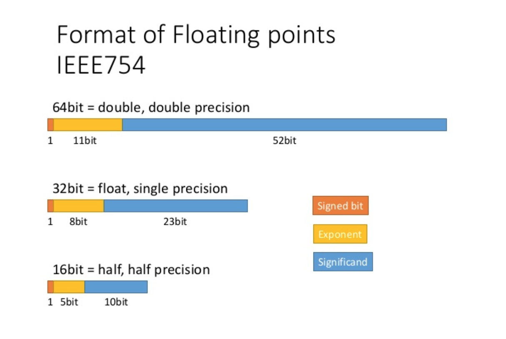 

<em>Using tensor cores for mixed-precision scientific computing.
Oct-2021. url: https://developer.nvidia.com/blog/tensor-cores-mixed-precision-scientific-computing/
</em>

## Simulating Low Precision

### Matlab function chop
To simulate low precision arithmetic on our 64-bit computers, we have imported a MATLAB package called [chop](https://www.mathworks.com/matlabcentral/fileexchange/70651-chop?s_tid=mwa_osa_a). The toolbox allows us to explore single precision, half precision, and other customized formats. Each input needs to be transformed, but the real work comes from chopping each operation. The code below is a toy example of how to calculate $x + y \times z$ in half precision with chop.

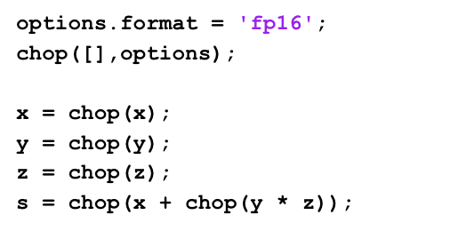 

### Blocking
When the number is being chopped from double precision to half precision, a lot of bits are dropped (from 64 bits to 16 bits). This would certainly cause a level of inaccuracy, so in order to reduce the errors, a method called blocking is used. Blocking is the same as breaking a large operation into smaller chunks, where each is computed independently and the result is then summed. 

We compute the inner product for each precision and block size for 20 times and calculate the average. The errors are calculated as the differences between the result of using the chopped version of inner product function and the built-in function in matlab. 

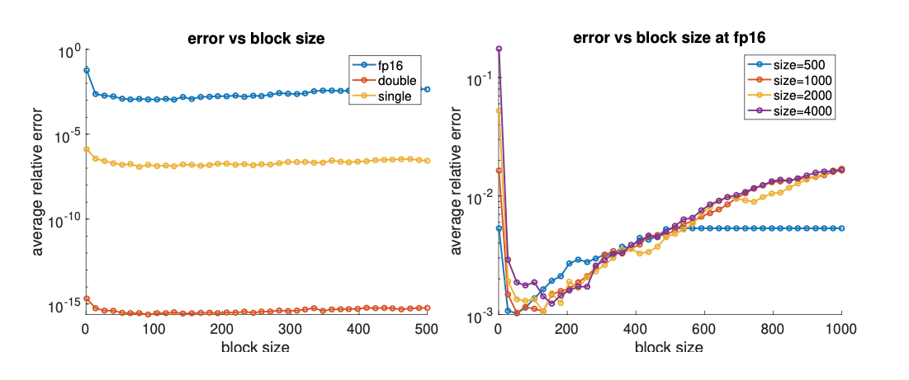 

On the left-hand side of the graph where the size of the vector is 1000, the errors of half precision are the largest because it has the least bits. If we take a closer look at only half precision, we get the graph on the right with different vector sizes. The errors decrease sharply when the blocking method is introduced. However, larger block sizes do not necessarily mean lower errors, as the graph suggested: the errors increase again as the block size keeps growing. That is because when the block size is large, it's the same as doing no blocking at all. For example, for a size-500 vector, once the block size reaches 500, it just means putting the whole vector into the first block, the same as when blocking is not introduced. Therefore, the line becomes flat from 500. We use 256 as our default block size in our codes because the matrix dimension is rather large in our problem.

## Inverse Problems and Iterative Methods
Inverse problems are problems where our goal is to find the internal or hidden information (inputs) from outside measurements (results). The internal data can be approximated by iterative methods, a repeating implementation of the same system of equations, with variables getting updated each round, hoping the value generated can be closer to the true value we desire each term. 

### Conjugate Gradient Method
The [Conjugate Gradient algorithm](https://www.cs.cmu.edu/~quake-papers/painless-conjugate-gradient.pdf) (CG) aims to solve the linear system Ax = b where A is SPD (symmetric and positive definite),transforming the problem of finding solution to an optimization problem where we want to minimize $\phi(x)=\frac{1}{2}x^{T}Ax-x^{T}b$. This can be easily seen from $\nabla \phi (x) = 0$ -> $Ax-b=0$.

In each step, the method provides us with a search direction and a step-length so that the error of this iteration is A-orthogonal to the search direction of the previous iteration. Eventually, it will converge to the minimal point. The CGLS algorithm is the least-squares version of the CG method, applied to the normal equation ATAx = ATb. However, CGLS requires computing inner products, which can overflow for large-scale problems in low precision.

### Chebyshev Semi-Iterative Method

The Chebyshev Semi-Iterative (CS) Method requires no inner product computation, which is great because inner products can cause overflow easily in low precision. But there is always the trade-off! The CS method requires the user to have an idea of the range of the matrix A's eigenvalues. The result given by CS is a linear combination of all solutions in each iteration, and the weights are obtained from the Chebyshev polynomial, which has the favorable property to ensure that the result obtained in each iteration of CS is smaller than an upper bound.

## Experiment!!

### IR Tools
We modify the CGLS method in the [IRtool](https://github.com/jnagy1/IRtools.git) package in Matlab so that it can operate in lower precision, and we use two test problems in the same package to investigate how the method performs at lower precision, mainly half precision. 
### Image Deblurring Using CGLS
First, we use our modified version of CGLS without regularization to solve the image deblurring problem. In this application, we solve Ax = b, where b is an observed blurred image, A is a matrix that models the blurring operation, and x is the desired clean image. We didn’t add any noise to b in the problem of Ax = b at the beginning, and the graphs are demonstrated below. 

 

We use our modified version of CGLS for single and half precision, and the graph in single precision is similar to the graph in double precision. However, for half precision, the background is not the same as that in the double-precision or single-precision graph; it contains more artifacts.

We also plot the error norms of the solution at each iteration using different precision levels. 

 

From the graph, all three error norms overlap from the beginning until around the 20th iteration, where the half-precision errors begin to deviate from those in single and double precision. The difference is due to the round-off errors of half precision, which add up and take over. Besides, the error norms for half precision terminates at the 28th iteration because overflow of inner products causes NaNs (Not a Number) to be computed during the iteration.

After investigating the idealized situations where there is no noise in the observed image, we then apply our code to problems that contains additive random noise to see how it is likely to perform in real life. That is, we try to compute x from the observed image b = Ax + noise.

For half precision, with 0.1% noise, the picture looks almost the same as the one that contains no noise. However, if the noise level is increased to 1%, the background has substantially more artifacts, while the middle object is still identifiable. Noise has taken over the black background but not the satellite yet. Eventually, the whole image is flushed with the noisy ripples with 10% noise; the picture no longer contains any meaningful information.

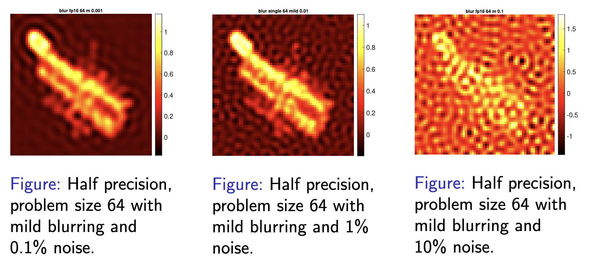 

Now we turn our attention to the error norm, the difference between the original image and the one our algorithm generates at each iteration. When 0.1% noise is added, as the number of iterations goes up, the error norm reduces significantly across all three formats. Intriguingly, for images with 1% or 10% noise, the best reconstruction is not the last iteration but somewhere along the middle (it’s around the 50th iteration for 1% and 10th for 10%). The reason behind the phenomenon is that while we are transforming the output image, b, the blended noise also gets inverted along each iteration. Eventually, the random data accumulate and dominate the solution at some point. We are showing the results where the error norm is the smallest to see what is the best possible solution we can compute.

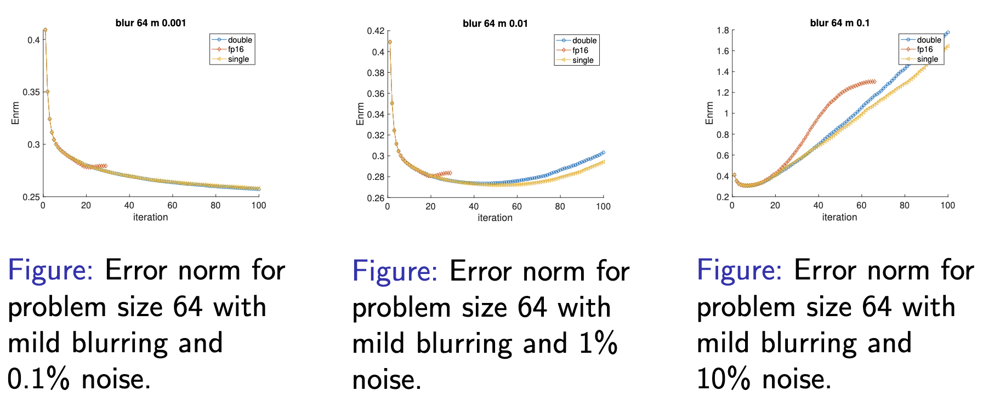 

<!--
### Tomography Reconstruction Using CGLS
Below is the result of CGLS on the tomography reconstruction test problem at different precision levels. For double and single precision, the reconstruction is doing well, yet for fp16, we start to get this completely blue picture from the first iteration caused by overflow of Inf/-Inf.

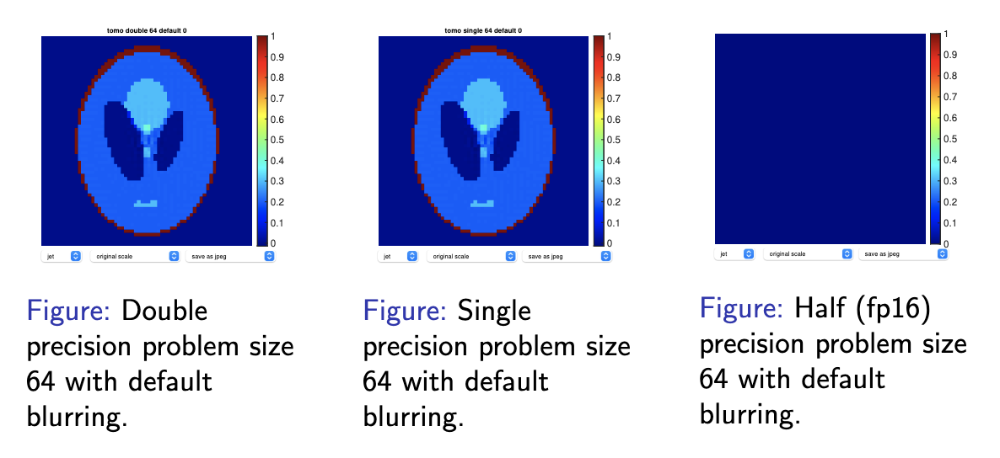 

Our solution to this issue is to rescale A and b by dividing both by 100. And we get the result below:

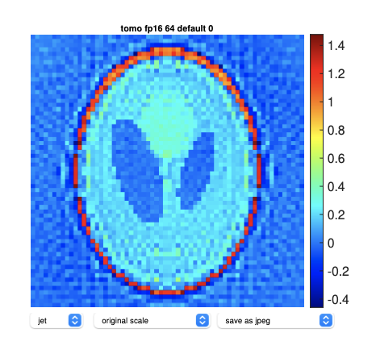 

which is still blurry but at least the shape is visible :)

Then we add noise to the right-hand side b, and plot the error norms below:

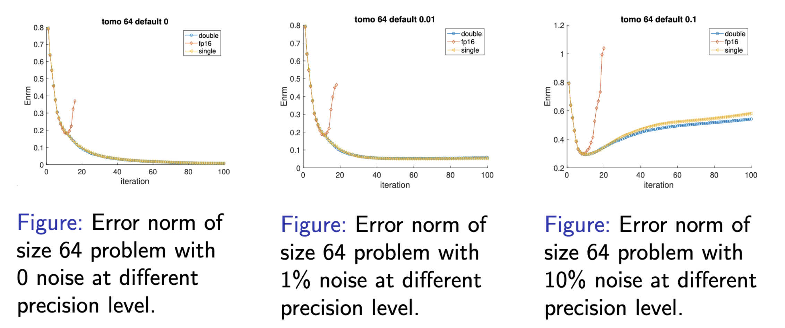 

As in the image deblurring problem, the error norms first decrease and then increase. In the cases with noise, this is mainly because noise starts to take over in the later part of the iteration. However, we still see the same behavior in the noise-free test problems at half precision, which is because the truncation errors accumulate as the iteration goes on.
-->

### Image Deblurring Using CS
In order to prevent the occurrence of overflow, we experiment with the CS algorithm (where no inner products are needed) and use chop for lower precision. Tikhonov regularization is applied to CS after we find out that the algorithm performs poorly due to the close-to-zero singular values of A when it's ill-conditioned. Now we are solving:
$$\min_{x} \{||Ax-b||_2^2+\lambda^2||x||_2^2\}$$ where $\lambda$ is a parameter that needs to be chosen. Here we show experiments for the case with 10% noise, and we use $\lambda$ = 0.199.

From the graph below, it is clear that even with 10% noise, the half-precision image looks very similar to that in double precision, better than what we have using CGLS. 

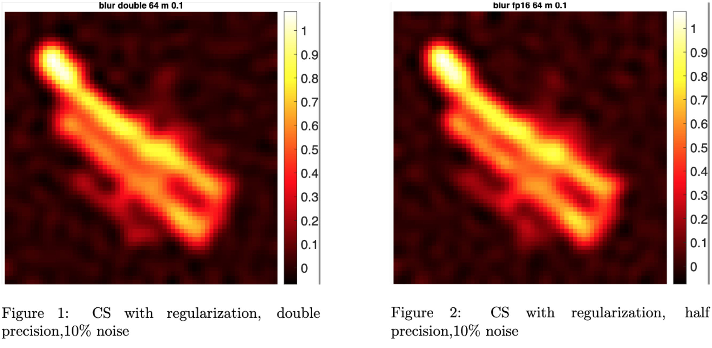 

For the image deblurring problem, we further comfirm the similarity by plotting the error norms. 

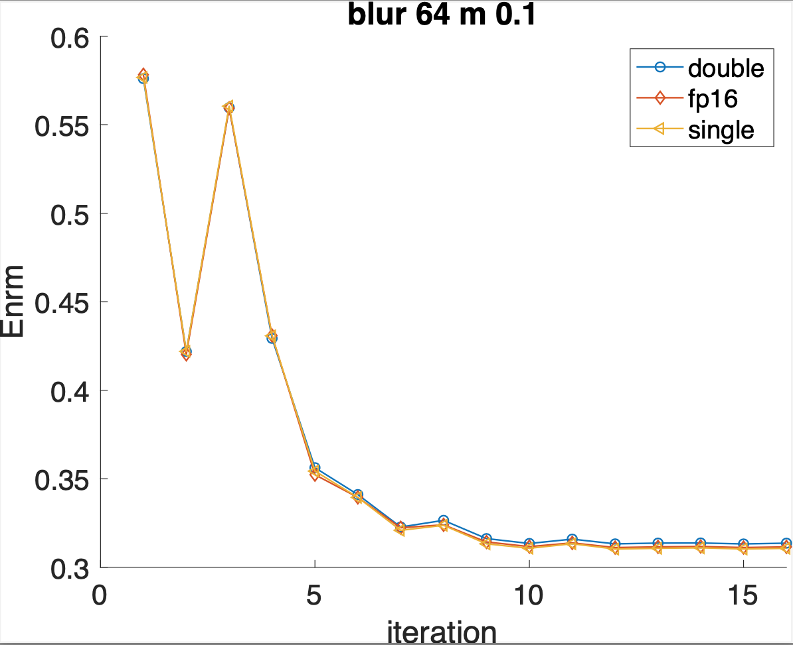 

We can see that the error norms of the three precision levels overlap, illustrating that the result in half precision is close to that in double precision. 

<!--
### Tomography Reconstruction Using CS
The result for the tomography reconstruction problem using CS is showed below. 

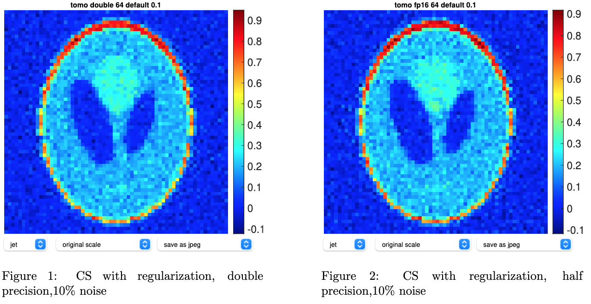 

Although there is no inner product in CS, we still have overflow in half precision, which is because the matrix A is too large. Therefore, we rescale A and b by diving both of by 100 again, and the algorithm successfully runs to the end without generating NaNs. The image in half precision is as good as its counterpart in double precision, displaying clear boundaries and backgrounds. The error norms also overlap among the three precision levels.
-->

### Image Deblurring Using CGLS with regularization
To fairly compare CGLS and CS, we add Tikhonov regularization to CGLS and run the test problem again. The diagrams are listed below.

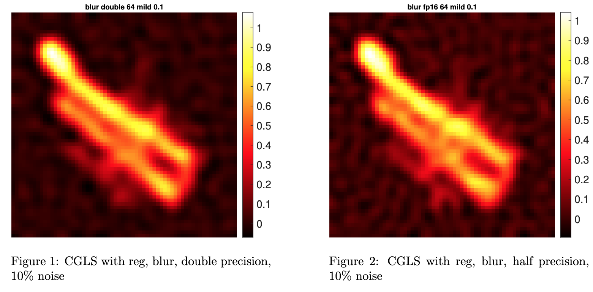 

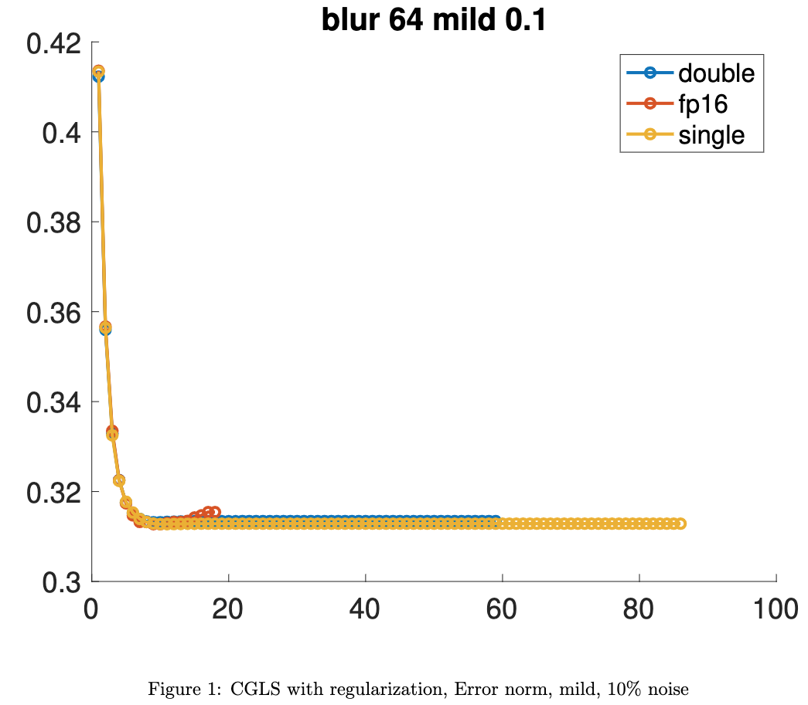 

The diagram for half precision looks much better than that produced by CGLS without regularization. However, difference still presents between half and double precision in the background. At the end of the iteration for half precision, the error norms still increase again. If we zoom in the graph of the error norms for CS and CGLS with regularization, we can see that the error norms at half precision converge for CS but increases rapidly for CGLS, suggesting that for half precision, CS is a better choice. However, for double precision, the CGLS method with regularization is clearly more stable. Therefore, CGLS with regularization is more suitable for double precision. 

 

We performed similar experiments with an image reconstruction problem from tomography; see our paper for further details!

