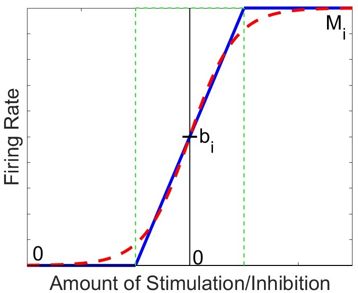
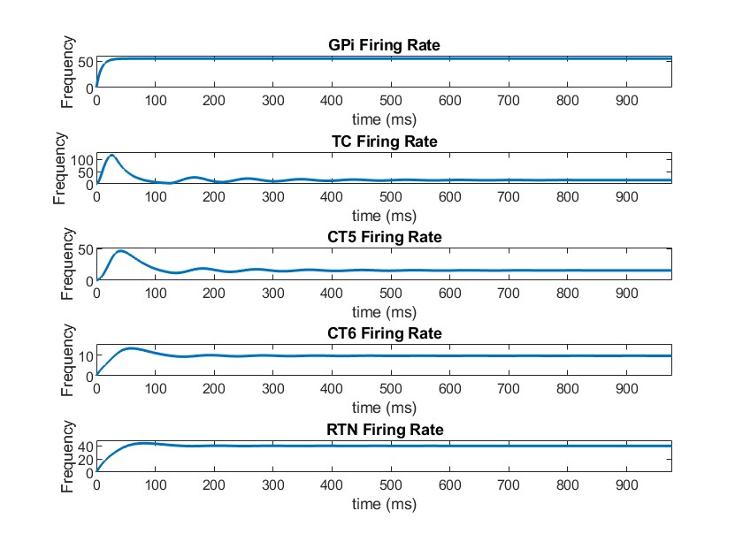
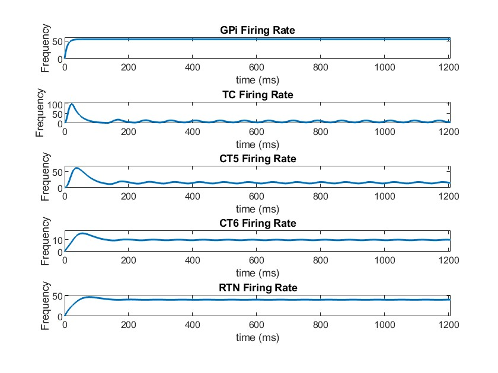
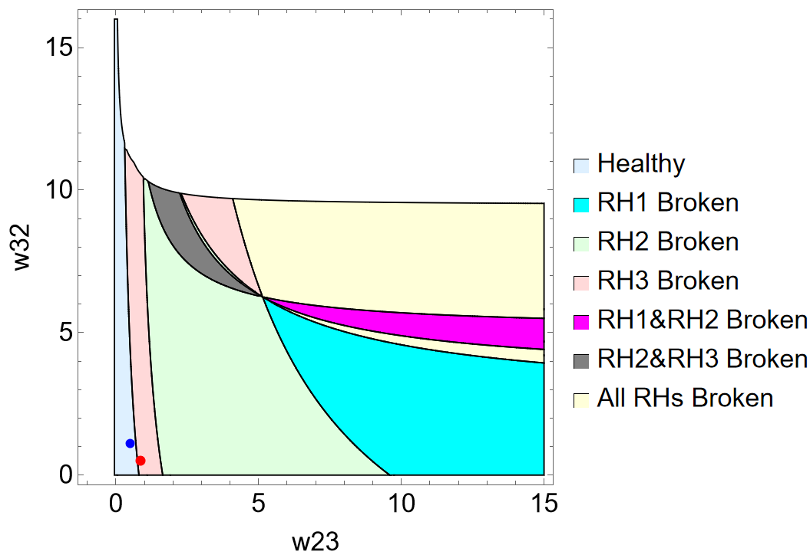

# Mathematical Modeling of Healthy and Parkinsonian Firing Patterns in the Primate Thalamocortical Motor Circuit
Parkinson's disease (PD) is a slowly progressing neuro-degenerative disease featuring impaired motor symptoms such as bradykinesia, muscular rigidity, and resting tremors.1 In industrialized countries, PD affects 0.3% of all people and 1% of people over age 60.6 The basal ganglia, motor thalamus, and motor cortex are three main components of the brain's motor circuit and are responsible for movement planning and execution; movement disorders such as PD can develop when the typical activity of this circuit is disrupted.2,3 Specifically, PD is associated with the loss of dopaminergic neurons and altered neuronal oscillations in the beta-band (13-30 Hz).4 Other projects, such as the <a href="https://www.worldscientific.com/doi/epdf/10.1142/S0129065718500211">2019 paper by M. Caiola and M. Holmes</a>, have investigated the changes in the basal ganglia neuronal activity from a mathematical modeling perspective, but little research has been done on the parkinsonism-associated changes in the areas of the thalamus and cortex which are involved in the motor circuit.5 We employ a mathematical model to investigate network connection changes within the thalamocortical motor ciruit to better understand the transition from healthy to parkinsonian states in the brain.
# Firing Rate Model
We choose to use a firing rate model to describe our system. This approach can successfully represent networks, since each unit in the model can represent a population of neurons receiving input (average firing rates) from other neuron populations.

A simplified circuit diagram of the thalamocortical motor circuit network is shown below, and provides the neuroscience basis for our model. The rounded squares each represent a population of neurons, which are connected by either excitatory (arrow-tipped lines) or inhibitory (circle-tipped lines) synaptic weights. The green circle represents the interneuron population of the thalamus.

  <table>
  <tr>
    <td>GPi (<em>y</em>1)</td>
    <td>globus pallidus internal</td>
  </tr>
  <tr>
    <td>TC (<em>y</em>2)</td>
    <td>thalamocortical neurons</td>
  </tr>
  <tr>
    <td>CT5 (<em>y</em>3)</td>
    <td>corticothalamic layer 5</td>
  </tr>
  <tr>
    <td>CT6 (<em>y</em>4)</td>
    <td>corticothalamic layer 6</td>
  </tr>
  <tr>
    <td>RTN (<em>y</em>5)</td>
    <td>thalamic reticular nucleus</td>
  </tr>
  <tr>
    <td>IN (<em>&gamma;</em>)</td>
    <td>thalamic interneuron population</td>
  </tr>
</table>

Treating the interneuron population as a "relay," <em>&gamma;</em>, we can establish the following system of equations:

<em>&tau;1y'1</em> = &minus;<em>y1</em> &plus; <em>f1</em>(<em>&beta;1</em> &plus; <em>h</em>)

<em>&tau;2y'2</em> = &minus;<em>y2</em> &plus; <em>f2</em>(<em>w12y1</em> &plus; <em>w32y3</em> &plus; <em>w42y4</em> &minus; <em>w52y5</em> &plus; <em>&gamma;</em> &plus; <em>b2</em>)

<em>&tau;3y'3</em> = &minus;<em>y3</em> &plus; <em>f3</em>(<em>w23y2</em> &plus; <em>w43y4</em> &plus; <em>b3</em>)

<em>&tau;4y'4</em> = &minus;<em>y4</em> &plus; <em>f4</em>(<em>w34y3</em> &plus; <em>b4</em>)

<em>&tau;5y'5</em> = &minus;<em>y5</em> &plus; <em>f5</em>(<em>w45y4</em> &plus; <em>b5</em>)
  
&gamma; = &minus;<em>w62</em>(&minus;<em>w16y1</em> &minus; <em>w56y5</em> &plus; <em>w46y4</em> &plus; <em>b6</em>)

<table>
  <tr>
    <td><em>yi</em></td>
    <td>average neuronal population firing rate</td>
  </tr>
  <tr>
    <td><em>wjk</em></td>
    <td>weight of the connection between populations <em>j</em> and <em>k</em></td>
  </tr>
  <tr>
    <td><em>h</em></td>
    <td>constant basal ganglia input</td>
  </tr>
  <tr>
    <td><em>&tau;i</em></td>
    <td>membrane time constant</td>
  </tr>
  <tr>
    <td><em>fi</em></td>
    <td>activation function</td>
  </tr>
</table>

Note that <em>w23</em> represents the difference between the excitatory and inhibitory inputs from TC to CT5. Note also that <em>wjk</em> > 0 and &tau;<em>i</em> > 0.

This can be represented with vectors and matrices as:

<em>T<strong>y'</strong></em> = &minus;<em><strong>y</strong></em> &plus; <em><strong>F</strong></em>(<em><strong>x</strong></em>) &xrArr; <em>T<strong>y'</strong></em> = <em>A<strong>y</strong></em> &plus; <em><strong>B</strong></em>
# Activation Function Selection
Neurons traditionally respond to inputs sigmoidally.7,8,9 However, this model creates a nonlinear system of equations for which it is impossible to solve for eigenvalues analytically. In order to attain eigenvalues and be able to comment on the behavior of the model as a whole, we must establish a simpler activation function that still manages to approximate experimental neuron discharge behavior.5 A piecewise linear (PWL) activation function is ideal in our case, as it allows us to break down a complex system into linear pieces which can be solved and manipulated:

We can break down this system into 35 = 243 distinct linear regions in space, each with its own steady state (fixed point in space which the solution tends to as time increases). Out of these 243 regions, only the region in which each activation function is between 0 spikes/sec and its maximum firing rate contains a physiologically realistic steady state, further denoted as the middle region (outlined in green in the diagram below).

# Data Matching
This semi-linear firing rate model has a number of constant values that we must locate in experimental data and incorporate, namely the baseline firing rates, maximum firing rates, and membrane time constants for each neuron population involved in our simplified motor circuit model. We were able to find values for these parameters through literature review, although some required that we make estimates informed by information from areas of the brain that behave similarly or data on these parameters from mice, rats, or cats. However, there does not seem to be data that documents the baseline firing rate for the thalamic interneuron population in the primate brain. Given our uncertainty about the true baseline firing rate value for the primate thalamic interneuron population, we decided to create two models, one with the low and one with the high baseline. The parameter values are shown in the table below:

<table>
  <tr>
    <td>Neuron Population</td>
    <td><em>bi</em></td>
    <td><em>Mi</em></td>
    <td><em>&tau;i</em></td>
  </tr>
  <tr>
    <td>GPi (<em>y</em>1)</td>
    <td>55 Hz5,10,11,12,13</td>
    <td>200 Hz14</td>
    <td>8 ms11,15,16</td>
  </tr>
  <tr>
    <td>TC (<em>y</em>2)</td>
    <td>18.5 Hz17</td>
    <td>300 Hz</td>
    <td>25 ms</td>
  </tr>
  <tr>
    <td>CT5 (<em>y</em>3)</td>
    <td>7.25 Hz18</td>
    <td>200 Hz</td>
    <td>20 ms</td>
  </tr>
  <tr>
    <td>CT6 (<em>y</em>4)</td>
    <td>7.25 Hz18</td>
    <td>200 Hz</td>
    <td>15 ms</td>
  </tr>
  <tr>
    <td>RTN (<em>y</em>5)</td>
    <td>25 Hz17</td>
    <td>500 Hz17</td>
    <td>16.51 ms</td>
  </tr>
  <tr>
    <td>IN (<em>&gamma;</em>)</td>
    <td>Low: 6 Hz19   High: 22.7 Hz20</td>
    <td>N/A</td>
    <td>N/A</td>
  </tr>
</table>

# Stability and Steady State Conditions
No matter the disease state of our model, the neurons should not be at a state of maximal firing or absent firing for an extended period of time. Additionally, in Parkinsonian solutions, we should expect oscillations of firing rates. Thus the following must hold:
1. Middle region contains its own steady state, and trajectories must not stabilize in another region.
2. <strong>Healthy:</strong> Middle region is stable &xrarr; trajectories are thus forced to stabilize in the middle region, making the system globally asymptotically stable.   <strong>Parkinsonian:</strong> Middle region is unstable &xrarr; trajectories are thus forced to oscillate around the middle region, forming a globally stable limit cycle.

To determine stability, the PWL activation function allows us to solve for the eigenvalues of each of the 243 regions explicitly. We found 3 possible cases: 
1. The region is stable regardless of weights.
2. The region's stability is conditional on weight values.
3. The region (including the middle region) has eigenvalues that cannot be solved for analytically. Therefore, we used the <strong>Routh-Hurwitz Stability Criterion</strong> (RH) to derive 3 stability conditions.

# Weight Search
The current literature does not specify the baseline firing rate for the interneuron population, <em>b6</em>, so we took two estimates: <em>b6</em> = 6 for the low estimate, and <em>b6</em> = 22.7 for the high estimate. 

Comparing our data to the predicted values our model outputted, we were able to minimize the sum of squared error between the two and find a healthy solution for both the low and the high estimates of <em>b6</em>. The outputs for the low <em>b</em>6 are shown below:

Healthy Solution: 

<table>
  <tr>
    <td><em>w12</em> = 1.520384442</td>
    <td><em>w16</em> = 1.621278311</td>
    <td><em>w23</em> = 0.4962387866</td>
    <td><em>w32</em> = 1.117631687</td>
  </tr>
  <tr>
    <td><em>w34</em> = 0.1540248925</td>
    <td><em>w42</em> = 1.217895798</td>
    <td><em>w43</em> = 0.0672671083</td>
    <td><em>w45</em> = 1.542582263</td>
  </tr>
  <tr>
    <td><em>w46</em> = 9.049109867</td>
    <td><em>w52</em> = 4.5350845</td>
    <td><em>w56</em> = 0.3330689302</td>
    <td><em>w62</em> = 7.127373038</td>
  </tr>
</table>

Below is shown the firing rate outputs using these weights.

Here, all firing rates tend toward a specifc value as time increases, so they are stable solutions. 

Parkinsonian Solution: 

<table>
  <tr>
    <td><em>w12</em> = 1.520384442</td>
    <td><em>w16</em> = 1.621278311</td>
    <td><em>w23</em> = 0.8691494663</td>
    <td><em>w32</em> = 0.5043792396</td>
  </tr>
  <tr>
    <td><em>w34</em> = 0.1540248925</td>
    <td><em>w42</em> = 1.217895798</td>
    <td><em>w43</em> = 0.0672671083</td>
    <td><em>w45</em> = 1.542582263</td>
  </tr>
  <tr>
    <td><em>w46</em> = 9.049109867</td>
    <td><em>w52</em> = 4.5350845</td>
    <td><em>w56</em> = 0.3330689302</td>
    <td><em>w62</em> = 7.127373038</td>
  </tr>
</table>

Below is shown the firing rate outputs using these weights.

Here, several firing rates oscillate, indicating a limit cycle solution.
# Weight Space
We were interested in the role of the thalamus in parkinsonian dysfunction, so we explored the relationship between <em>w</em>23 and <em>w</em>32, which represent the excitatory and inhibitory connections between TC and CT5. Forcing all correlating weights to be equal in healthy and parkinsonian solutions except <em>w</em>23 and <em>w</em>32, we found a healthy solution that could be forced into a parkinsonian state by only altering <em>w</em>23 and <em>w</em>32. In a parkinsonian solution, at least one of the Routh-Hurwitz stability conditions must be broken. We examined which condition or combination of conditions is broken when the system moves from a healthy to a parkinsonian state for different values of <em>w</em>23 and <em>w</em>32. The region plot for the low <em>b</em>6 is shown below.

# Conclusions and Future Directions
<ul>
  <li>Our model can represent the average firing rates of healthy and parkinsonian states in the thalamocortical motor circuit.</li>
  <li>We established stability and steady state conditions for the system to be healthy or parkinsonian.</li>
  <li>We have found multiple sets of weights that both satisfy the conditions and match the neuronal firing patterns in our <em>in-vivo</em> primate dataset.</li>
  <li>We discovered that changing only the connection strength between TC and CT5 can force the system from a healthy to a parkinsonian state.</li>
  <li><strong>Next steps:</strong></li> <ul>
    <li>Examine the transition from both healthy to parkinsonian and parkinsonian to healthy.</li>
    <li>Explore methods of biologically validating our model by pharmacologically manipulating the weights of motor circuit network connections.</li> </ul>
</ul>

# More About the Team
1. <strong>Carly Ferrell</strong> is a rising senior at Mississippi State University majoring in mathematics and minoring in statistics and music with a concentration in voice. She is interested in utilizing her skills in applied mathematics and statistcs to research music, specifically music theory and sight singing. Outside class, she enjoys reading, dancing, singing, and composing music. 

 
 
2. <strong> Qile Jiang</strong> is a rising junior at Brown University majoring in Applied Mathematics. His primary research area is in applied dynamical systems, but he also has a keen interest in pure math topics such as algebra. Outside of school, he spends his time training boxing, painting, and going to operas and classical concerts.

 
 
3. <strong>Margaret Olivia Leu</strong> is a junior at Pomona College double majoring in mathematics and politics. She is interested in working on ways to use mathematics as a tool in the fields of politics and social justice work, and hopes to pursue a career that combines these two interests. Outside academics, she enjoys crocheting, cooking, and listening to music.

 
 
# References
1. Sveinbjornsdottir, S. (2016).The clinical symptoms of Parkinson's disease. <em>Journal of Neurochemistry, 139</em>(1), 318-324. https://doi.org/10.1111/jnc.13691.
2. DeLong, M. R., & Wichmann, T. (2007). Circuits and circuit disorders of the basal ganglia. <em>Archives of Neurology, 64</em>(1), 20–24. https://doi.org/10.1001/archneur.64.1.20.
3. Alexander, G. E., DeLong, M.R., & Strick, P.L. (1986). Parallel Organization of functionally segregated circuits linking basal ganglia and cortex. <em>Annual Review of Neuroscience, 9</em>(1), 357-381. https://doi.org/10.1146/annurev.ne.09.030186.002041
4. Galvan, A., Devergnas, A., & Wichmann, T. (2015). Alterations in neuronal activity in basal ganglia-thalamocortical circuits in the parkinsonian state. <em>Frontiers in Neuroanatomy, 9</em>, 5. https://doi.org/10.3389/fnana.2015.00005.
5. Caiola, M., & Holmes, M. H. (2019). Model and analysis for the onset of parkinsonian firing patterns in a simplified basal ganglia. <em>International Journal of Neural Systems, 29</em>(1). https://doi.org/10.1142/S0129065718500211.
6. de Lau, L. M. L., & Breteler, M. M. B. (2006). Epidemiology of Parkinson's disease. <em>The Lancet Neurology, 5</em>(6), 525-535. https://doi.org/10.1016/S1474-4422(06)70471-9.
7. Rall, W. (1955). Experimental monosynaptic input-output relations in the mammalian spinal cord. <em>Journal of Cellular and Comparative Physiology, 46</em>(3), 413–437. https://doi.org/10.1002/jcp.1030460303
8. Wilson, C. J., & Bevan, M. D. (2011). Intrinsic dynamics and synaptic inputs control the activity patterns of subthalamic nucleus neurons in health and in Parkinson’s disease. <em>Neuroscience, 198</em>, 54–68. https://doi.org/10.1016/j.neuroscience.2011.06.049
9. Nambu, A., & Llinaś, R. (1994). Electrophysiology of globus pallidus neurons in vitro. <em>Journal of Neurophysiology, 72</em>(3), 1127–1139. https://doi.org/10.1152/jn.1994.72.3.1127
10. Kita, H., Tachibana, Y., Nambu, A., & Chiken, S. (2005). Balance of Monosynaptic Excitatory and Disynaptic Inhibitory Responses of the Globus Pallidus Induced after Stimulation of the Subthalamic Nucleus in the Monkey. <em>Journal of Neuroscience, 25</em>(38), 8611–8619. https://doi.org/10.1523/JNEUROSCI.1719-05.2005
11. Hikosaka, O. (2007). GABAergic output of the basal ganglia. <em>Progress in Brain Research, 160</em>, 209–226. https://doi.org/10.1016/S0079-6123(06)60012-5
12. Wichmann, T., Bergman, H., Starr, P. A., Subramanian, T., Watts, R. L., & DeLong, M. R. (1999). Comparison of MPTP-induced changes in spontaneous neuronal discharge in the internal pallidal segment and in the substantia nigra pars reticulata in primates. <em>Experimental Brain Research, 125</em>(4), 397–409. https://doi.org/10.1007/s002210050696
13. Bergman, H., Wichmann, T., Karmon, B., & DeLong, M. R. (1994). The primate subthalamic nucleus. II. Neuronal activity in the MPTP model of parkinsonism. <em>Journal of Neurophysiology, 72</em>(2), 507–520. https://doi.org/10.1152/jn.1994.72.2.507
14. Hashimoto, T., Elder, C. M., Okun, M. S., Patrick, S. K., & Vitek, J. L. (2003). Stimulation of the Subthalamic Nucleus Changes the Firing Pattern of Pallidal Neurons. <em>The Journal of Neuroscience, 23</em>(5), 1916–1923. https://doi.org/10.1523/JNEUROSCI.23-05-01916.2003
15. Nakanishi, H., Tamura, A., Kawai, K., & Yamamoto, K. (1997). Electrophysiological studies of rat substantia nigra neurons in an in vitro slice preparation after middle cerebral artery occlusion. <em>Neuroscience, 77</em>(4), 1021–1028. https://doi.org/10.1016/s0306-4522(96)00555-6
16. Nambu, A. (2007). Globus pallidus internal segment. <em>Progress in Brain Research, 160</em>, 135–150. https://doi.org/10.1016/S0079-6123(06)60008-3
17. van Albada, S. J., & Robinson, P. A. (2009). Mean-field modeling of the basal ganglia-thalamocortical system. I Firing rates in healthy and parkinsonian states. <em>Journal of Theoretical Biology, 257</em>(4), 642–663. https://doi.org/10.1016/j.jtbi.2008.12.018
18. Opris, I., Hampson, R. E., Stanford, T. R., Gerhardt, G. A., & Deadwyler, S. A. (2011). Neural Activity in Frontal Cortical Cell Layers: Evidence for Columnar Sensorimotor Processing. <em>Journal of Cognitive Neuroscience, 23</em>(6), 1507–1521. https://doi.org/10.1162/jocn.2010.21534
19. Ison, M. J., Mormann, F., Cerf, M., Koch, C., Fried, I., & Quiroga, R. Q. (2011). Selectivity of pyramidal cells and interneurons in the human medial temporal lobe. <em>Journal of Neurophysiology, 106</em>(4), 1713–1721. https://doi.org/10.1152/jn.00576.2010
20. Putrino, D. F., Chen, Z., Ghosh, S., & Brown, E. N. (2011). Motor Cortical Networks for Skilled Movements Have Dynamic Properties That Are Related to Accurate Reaching. <em>Neural Plasticity, 2011</em>, 1–15. https://doi.org/10.1155/2011/413543
