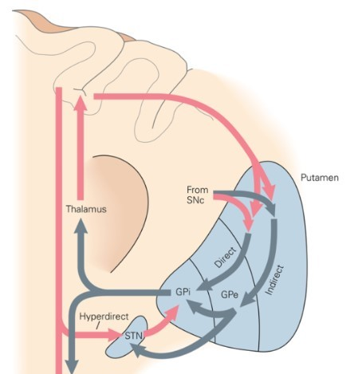
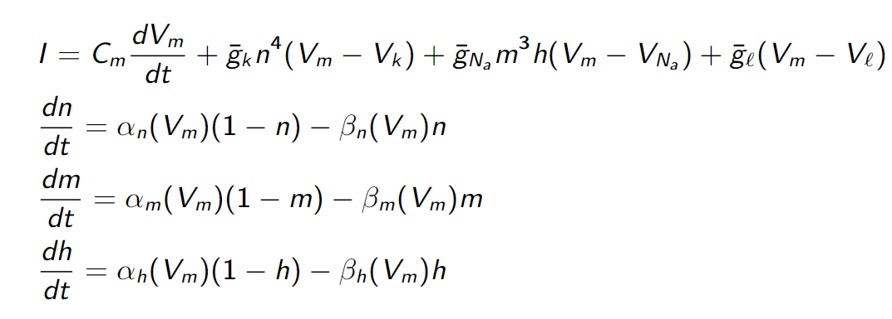
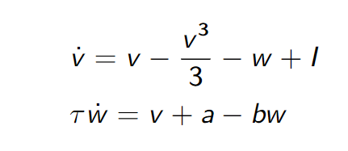
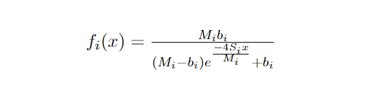

# Mathematical Modeling of Healthy and Parkinsonian Firing Patterns in the Primate Thalamocortical Motor Circuit
Parkinson's disease (PD) is a slowly progressing neuro-degenerative disease characterized by impaired motor symptoms such as bradykinesia, muscular rigidity, and resting tremors.1 In industrialized countries, PD affects 0.3% of all people and 1% of people over age 60.18 The basal ganglia, motor thalamus, and motor cortex are three main components of the brain's motor circuit and are responsible for movement planning and execution; movement disorders such as PD can develop when the typical activity of this circuit is disrupted.2 We employ a mathematical model to investigate the interactions between motor circuit components in normal and parkinsonian states, ultimately developing a deeper understanding of how PD presents itself in the brain. 

# The Motor Circuit
The basal ganglia, thalmus, and cortex are members of numerous segregated circuits and subcircuits in the brain, including the motor circuit; disruption in the flow of this circuit can lead to Parkinson's disease.3 The striatum and subthalamic nucleus (STN) function as input receptors in the motor circuit, receiving signals from the supplementary motor area (SMA) and the primary motor cortex (M1). This input passes through the direct and indirect pathways in the motor circuit.2 The direct pathway is composed of the connection from the striatum to the GPi to the thalamus; the indirect pathway flows from the striatum to the globus pallidus external (GPe), from the GPe to the STN, from the STN to the GPi, and from the GPi to the thalamus.4,5 After the input has passed through one of these pathways, the internal segment of the globus pallidus (GPi) and the substantia nigra pars reticulata (SNr) subsequently release output signals to the thalamus and brainstem.2 These relationships are demonstrated in the simplified model below.

The main cause of PD is the loss of dopaminergic neurons in the substantia nigra pars compacta (SNc), which in turn results in decreased levels of dopamine in the striatum.^6 This dopamine loss results in significant changes in the basal ganglia's neuronal activity, hence disrupting the motor circuit's overall flow and inhibiting the brain's ability to regulate bodily movement.2 Other projects, such as the 2019 paper by M. Caiola and M. Holmes, have investigated the changes in the basal ganglia neuronal activity from a mathematical modeling perspective, but little research has been done on the parkinsonism-associated changes in the areas of the thalamus and cortex which are involved in the motor circuit.7 Given the practical limitations associated with directly recording data concerning parkinsonian changes in neuronal activity in the thalamus and cortex, fitting a mathematical model to previously recorded data helps us to further investigate the effects of dopamine loss on thalamocortical neurons specifically.
# Disadvantages of Individual Neuron Models
Many attempts to model the activity of neuron networks are reduced models, which seek to simulate the behavior of a large population of neurons using a much smaller group of individual neurons.8 The most widely known of these individual neuron mathematical models is the Hodgkin-Huxley model,9 which provides the following nonlinear system that simulates an individual neuron's action potential firing dynamics with high accuracy:10,11

In this system, <em>I</em> is the current per unit area, <em>Cm</em> is the cell capacitance, <em>Vi</em> is the equilibrium potential of the <em>i</em>-th ionic current, <em>gi</em> is the maximum conductance of the <em>i</em>-th ionic current, <em>&alpha;i</em> and <em>&beta;i</em> are rate constants for the <em>i</em>-th ionic current (which vary with voltage instead of time), and <em>n</em>, <em>m</em> and <em>h</em> are activation probabilities such that 0 < <em>n</em>, <em>m</em>, <em>h</em> < 1.12 

The FitzHugh-Nagumo model was derived from the Hodgkin-Huxley model and shares many of the same characteristics of its predecessor, such as all-or-nothing firing, as well as the lack of a saddle equilibrium and therefore the absence of a well-defined firing threshold.13 However, the FitzHugh-Nagumo model is much less computationally complex than the Hodgkin-Huxley model since it can be reduced to the following two equations:

where <em>v</em> is the membrane potential, <em>w</em> is the recovery variable, <em>I</em> is the magnitude of the stimulus current, and <em>a</em>, <em>b</em>, and <em>&tau;</em> are positive constants, with the added condition that <em>&tau;</em> &Lt; 1.13 

Both of the above models, as well as other existing individual neuron firing models, boast the advantage of highly accurate simulation of the firing behavior of an individual neuron, and therefore have many useful applications. However, these models tend to fall short when it comes to understanding the firing rate behavior, interactions, and interconnectedness of a large network of neurons such as the motor circuit.7 The primate cortex alone contains millions of neurons and is just one component of the motor circuit.14 Given that our network is on such a large scale, solving and implementing millions of systems of equations for each individual neuron is simply infeasible. Alternatively, some have proposed simulating a large network of neurons using a greatly reduced number of neurons. This approach poses the likely dilemma of over-simplifying the dynamics of a neuron network and hence losing the ability to apply any findings in a clinical setting. There is no clear solution to this issue, as it is unclear how many neurons are necessary to accurately simulate various regions of the brain (it's likely that so many neurons are necessary that even a simplified network would be too computationally expensive to solve using the individual neuron modeling approach).7 Thus, in order to both accurately and efficiently model the firing rate dynamics of the motor circuit, we must utilize an approach that is not based on the use of individual neuron data.
# Firing Rate Model
Rather than relying on individual neuron models, an alternative approach is to use a network perspective in our model.15

In our analysis, we will expand the model developed by Caiola and Holmes7 from three dimensions (three nuclei model) to five dimensions. The Caiola and Holmes model builds on the findings of Wilson and Cowan,16 which were further explored by Dayan and Abbot, who hoped to develop an alternative to the preexisting accurate yet computationally complex models.17 These firing rate models output average firing rates for each of the unit's models rather than individual spikes, which is ideal for a network such as the motor circuit. We can allow each neuron population to be a unit of this firing rate model, examining the firing rate interactions between populations in the form of average firing rates.

In a firing rate model, each unit of the model will produce an average firing rate, thus eliminating the need to rely on individual neurons for our model.7 This average firing rate <em>y</em> can be found by solving: 

<em>&tau;y'</em> = &minus;<em>y</em> &plus; <em>F</em>(<em>Wy</em> &plus; <em>h</em>)

where <em>&tau;</em> is the vector of membrane time constants, <em>W</em> is the matrix of weights associated with the interactions between populations, <em>h</em> is the input coming from outside of the network, and <em>F</em> is the activation function.7 This approach to modeling can successfully represent networks, since each unit in the model can represent a population of neurons receiving input (average firing rates) from other neuron populations.

A simplified circuit diagram of the thalamocortical motor circuit network is shown below, and provides the neuroscience basis for our model. The rounded squares each represent a population of neurons, which are connected by either excitatory (arrow-tipped lines) or inhibitory (circle-tipped lines) synaptic weights. The green circle represents the interneuron population of the thalamus and can be treated as a relay neuron or as a series of FitzHugh-Nagumo neurons.

Treating the interneuron population as a "relay," <em>&gamma;</em>, we can establish the following system of equations:

<em>&tau;1y'1</em> = &minus;<em>y1</em> &plus; <em>F1</em>(<em>&beta;1</em> &plus; <em>h</em>)

<em>&tau;2y'2</em> = &minus;<em>y2</em> &plus; <em>F2</em>(<em>w12y1</em> &plus; <em>w32y3</em> &plus; <em>w42y4</em> &minus; <em>w52y5</em> &plus; <em>&gamma;</em> &plus; <em>b2</em>)

<em>&tau;3y'3</em> = &minus;<em>y3</em> &plus; <em>F3</em>(<em>w23y2</em> &plus; <em>w43y4</em> &plus; <em>b3</em>)

<em>&tau;4y'4</em> = &minus;<em>y4</em> &plus; <em>F4</em>(<em>w34y3</em> &plus; <em>b4</em>)

<em>&tau;5y'5</em> = &minus;<em>y5</em> &plus; <em>F5</em>(<em>w45y4</em> &plus; <em>b5</em>)
  
&gamma; = &minus;<em>w62</em>(&minus;<em>w16y1</em> &minus; <em>w56y5</em> &plus; <em>w46y4</em> &plus; <em>b6</em>)

where <em>y1</em>, <em>y2</em>, <em>y3</em>, <em>y4</em>, <em>y5</em> are the firing rates for the GPi, thalamocortical loop (TC), corticothalamic layer 5 (CT5), corticothalamic layer 6 (CT6), and reticular nucleus (RTN), respectively. <em>wjk</em> represents the weight of the firing rate flow from population <em>j</em> to population <em>k</em>. Note that <em>w23</em> represents the difference between the excitatory and inhibitory inputs from TC to CT5. Note also that <em>wjk</em> > 0, &tau;<em>i</em> > 0, and <em>Fi</em> represents the activation function for the <em>i</em>-th population.
# Sigmoidal Activation Function and Its Approximations
The choice of activation function for this model is significant, since it informs the behavior of the model. Although many different approaches to developing activation functions for neuronal mathematical modeling exist, previous studies have shown that a sigmoidal function is able to closely approximate the neuron discharge behavior recorded in experiments.19-21 We closely modeled our sigmoidal activation function off of the model developed by Holgado <em>et al.</em>:22

In this model, <em>Mi</em> is the maximum firing rate, and <em>Si</em> is the maximum slope. Following the example of Holgado <em>et al.</em>, we will assume <em>Si</em> = 1. The baseline firing rate is <em>bi</em>, meaning:

<em>Fi</em>(0) = <em>bi</em>

Although this sigmoidal function closely approximates typical neuron discharge behavior, it creates a nonlinear system of equations for which we are unable to find steady states. In order to attain eigenvalues and be able to comment on the behavior of the model as a whole, we must establish a simpler activation function that still manages to approximate experimental neuron discharge behavior.7
# Piecewise Linear Activation Function
Although there are several options to approximate the sigmoidal activation function&mdash; namely a linear function, a rectification function, and a piecewise linear function&mdash; only the latter can feasbily be applied: in an experimental setting, a population of neurons will never fire at a rate below zero or above its maximum firing rate, but a linear or rectification function would allow neurons to fire at rates that are negative or that increase to infinity.7 In order to approximate the sigmoidal function and satisfy the realistic constraints on the firing rate ranges of each neuron population, we choose a semi-linear piecewise function as our activation function:

Our model's system will therefore be composed of five piecewise linear equations. We can break down this system into 243 distinct linear regions in space. This allows us to solve for eigenvalues analytically, permitting us to investigate the system further and find a continuous solution. A piecewise linear activation function is ideal in our case, as it allows us to break down a complex system into linear pieces which can be solved and manipulated. 

Below the approximation of the piecewise linear activation function to the sigmoidal approximation is shown, with the middle region outlined in green.

# Data Fitting and Error Functions
This semi-linear firing rate model has a number of constant values that we must locate in experimental data and incorporate, namely the baseline firing rates, maximum firing rates, and membrane time constants for each neuron population involved in our simplified motor circuit model. We can record the maximum firing rate by gradually increasing the current we apply to a neuron until its firing rate levels out and using this level value as our maximum rate (since we have already established that a neuron's firing rate behaves sigmoidally). The baseline firing rate, according to Caiola and Holmes, is a neuron's average firing rate when "all inputs are chemically blocked."7 The membrane time constant &tau; can be calculated as the product of the membrane resistance (<em>rm</em>) and membrane capacitance (<em>cm</em>). This constant measures the time it takes for a neuron's firing potential to decrease from its resting value to 63% of this resting value after receiving a charge.24 We follow the precedent set by researchers working on previous firing rate models by noting that although the time constants in the firing rate model are not the same as membrane time constants, we will use membrane time constants in the place of the firing rate constants as this practice is the most established way of dealing with firing rate model time constants at this time.7,22,25,26 We were able to find values for these parameters through literature review, although we were unable to source some of the primate firing rate baselines, maximums, and membrane time constants in previous studies. These parameters required that we make estimates informed by information from areas of the brain that behave similarly or data on these parameters from mice, rats, or cats.

55 Hz is a generally accepted baseline firing rate value for GPi neurons.7,27,28,29,30 These neurons have a maximum firing rate of about 200 Hz.31 Due to difficulty finding recorded data on the GPi membrane time constant, we followed the example of Caiola and Holmes, who proposed using SNr's recorded time constant of 8 ms32 given that SNr and GPi behave similarly.28,33 
# Condition Search
In order to conduct a search for each of our weights <em>wjk</em>, we narrowed down the search by defining conditions based on steady states and stability. Steady states
# More About the Team
1. <strong>Carly Ferrell</strong> is a rising senior at Mississippi State University. *fill in more info here, potentially pic. ditto for others too*
2. <strong> Qile Jiang</strong> is a rising junior at Brown University.
3. <strong>Olivia Leu</strong> is a junior at Pomona College. 
# References
1. Sveinbjornsdottir, S. (2016).The clinical symptoms of Parkinson's disease. <em>Journal of Neurochemistry, 139</em>(1), 318-324. https://doi.org/10.1111/jnc.13691.
2. DeLong, M. R., & Wichmann, T. (2007). Circuits and circuit disorders of the basal ganglia. <em>Archives of Neurology, 64</em>(1), 20–24. https://doi.org/10.1001/archneur.64.1.20.
3. Alexander, G. E., DeLong, M.R., & Strick, P.L. (1986). Parallel Organization of functionally segregated circuits linking basal ganglia and cortex. <em>Annual Review of Neuroscience, 9</em>(1), 357-381. https://doi.org/10.1146/annurev.ne.09.030186.002041
4. DeLong, M. R. (1990). Primate models of movement disorders of basal ganglia origin. <em>Trends in Neurosciences, 13</em>(7), 281–85. https://doi.org/10.1016/0166-2236(90)90110-v.
5. Wichmann, T., & Delong, M.R. (2003). Functional neuroanatomy of the basal ganglia in Parkinson’s disease. <em>Advances in Neurology, 91</em>, 9–18.
6. Galvan, A., Devergnas, A., & Wichmann, T. (2015). Alterations in neuronal activity in basal ganglia-thalamocortical circuits in the parkinsonian state. <em>Frontiers in Neuroanatomy, 9</em>, 5. https://doi.org/10.3389/fnana.2015.00005.
7. Caiola, M., & Holmes, M. H. (2019). Model and analysis for the onset of parkinsonian firing patterns in a simplified basal ganglia. <em>International Journal of Neural Systems, 29</em>(1). https://doi.org/10.1142/S0129065718500211.
8. Rubin, J. E., & Terman, D. (2004). High frequency stimulation of the subthalamic nucleus eliminates pathological thalamic rhythmicity in a computational model. <em>Journal of Computational Neuroscience, 16</em>(3), 211–235. https://doi.org/10.1023/B:JCNS.0000025686.47117.67.
9. Hodgkin, A. L., & Huxley, A. F. (1952). A quantitative description of membrane current and its application to conduction and excitation in nerve. <em>The Journal of Physiology, 117</em>(4), 500–544.
10. Schwiening, C. J. (2012). A brief historical perspective: Hodgkin and Huxley. <em>The Journal of Physiology, 590</em>(Pt 11), 2571–2575. https://doi.org/10.1113/jphysiol.2012.230458
11. Fang, X., Duan, S., & Wang, L. (2021). Memristive Hodgkin-Huxley Spiking Neuron Model for Reproducing Neuron Behaviors. <em>Frontiers in Neuroscience, 15</em>. \\https://www.frontiersin.org/article/10.3389/fnins.2021.730566.
12. Rodríguez-Collado, A., & Rueda, C. (2021). A simple parametric representation of the Hodgkin-Huxley model. <em>PLoS ONE, 16</em>(7), e0254152. https://doi.org/10.1371/journal.pone.0254152
13. Sherwood, W. E. (2014). FitzHugh-Nagumo model. <em>Encyclopedia of Computational Neuroscience</em>. https://link.springer.com/content/pdf/10.1007\%2F978-1-4614-7320-6\_147-1.pdf.
14. Collins, C. E., Airey, D. C., Young, N. A., Leitch, D. B., & Kaas, J. H. (2010). Neuron densities vary across and within cortical areas in primates. <em>Proceedings of the National Academy of Sciences, 107</em>(36), 15927–15932. https://doi.org/10.1073
15. McIntyre, C. C., & Hahn, P. J. (2010). Network Perspectives on the Mechanisms of Deep Brain Stimulation. <em>Neurobiology of Disease, 38</em>(3), 329–337. https://doi.org/10.1016/j.nbd.2009.09.022
16. Wilson, H. R., & Cowan, J. D. (1972). Excitatory and Inhibitory Interactions in Localized Populations of Model Neurons. <em>Biophysical Journal, 12</em>(1), 1–24.
17. Dayan, P., & Abbott, L. F. (2001). Theoretical neuroscience: Computational and mathematical modeling of neural systems. <em>Massachusetts Institute of Technology Press</em>.
18. de Lau, L. M. L., & Breteler, M. M. B. (2006). Epidemiology of Parkinson's disease. <em>The Lancet Neurology, 5</em>(6), 525-535. https://doi.org/10.1016/S1474-4422(06)70471-9.
19. Rall, W. (1955). Experimental monosynaptic input-output relations in the mammalian spinal cord. <em>Journal of Cellular and Comparative Physiology, 46</em>(3), 413–437. https://doi.org/10.1002/jcp.1030460303
20. Wilson, C. J., & Bevan, M. D. (2011). Intrinsic dynamics and synaptic inputs control the activity patterns of subthalamic nucleus neurons in health and in Parkinson’s disease. <em>Neuroscience, 198</em>, 54–68. https://doi.org/10.1016/j.neuroscience.2011.06.049
21. Nambu, A., & Llinaś, R. (1994). Electrophysiology of globus pallidus neurons in vitro. <em>Journal of Neurophysiology, 72</em>(3), 1127–1139. https://doi.org/10.1152/jn.1994.72.3.1127
22. Holgado, A. J. N., Terry, J. R., & Bogacz, R. (2010). Conditions for the Generation of Beta Oscillations in the Subthalamic Nucleus–Globus Pallidus Network. <em>The Journal of Neuroscience, 30</em>(37), 12340–12352. https://doi.org/10.1523/JNEUROSCI.0817-10.2010
23. Ermentrout, G.B., & Terman, D.H. (2010). <em>Mathematical Foundations of Neuroscience</em>. Springer New York. https://doi.org/10.1007/978-0-387-87708-2
24. Isokawa, M. (1997). Membrane time constant as a tool to assess cell degeneration. <em>Brain Research Protocols, 1</em>(2), 114–116. https://doi.org/10.1016/S1385-299X(96)00016-5
25. Pavlides, A., John Hogan, S., & Bogacz, R. (2012). Improved conditions for the generation of beta oscillations in the subthalamic nucleus–globus pallidus network. <em>European Journal of Neuroscience, 36</em>(2), 2229–2239. https://doi.org/10.1111/j.1460-9568.2012.08105.x
26. Pavlides, A., Hogan, S. J., & Bogacz, R. (2015). Computational Models Describing Possible Mechanisms for Generation of Excessive Beta Oscillations in Parkinson’s Disease. <em>PLOS Computational Biology, 11</em>(12), e1004609. https://doi.org/10.1371/journal.pcbi.1004609
