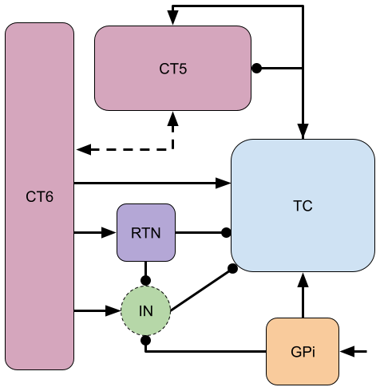
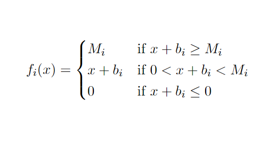
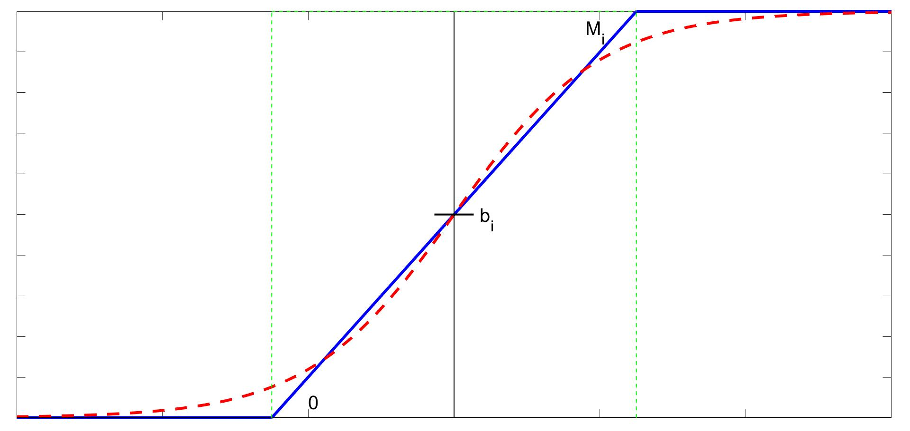
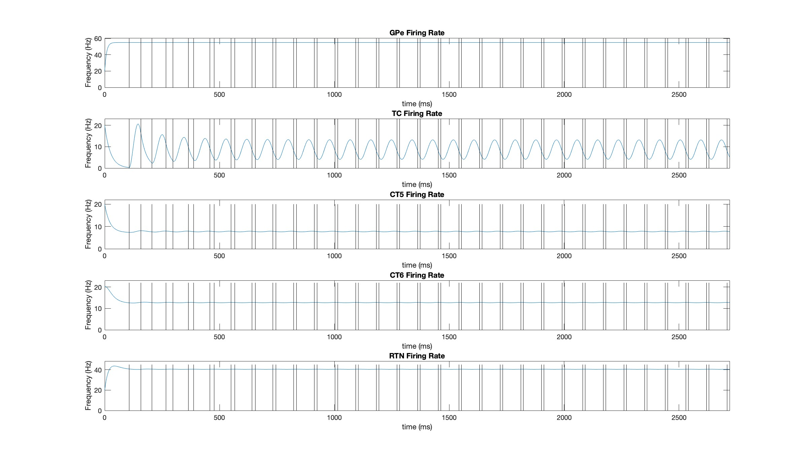
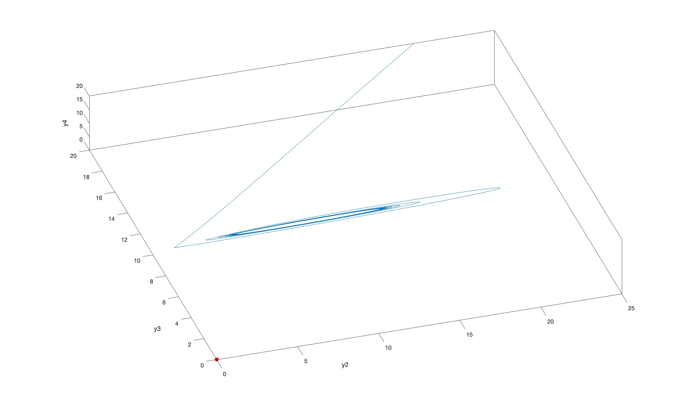

# Mathematical Modeling of Healthy and Parkinsonian Firing Patterns in the Primate Thalamocortical Motor Circuit
Parkinson's disease (PD) is a slowly progressing neuro-degenerative disease featuring impaired motor symptoms such as bradykinesia, muscular rigidity, and resting tremors.1 In industrialized countries, PD affects 0.3% of all people and 1% of people over age 60.18 The basal ganglia, motor thalamus, and motor cortex are three main components of the brain's motor circuit and are responsible for movement planning and execution; movement disorders such as PD can develop when the typical activity of this circuit is disrupted.2 Specifically, PD is associated with the loss of dopaminergic neurons and altered neuronal oscillations in the beta-band (13-30 Hz).6 We employ a mathematical model to investigate network connection changes within the motor circuit in order to better understand the transition from healthy to parkinsonian states in the brain. 
# The Motor Circuit
The basal ganglia, thalamus, and cortex are members of numerous segregated circuits and subcircuits in the brain, including the motor circuuit; disruption in the flow of this circuit can lead to Parkinson's disease.3 The main cause of PD is the loss of dopaminergic neurons, which results in significant changes in the basal ganglia's neuronal activity, hence disrupting the motor circuit's overall flow and inhibiting the brain's ability to regulate bodily movement.2,6 Other projects, such as the <a href="https://www.worldscientific.com/doi/epdf/10.1142/S0129065718500211">2019 paper by M. Caiola and M. Holmes</a>, have investigated the changes in the basal ganglia neuronal activity from a mathematical modeling perspective, but little research has been done on the parkinsonism-associated changes in the areas of the thalamus and cortex which are involved in the motor circuit.7 Given the practical limitations associated with directly recording data concerning parkinsonian changes in neuronal activity in the thalamus and cortex, fitting a mathematical model to previously recorded data helps us to further investigate the effects of dopamine loss on thalamocortical neurons specifically.
# Firing Rate Model
We choose to use a firing rate model to describe our system. This type of model outputs average firing rates for each of the unit's models rather than individual spikes, which is ideal for a network such as the motor circuit. We can allow each neuron population to be a unit of this firing rate model, examining the firing rate interactions between populations in the form of average firing rates.This also eliminates the need to rely on individual neurons for our model.7 This approach to modeling can successfully represent networks, since each unit in the model can represent a population of neurons receiving input (average firing rates) from other neuron populations.

A simplified circuit diagram of the thalamocortical motor circuit network is shown below, and provides the neuroscience basis for our model. The rounded squares each represent a population of neurons, which are connected by either excitatory (arrow-tipped lines) or inhibitory (circle-tipped lines) synaptic weights. The green circle represents the interneuron population of the thalamus.

Treating the interneuron population as a "relay," <em>&gamma;</em>, we can establish the following system of equations:

<em>&tau;1y'1</em> = &minus;<em>y1</em> &plus; <em>f1</em>(<em>&beta;1</em> &plus; <em>h</em>)

<em>&tau;2y'2</em> = &minus;<em>y2</em> &plus; <em>f2</em>(<em>w12y1</em> &plus; <em>w32y3</em> &plus; <em>w42y4</em> &minus; <em>w52y5</em> &plus; <em>&gamma;</em> &plus; <em>b2</em>)

<em>&tau;3y'3</em> = &minus;<em>y3</em> &plus; <em>f3</em>(<em>w23y2</em> &plus; <em>w43y4</em> &plus; <em>b3</em>)

<em>&tau;4y'4</em> = &minus;<em>y4</em> &plus; <em>f4</em>(<em>w34y3</em> &plus; <em>b4</em>)

<em>&tau;5y'5</em> = &minus;<em>y5</em> &plus; <em>f5</em>(<em>w45y4</em> &plus; <em>b5</em>)
  
&gamma; = &minus;<em>w62</em>(&minus;<em>w16y1</em> &minus; <em>w56y5</em> &plus; <em>w46y4</em> &plus; <em>b6</em>)

where <em>y1</em>, <em>y2</em>, <em>y3</em>, <em>y4</em>, <em>y5</em> are the firing rates for the GPi, thalamocortical loop (TC), corticothalamic layer 5 (CT5), corticothalamic layer 6 (CT6), and reticular nucleus (RTN), respectively. Each <em>wjk</em> represents the weight of the firing rate flow from population <em>j</em> to population <em>k</em>. Note that <em>w23</em> represents the difference between the excitatory and inhibitory inputs from TC to CT5. Note also that <em>wjk</em> > 0, &tau;<em>i</em> > 0, and <em>Fi</em> represents the activation function for the <em>i</em>-th population.

This can be represented with vectors and matrices as:

<em>T<strong>y'</strong></em> = &minus;<em><strong>y</strong></em> &plus; <em><strong>F</strong></em>(<em><strong>x</strong></em>) &xrArr; <em>T<strong>y'</strong></em> = <em>A<strong>y</strong></em> &plus; <em><strong>B</strong></em>
# Activation Function Selection
The choice of activation function for this model is significant, since it informs the behavior of the model. Although many different approaches to developing activation functions for neuronal mathematical modeling exist, previous studies have shown that a sigmoidal function is able to closely approximate the neuron discharge behavior recorded in experiments.19-21 However, this model creates a nonlinear system of equations for which it is impossible to find steady states. In order to attain eigenvalues and be able to comment on the behavior of the model as a whole, we must establish a simpler activation function that still manages to approximate experimental neuron discharge behavior.7 Thus, we choose a piecewise linear (PWL) function as our activation function:

We can break down this system into 35 = 243 distinct linear regions in space, each with its own steady state (fixed point in space which the solution tends to as time increases). This allows us to solve for eigenvalues analytically, permitting us to investigate the system further and find a continuous solution. A piecewise linear activation function is ideal in our case, as it allows us to break down a complex system into linear pieces which can be solved and manipulated. 

Below the approximation of the piecewise linear activation function to the sigmoidal approximation is shown, with the middle region outlined in green.

# Data Fitting and Error Functions
This semi-linear firing rate model has a number of constant values that we must locate in experimental data and incorporate, namely the baseline firing rates, maximum firing rates, and membrane time constants for each neuron population involved in our simplified motor circuit model. We were able to find values for these parameters through literature review, although some required that we make estimates informed by information from areas of the brain that behave similarly or data on these parameters from mice, rats, or cats. However, there does not seem to be data that documents the baseline firing rate for the thalamic interneuron population in the primate brain. Given our uncertainty about the true baseline firing rate value for the primate thalamic interneuron population, we decided to create two models, one with the low and one with the high baseline. The parameter values are shown in the table below:

<table>
  <tr>
    <td>Neuron Population</td>
    <td><em>bi</em></td>
    <td><em>Mi</em></td>
    <td><em>&tau;i</em></td>
  </tr>
  <tr>
    <td>GPi (<em>y</em>1)</td>
    <td>55 Hz7,27,28,29,30</td>
    <td>200 Hz31</td>
    <td>8 ms28,32,33</td>
  </tr>
  <tr>
    <td>TC (<em>y</em>2)</td>
    <td>18.5 Hz34</td>
    <td>300 Hz</td>
    <td>25 ms</td>
  </tr>
  <tr>
    <td>CT5 (<em>y</em>3)</td>
    <td>7.25 Hz35</td>
    <td>200 Hz</td>
    <td>20 ms</td>
  </tr>
  <tr>
    <td>CT6 (<em>y</em>4)</td>
    <td>7.25 Hz35</td>
    <td>200 Hz</td>
    <td>15 ms</td>
  </tr>
  <tr>
    <td>RTN (<em>y</em>5)</td>
    <td>25 Hz34</td>
    <td>500 Hz34</td>
    <td>16.51 ms</td>
  </tr>
  <tr>
    <td>IN (<em>&gamma;</em>)</td>
    <td>Low: 6 Hz36   High: 22.7 Hz37</td>
    <td>N/A</td>
    <td>N/A</td>
  </tr>
</table>

# Stability and Steady State Conditions
No matter the disease state of our model, the neurons should not be at a state of maximal firing or absent firing for an extended period of time. Additionally, in Parkinsonian solutions, we should expect oscillations of firing rates. Thus the following must hold:
1. Middle region contains its own steady state, and trajectories must not stabilize in another region.
2. <strong>Healthy:</strong> Middle region is stable &xrarr; trajectories are thus forced to stabilize in the middle region, making the system globally asymptotically stable.   <strong>Parkinsonian:</strong> Middle region is unstable &xrarr; trajectories are thus forced to oscillate around the middle region, forming a globally stable limit cycle.

To determine stability, the PWL activation function allows us to solve for the eigenvalues of each of the 243 regions explicitly. We found 3 possible cases: 
1. The region is stable regardless of weights.
2. The region's stability is conditional on weight values.
3. The region (including the middle region) has eigenvalues that cannot be solved for analytically. Therefore, we used the <strong>Routh-Hurwitz Stability Criterion</strong> (RH) to derive 3 stability conditions.
# Weight Search
The current literature does not specify the baseline firing rate for the interneuron population, <em>b6</em>, so we tooka high estimate and a low estimate: <em>b6</em> = 6 for the low estimate, and <em>b6</em> = 22.7 for the high estimate. 

Comparing our data to the predicted values our model outputted, we were able to minimize the sum of squared error between the two and find a healthy solution for both the low and the high estimates of <em>b6</em>, and they are shown below:

Healthy Solution with Low <em>b6</em>: 

<table>
  <tr>
    <td><em>w12</em> = 1.520384442</td>
    <td><em>w16</em> = 1.621278311</td>
    <td><em>w23</em> = 0.4962387866</td>
    <td><em>w32</em> = 1.117631687</td>
  </tr>
  <tr>
    <td><em>w34</em> = 0.1540248925</td>
    <td><em>w42</em> = 1.217895798</td>
    <td><em>w43</em> = 0.0672671083</td>
    <td><em>w45</em> = 1.542582263</td>
  </tr>
  <tr>
    <td><em>w46</em> = 9.049109867</td>
    <td><em>w52</em> = 4.5350845</td>
    <td><em>w56</em> = 0.3330689302</td>
    <td><em>w62</em> = 7.127373038</td>
  </tr>
</table>

Parkinsonian Solution with Low <em>b6</em>: 

<table>
  <tr>
    <td><em>w12</em> = 1.520384442</td>
    <td><em>w16</em> = 1.621278311</td>
    <td><em>w23</em> = 0.8691494663</td>
    <td><em>w32</em> = 0.5043792396</td>
  </tr>
  <tr>
    <td><em>w34</em> = 0.1540248925</td>
    <td><em>w42</em> = 1.217895798</td>
    <td><em>w43</em> = 0.0672671083</td>
    <td><em>w45</em> = 1.542582263</td>
  </tr>
  <tr>
    <td><em>w46</em> = 9.049109867</td>
    <td><em>w52</em> = 4.5350845</td>
    <td><em>w56</em> = 0.3330689302</td>
    <td><em>w62</em> = 7.127373038</td>
  </tr>
</table>

insert pics

Each of the solutions tends toward a specific firing rate, showing that the solution is stable.

Although it is impossible to graph a 5-D system, we can choose three dimensions out of the five and graph this in 3-D:

insert pics

It is clear that the line spirals inward to a point, showing that it is stable.

Comparing our data to the predicted values our model outputted, we were able to minimize the sum of squared error between the two and find a parkinsonian solution for both the low and the high estimates of <em>b6</em>, and they are shown below:

Healthy Solution with High <em>b6</em>: 

<table>
  <tr>
    <td><em>w12</em> = 1.369676658</td>
    <td><em>w16</em> = 1.858041961</td>
    <td><em>w23</em> = 0.5298526616</td>
    <td><em>w32</em> = 1.028216437</td>
  </tr>
  <tr>
    <td><em>w34</em> = 0.1939248305</td>
    <td><em>w42</em> = 1.246656565</td>
    <td><em>w43</em> = 0.02150352807</td>
    <td><em>w45</em> = 1.431595807</td>
  </tr>
  <tr>
    <td><em>w46</em> = 8.456749369</td>
    <td><em>w52</em> = 4.381617591</td>
    <td><em>w56</em> = 0.4765754294</td>
    <td><em>w62</em> = 5.843896231</td>
  </tr>
</table>

Parkinsonian Solution with High <em>b6</em>: 

<table>
  <tr>
    <td><em>w12</em> = 1.369676658</td>
    <td><em>w16</em> = 1.858041961</td>
    <td><em>w23</em> = 0.9914473113</td>
    <td><em>w32</em> = 0.5548923727</td>
  </tr>
  <tr>
    <td><em>w34</em> = 0.1939248305</td>
    <td><em>w42</em> = 1.246656565</td>
    <td><em>w43</em> = 0.02150352807</td>
    <td><em>w45</em> = 1.431595807</td>
  </tr>
  <tr>
    <td><em>w46</em> = 8.456749369</td>
    <td><em>w52</em> = 4.381617591</td>
    <td><em>w56</em> = 0.4765754294</td>
    <td><em>w62</em> = 5.843896231</td>
  </tr>
</table>

The solution for the high <em>b6</em> is plotted below:

The TC solution oscillates around a firing rate, showing that it will produce a limit cycle solution.

Although it is impossible to graph a 5-D system, we can choose three dimensions out of the five and graph this in 3-D:

Here, it is clear that the solution produces a limit cycle.
# More About the Team
1. <strong>Carly Ferrell</strong> is a rising senior at Mississippi State University majoring in mathematics and minoring in statistics and music with a concentration in voice. She is interested in utilizing her skills in applied mathematics and statistcs to research music, specifically music theory and sight singing. Outside class, she enjoys reading, dancing, singing, and composing music. 

 
 
2. <strong> Qile Jiang</strong> is a rising junior at Brown University majoring in Applied Mathematics. His primary research area is in applied dynamical systems, but he also has a keen interest in pure math topics such as algebra. Outside of school, he spends his time training boxing, painting, and going to operas and classical concerts.

 
 
3. <strong>Margaret Olivia Leu</strong> is a junior at Pomona College double majoring in mathematics and politics. She is interested in working on ways to use mathematics as a tool in the fields of politics and social justice work, and hopes to pursue a career that combines these two interests. Outside academics, she enjoys crocheting, cooking, and listening to music.

 
 
# References
1. Sveinbjornsdottir, S. (2016).The clinical symptoms of Parkinson's disease. <em>Journal of Neurochemistry, 139</em>(1), 318-324. https://doi.org/10.1111/jnc.13691.
2. DeLong, M. R., & Wichmann, T. (2007). Circuits and circuit disorders of the basal ganglia. <em>Archives of Neurology, 64</em>(1), 20–24. https://doi.org/10.1001/archneur.64.1.20.
3. Alexander, G. E., DeLong, M.R., & Strick, P.L. (1986). Parallel Organization of functionally segregated circuits linking basal ganglia and cortex. <em>Annual Review of Neuroscience, 9</em>(1), 357-381. https://doi.org/10.1146/annurev.ne.09.030186.002041
4. DeLong, M. R. (1990). Primate models of movement disorders of basal ganglia origin. <em>Trends in Neurosciences, 13</em>(7), 281–85. https://doi.org/10.1016/0166-2236(90)90110-v.
5. Wichmann, T., & Delong, M.R. (2003). Functional neuroanatomy of the basal ganglia in Parkinson’s disease. <em>Advances in Neurology, 91</em>, 9–18.
6. Galvan, A., Devergnas, A., & Wichmann, T. (2015). Alterations in neuronal activity in basal ganglia-thalamocortical circuits in the parkinsonian state. <em>Frontiers in Neuroanatomy, 9</em>, 5. https://doi.org/10.3389/fnana.2015.00005.
7. Caiola, M., & Holmes, M. H. (2019). Model and analysis for the onset of parkinsonian firing patterns in a simplified basal ganglia. <em>International Journal of Neural Systems, 29</em>(1). https://doi.org/10.1142/S0129065718500211.
8. Rubin, J. E., & Terman, D. (2004). High frequency stimulation of the subthalamic nucleus eliminates pathological thalamic rhythmicity in a computational model. <em>Journal of Computational Neuroscience, 16</em>(3), 211–235. https://doi.org/10.1023/B:JCNS.0000025686.47117.67.
9. Hodgkin, A. L., & Huxley, A. F. (1952). A quantitative description of membrane current and its application to conduction and excitation in nerve. <em>The Journal of Physiology, 117</em>(4), 500–544.
10. Schwiening, C. J. (2012). A brief historical perspective: Hodgkin and Huxley. <em>The Journal of Physiology, 590</em>(Pt 11), 2571–2575. https://doi.org/10.1113/jphysiol.2012.230458
11. Fang, X., Duan, S., & Wang, L. (2021). Memristive Hodgkin-Huxley Spiking Neuron Model for Reproducing Neuron Behaviors. <em>Frontiers in Neuroscience, 15</em>. \\https://www.frontiersin.org/article/10.3389/fnins.2021.730566.
12. Rodríguez-Collado, A., & Rueda, C. (2021). A simple parametric representation of the Hodgkin-Huxley model. <em>PLoS ONE, 16</em>(7), e0254152. https://doi.org/10.1371/journal.pone.0254152
13. Sherwood, W. E. (2014). FitzHugh-Nagumo model. <em>Encyclopedia of Computational Neuroscience</em>. https://link.springer.com/content/pdf/10.1007\%2F978-1-4614-7320-6\_147-1.pdf.
14. Collins, C. E., Airey, D. C., Young, N. A., Leitch, D. B., & Kaas, J. H. (2010). Neuron densities vary across and within cortical areas in primates. <em>Proceedings of the National Academy of Sciences, 107</em>(36), 15927–15932. https://doi.org/10.1073
15. McIntyre, C. C., & Hahn, P. J. (2010). Network Perspectives on the Mechanisms of Deep Brain Stimulation. <em>Neurobiology of Disease, 38</em>(3), 329–337. https://doi.org/10.1016/j.nbd.2009.09.022
16. Wilson, H. R., & Cowan, J. D. (1972). Excitatory and Inhibitory Interactions in Localized Populations of Model Neurons. <em>Biophysical Journal, 12</em>(1), 1–24.
17. Dayan, P., & Abbott, L. F. (2001). Theoretical neuroscience: Computational and mathematical modeling of neural systems. <em>Massachusetts Institute of Technology Press</em>.
18. de Lau, L. M. L., & Breteler, M. M. B. (2006). Epidemiology of Parkinson's disease. <em>The Lancet Neurology, 5</em>(6), 525-535. https://doi.org/10.1016/S1474-4422(06)70471-9.
19. Rall, W. (1955). Experimental monosynaptic input-output relations in the mammalian spinal cord. <em>Journal of Cellular and Comparative Physiology, 46</em>(3), 413–437. https://doi.org/10.1002/jcp.1030460303
20. Wilson, C. J., & Bevan, M. D. (2011). Intrinsic dynamics and synaptic inputs control the activity patterns of subthalamic nucleus neurons in health and in Parkinson’s disease. <em>Neuroscience, 198</em>, 54–68. https://doi.org/10.1016/j.neuroscience.2011.06.049
21. Nambu, A., & Llinaś, R. (1994). Electrophysiology of globus pallidus neurons in vitro. <em>Journal of Neurophysiology, 72</em>(3), 1127–1139. https://doi.org/10.1152/jn.1994.72.3.1127
22. Holgado, A. J. N., Terry, J. R., & Bogacz, R. (2010). Conditions for the Generation of Beta Oscillations in the Subthalamic Nucleus–Globus Pallidus Network. <em>The Journal of Neuroscience, 30</em>(37), 12340–12352. https://doi.org/10.1523/JNEUROSCI.0817-10.2010
23. Ermentrout, G.B., & Terman, D.H. (2010). <em>Mathematical Foundations of Neuroscience</em>. Springer New York. https://doi.org/10.1007/978-0-387-87708-2
24. Isokawa, M. (1997). Membrane time constant as a tool to assess cell degeneration. <em>Brain Research Protocols, 1</em>(2), 114–116. https://doi.org/10.1016/S1385-299X(96)00016-5
25. Pavlides, A., John Hogan, S., & Bogacz, R. (2012). Improved conditions for the generation of beta oscillations in the subthalamic nucleus–globus pallidus network. <em>European Journal of Neuroscience, 36</em>(2), 2229–2239. https://doi.org/10.1111/j.1460-9568.2012.08105.x
26. Pavlides, A., Hogan, S. J., & Bogacz, R. (2015). Computational Models Describing Possible Mechanisms for Generation of Excessive Beta Oscillations in Parkinson’s Disease. <em>PLOS Computational Biology, 11</em>(12), e1004609. https://doi.org/10.1371/journal.pcbi.1004609
