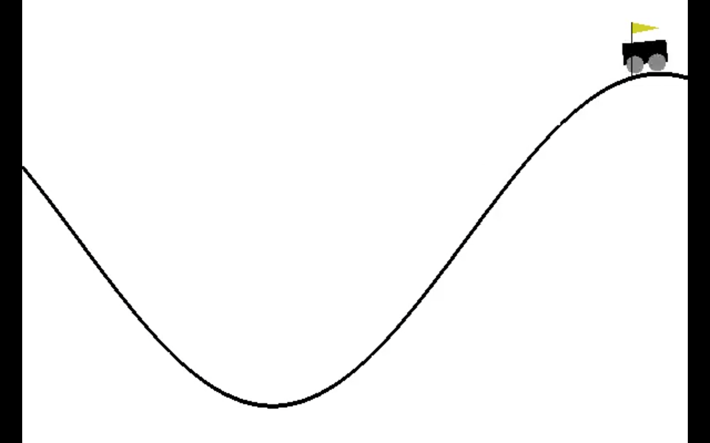
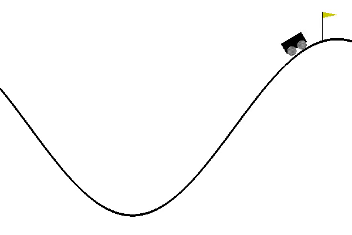
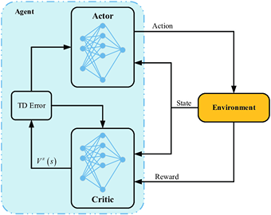
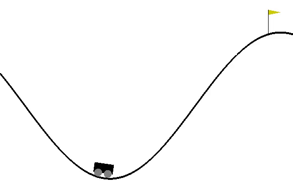

## What is the best way to get a car out of the bottom of a hill?

## Introduction

This blog post was written by Jacob Mantooth,Dewan Chowdhury, Arjun Sethi-Olowin and with the help of our advisory Dr.Ruthotto.

In addition to this post, the team has also created slides for a [midterm presentation](), a [poster blitz video](), and a [poster]().

The word around town is that reinforcement learning is the top dog and has the answers to all our problems. We wanted to see if that really was the case, so this summer we took a trip to Emory University where we looked at the continuous mountain car problem to see if reinforcement learning really, was the best. The continuous mountain car problem is an example of an optimal control problem. You may be asking yourself what is an optimal control problem? An optimal control problem is a dynamical system with an ODE that involves some controllable function $u$. In our case the continuous mountain can be modeled as a PDE where $u$ is some controllable function. In the continuous mountain car problem our control,$u$, is whether the car accelerates left or right. In an optimal control problem, we seek to optimize some objective function, in our case we will minimize the objective function. Our two objective functions are the running cost, which penalizes the car for acceleration. While our other objective function is the terminal cost which penalizes the car for not reaching the goal, the top of the hill, in time. In the image below you can see an example of what the mountain car problem looks like.

### The Why???

You may be wondering what our reason was for picking the mountain car problem, there are a couple of reasons why we picked this example. One of the reasons was that the continuous mountain car problem is a well establish benchmark for reinforcement learning models. Another thing that makes the mountain car problem great is that the mountain car problem is in a 2-D state-space which allows for good plotting and visualization. One other reason that we picked the mountain car is that it is both a reinforcement learning and optimal control problem. In our case it has a finite horizon and is in a continuous state. The whole reason we are doing this is because we want to compare three different ways of solving the continuous mountain car problem and see which one really is the best. The three methods that we will be testing can be broken down as one local method and two global methods, we will be discussing each in-detail below.

## Our Three Approaches

### Local

Our first method that we looked at during this REU was the local method. In this approach we found the local solution using numerical ODE solvers and Nonlinear Optimization.

To solve our optimization problem, we used gradient descent. By taking an initial guess for $u_h$ and repeatedly updating $u_h$ using the gradient of the objective function and step size $\alpha$

$(u_h)_0 = \vec0$

$\vdots$

$(u_h)_6 = (u_h)_5 - \alpha( \nabla J((u_h)_5))$

$\vdots$

$(u_h)_* = (u_h)_{19} - \alpha( \nabla J((u_h)_1{19}))$

Below is a nice visual example of what all this math means. When the tail reaches the dotted line, it means our car has reached the top of the hill. 

  

The graph shows us the position vs velocity of the car. In the graph the black dot represents t and the tail of the plot, when x-position is .45 is time T. In the graph we see the color change from red-blue, in our plot the blue color is when the car is accelerating, and control is positive but red otherwise.

Our next goal was how do we create a nice visualization of what the actual solution looks like.

We see in this video what our optimal local solution looks like. A couple of things that should be noted is, if we move the car to a new position then this local solution may no longer work. The same can be said if we slowed down/speed up a bit then this solution may not even let the car get to the top of the mountain. Another downside of the local is that it is a Non-linear and non-convex problem which makes this method slow. This local solution will serve as a baseline so we can compare other methods to something to see which one is really the best.

## Global Methods

Now that we have established a baseline, we will discuss our other two methods. Our other two methods that we will be looking at are global methods, the first being reinforcement learning method and the other being optimal control method. You may be asking yourself what is the difference? Reinforcement learning is more of a data driven approach while the optimal control method is a hybrid approach, using both a model and data.

# Reinforcement Learning

Our first stop in exploring global methods is reinforcement learning.  We will be using reinforcement learning with actor-critic algorithm. This approach is completely data-based approach. In reinforcement learning it has no knowledge of the model, it only considers the objective function. In reinforcement learning we would like to maximize a reward, so in our case we will maximize negative cost. Reinforcement learning is stochastic in two ways with initial position and action space which allows for exploration. In Reinforcement learning we are trying to estimate an optimal control policy. One of the big things that we have yet to discuss is, what is actor-critic algorithm? In the actor-critic algorithm the critic must learn about and critique whatever policy is currently being followed by the actor. The next picture is a nice visualization of what is going on in the actor-critic algorithm.

Some useful background in our reinforcement learning method is that we were working in the OpenAI gym mountain car environment, so we were able to find preexisting code for our project. The thing is our preexisting code was not the same as our problem, so we had to modify it some. The modification we did was the following: we changed the rewards to be continuous and we made it have a fixed final time instead of ending the iteration once reaching the goal. The following video is the results that we were able to get after many training cycles.

In this video we see that reinforcement learning method gave us a sub optimal solution compared to the local solution. You may also notice that in the reinforcement learning method our car takes an extra swing backwards to get to the top of the hill. In our reinforcement learning method it took many episodes just to get the car to our goal. We saw that reinforcement learning is very fragile, a couple of changes saw our success rate go from 70% to 10%. 

# Optimal control method

Our last two methods were vastly different with reinforcement learning using a data driven approach and the local method using a model-based approach. We will now be looking at the optimal control method which combines both model and data driven approaches. In this approach, we aim to estimate the corresponding value function with neural network approximators utilizing feedback from the Hamilton-Jacobi-Bellman equation and Hamiltonian.

## Our Experiences

### Week 1

In week one we decided to make a game plan for the following weeks. We would work on the local method for just a week since it was basically finished. For the other two methods we would spend two weeks on each method. Lastly, we would save the last week to wrap up all three methods and anything else that is left over. During the first week we wanted to look at the local method and explore it some.

### Week 2 & 3

We decided to spend two weeks to look at reinforcement learning, during these two week we were able to produce a PowerPoint in beamer for our mid-week presentation. In week two and three we looked at our first global method. Dr.Ruthotto handed us some pre written code to play around with. A thing that should be noted is that this prewritten code only worked maybe 50% of the time. Looking deeper into the code we realized that we would have to mess around with the code to get it to match our problem. After we made these couple of changes in our code, we saw how fragile reinforcement learning is, instead of working 50% of the time our code barely worked at all. During this week we were also able to produce a rendering of both of our local and RL methods, adding a nice touch to our presentation that we gave.

### Week 4 & 5

We are currently looking at optimal control method. During week 4 we were able to produce a rough draft of the website while also taking a deeper look into optimal control method.

### Week 6

## More About Our Team

-   **Jacob Mantooth**
-   **Dewan Chowdhury**
-   **Arjun Sethi-Olowin**

# References
