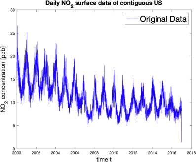
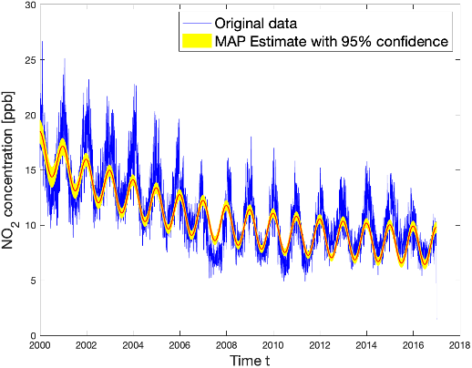

<!-- https://docs.google.com/document/d/1DbfqmpkV7B7h78s44ZPp59s8fOqnl93ATvakM_nx7o8/edit -->

This blog post was written by Riley Chen, Mason Lu, Matilda Slosser, and Aneesh Srinivas and published with minor edits. The team was advised by [Julianne Chung](http://www.math.emory.edu/~jmchung/), [Matthias Chung](http://www.math.emory.edu/~mchun45/), [Elizabeth Newman](../author/elizabeth-newman/). In addition to this post, the team has also created a [poster](content/2023-NO2-Poster.pdf). 

## Introduction 
Nitrogen Dioxide ($NO_2$) is a common gaseous pollutant. It is a by-product of combustion, making its local concentration levels directly tied to gas vehicle emissions and fossil fuel-sourced energy production. In the United States, cars are the largest source of $NO_2$, which links high concentrations to urban environments. 

Tracking and predicting $NO_2$ concentrations is an issue of public health and social justice. Certain individuals like children, older adults, or those with pre-existing lung conditions are susceptible to poor health outcomes after exposure to $NO_2$.  Marginalized people tend to be forced through economic and social structures into areas with relatively high $NO_2$ concentrations, resulting in disproportionate exposure.

[Our data](https://pubmed.ncbi.nlm.nih.gov/31851499/) is generated from the Air Quality System (AQS) $NO_2$ monitoring networks over the contiguous United States of the Environmental Protection Agency (EPA). This data is from Jan 1st, 2000, to Dec 31st, 2016, with 6210 points. Our main goal is to create a model to predict average $NO_2$ concentration across the contiguous United States. We also aimed to analyze the relationship between $NO_2$ concentration and the Social Vulnerability Index (SVI) geographically.

## Model-Driven Approach
We plotted the daily average concentration of $NO_2$ over the US from the year 2000 to the year 2016 and observed that the data has seasonal oscillations and a decaying trend. 

Therefore, we incorporated this information to build the model shown below.
 
$ y_{\mathrm {model}}=p_1+p_2 e^{p_3(t-p4)}+p_5 \cos(2πp_6(t-p_7)). $    

where

- $p_1$ - our intercept (average $NO_2$ on December 31st, 1999). 
- $p_2$ - starting value of the exponential decay
- $p_3$ - exponential decay scale factor 
- $p_4$ - the starting time. Since the data started in 2000, we expected $p_4 ≈2000$. 
- $p_5$ - the amplitude of the seasonal oscillation. 
- $p_6$ - the frequency of the cosine component. 
- $p_7$ - the cosine shift, which increases our model’s adaptability 

To learn more about the parameters, we aimed to randomly generate samples in the hope that if the sample space was large enough, a good approximation for the distribution of parameters could be found. A Markov Chain Monte Carlo (MCMC) method was utilized to generate the samples, which implemented Bayes' theorem. The specific algorithm we used is called Adaptive Metropolis. We fixed $p_4$ to be 2000 and $p_6$ to be 1 to ensure enough random walk for the algorithm. We generated 400,000 sets of values for the parameter set.

Plotting the samples component-wise we observe that each graph only has one peak. That means that the samples agree, and gives us some confidence that each parameter is within the range in its own graph. After investigating each parameter, we wanted to explore how each pair of parameters was related to each other. Most were Gaussian if the outliers were ignored. However, $p_1$ and $p_3$ were highly correlated.

We also calculated the posterior function value of the new parameter set for each random set we generated. We then updated our current maximize-a-posterior (MAP) estimate for the parameter set. This estimate gives us the most probable value for the parameter sets given this data. The model with this parameter set is plotted with a 95 percent prediction interval, as shown below. The interval is wider at the peaks and troughs, making it harder to predict the exact value at the highest and lowest points in each oscillation cycle.

## Main Findings 
 
Our model-driven approach with appropriately selected parameters provided reasonable predictions of the average daily $NO_2$ concentrations. Including a weight matrix in the objective function resulted in a better data fit.
Our visual inspection of the posterior MCMC samples suggests high levels of agreement and demonstrate
little uncertainty in their predictions.
We also experimented with an LSTM model but were not able to achieve competetive results. 
Although weak for some years, we observe correlations between the SVI and
NO2 concentration, most noticeable in 2010.

## Interested in Learning More?
Please see our [poster](content/2023-NO2-Poster.pdf).
