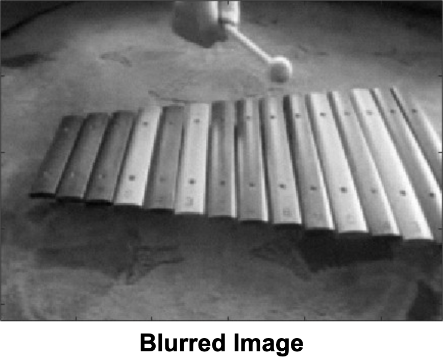
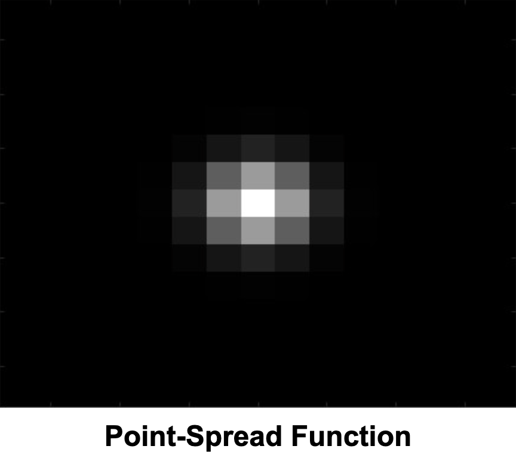
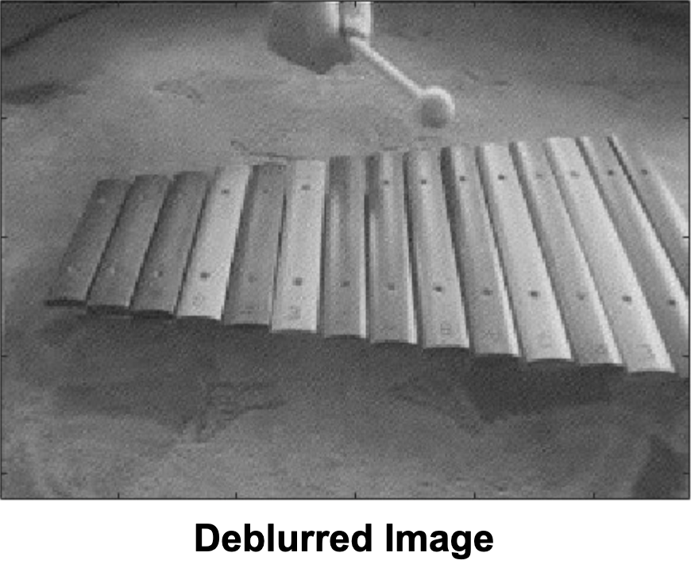
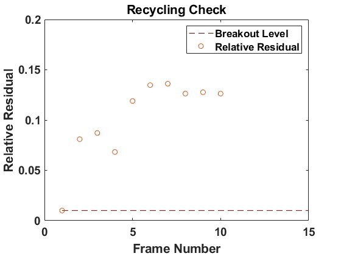

This blog post was written by Clara Armstrong, Olivia Kallay, and Srijon Sarkar and published with minor edits. The team was advised by [Lucas Onisk](../author/lucas-onisk). In addition to this post, the team has also given a [midterm presentation](), filmed a [poster blitz video](), created a [poster]() and written a [manuscript](). 

## Background

The image deblurring problem can be framed as a least-squares problem. We let $A$ be our blurring matrix, the convolution of a _Point-Spread Function (PSF)_ and a boundary condition. The true image is represented by $X$, and the blurred by $B$; we vectorize both to get our linear system, $Ax=b$. For example, we see below an image blurred using PSF Gauss with 2% noise:

  
  
  

Consider the solution $x$ written with respect to the singular value decomposition (SVD) assuming $A$ is invertible. The blurred imagine contains error such that $b=\hat{b}+e$; we observe that 

$$
x = V\Sigma^{-1}U^Tb
  = \sum_{i=1}^{n}\frac{u_i^Tb}{\sigma_i}v_i
  = \sum_{i=1}^{n}\frac{u_i^T\hat{b}}{\sigma_i}v_i+ \sum_{i=1}^{n}\frac{u_i^Te}{\sigma_i}v_i
$$

where the first sum is our _true solution_ and the second is our _inverted noise_. For image deblurring problems, the $u_i^Te$ terms are constant in magnitude. $A$ is an ill-conditioned matrix, causing the solution to be dominated by the inverted noise, which becomes very big as the singular values $\sigma_i$ decay to numerical zero.

## Our Approach

We will focus on two Krylov techniques: _Arnoldi_ and _Golub-Kahan bidiagonalization_. Using Krylov methods allows us to work in a smaller subspace that captures enough information about the system to compute an approximate solution, making our problem easier to solve than solving directly. 

A Krylov subspace is the span of repeated applications of a matrix $A$ to a vector $b$, or

$K_p(A, b) = \text{span}\{b, Ab, A^2b, ... , A^{p-1}b\}$

The Arnoldi relation is at the core of the _Generalized Minimal Residual (GMRES)_ method for solving **square nonsymmetric** linear problems. After $p$ steps of the Arnoldi iteration, we develop the relation

$AV_p = V_{p+1}H_{p+1}$

where $A$ is the square operator from the linear system, $V_{p+1}$ has orthonormal columns that span the subspace $K_p(A, b)$, $V_p$ contains the first $p$ orthonormal columns of $V_{p+1}$, and $H_{p+1}$ is an upper Hessenberg matrix (an upper triangular matrix that contains an additional subdiagonal band) of the scalar coefficients from the orthonormalization process of Gram-Schmidt, used in Arnoldi.

_Golub-Kahan bidiagonalization (GKB)_ is associated with the LSQR method, where $A$ could be **non-square**. GKB generates orthonormal vectors that span the following spaces:

$$K_p(A^TA, A^Tb) \text{ and } K_p(AA^T, b)$$

After $p$ steps of GKB, we have the following relationships

$$AV_p = U_{p+1}B_{p+1} \text{ and } A^TU_{p+1} = V_{p+1}\tilde B_{p+1}$$

where $V_{p+1}$ and $U_{p+1}$ contain orthonormal columns spanning $K_p (A^TA, A^Tb)$ and $K_p(AA^T, b)$, $B_{p+1}$ is the lower-bidiagonal, projected variant of $A$, and $\tilde B_{p+1}$ is square due to the inclusion of an additional column.

## Our Observations

Since GMRES and LSQR require many matrix-vector products, we desire to gain efficiency through recycling strategies to circumvent such repetitive computation while solving sequences of closely related problems. 

We observed for that $r^{(2)}=Ax_{approx}^{(1)}-b^{(2)}$, the residual of the second problem using our solution to the first (seed) problem, the Reconstructive Residual Norm (RRN) satisfies

$$DP \leq \frac{||r^{(2)}||}{||b||} < 1,$$

where DP represents a breakout parameter from the _Discrepancy Principle_, $\tau\delta$, in which $\tau$ is a safety parameter close to one and $\delta$ is an upper-bound on the erroneous right-hand sides. 

Although the residual is above the breakout level given by the DP, it remains significantly lower than if we started from the zero vector (which would produce a relative residual of one). Thus, by recycling basis vectors from previous solutions to solve subsequent problems, we drastically reduce the RRN.

We note that with these types of methods, residuals decrease, but errors demonstrate semiconvergent behavior; we see the error decrease until a certain point at which it will begin growing exponentially.

As the basis from the seed problem contains useful information for non-arbitrarily chosen right-hand sides (image frames for our purposes), we incorporate this information by calculating

$$\text{res} = \frac{r^{(2)} - V_pV_p^Tr^{(2)}}{\||r^{(2)} - V_pV_p^Tr^{(2)}\||}$$

and appending it in $[V_p \quad res] = \tilde V_{\ell}$ thereby forming the _flexible Arnoldi_ method as $A[\tilde V_{\ell}] = \tilde U_{\ell+1}J_{\ell+1}$ at step $\ell$. $U$ and $J$ come from completing the back half of Arnoldi, respectively representing a new basis and a projected variant of $A$.

## Future Directions

Eventually, we will run out of memory as we continue iterating flexible Arnoldi and storing more basis vectors. To avoid this, we will utilize different compression strategies to decide which basis vectors should be retained for solving subsequent problems, and which may be discarded. The compression strategies we aim to use are 
1. Truncated Singular Value Decomposition
2. Reduced Basis Decomposition
3. Solution-Oriented Compression

We aim to combine compression techniques with flexible algorithms, including extending our work to non-square operators to replicate _flexible GKB_ for LSQR.

Further, as these iterative processes continue and our subspace grows, it might capture information from small singular values. So, we discern the need for penalized least squares using _Tikhonov regularization_ for our projected problems as

$${\min_\textbf{x}} ||A\textbf{x}-\textbf{b}||_2^2 + \lambda||\textbf{x}||_2^2.$$

So far, we have only focused on sequences of images, such as those that may arise from a video. However, these techniques can also be useful for other sequences of linear inverse problems, such as those arising from medical imaging. 

## References

1. _On the Use of Arnoldi and Golub-Kahan Bases to Solve Nonsymmetric Ill-Posed Inverse Problems_, Brown, A. M., (2015)
2. _GMRES: A Generalized Minimal Residual Algorithm for Solving Nonsymmetric Linear Systems_, Saad, Y. and Schultz, M.H., (1986)
3. _Hybrid Projection Methods with Recycling for Inverse Problems_, Jiang, J., Chung, J., and de Sturler, E., (2021)
