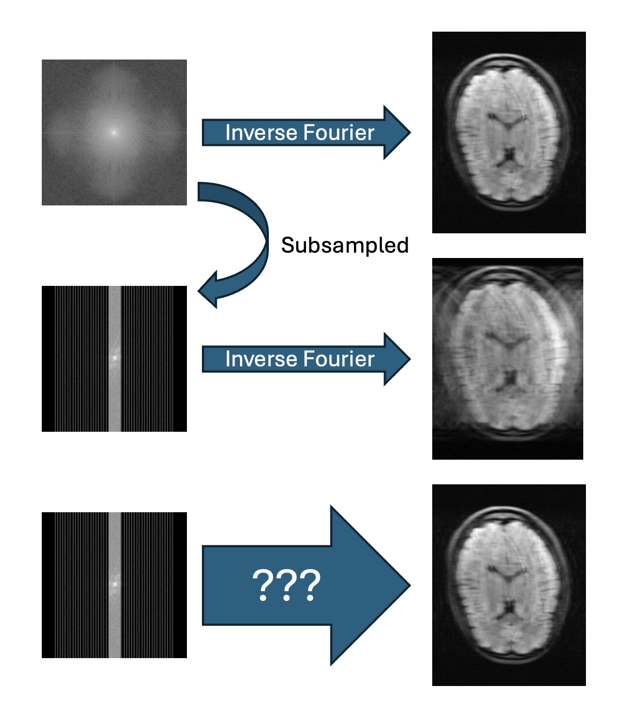
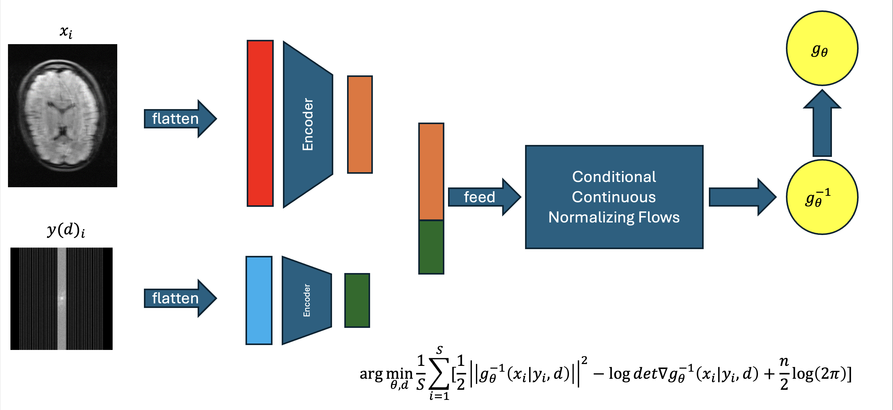
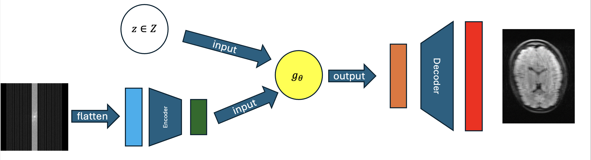

  
Reconstructing images from noisy and indirect observations is an ill-posed inverse problem critical for many medical and imaging applications However, obtaining such indirect observations is expensive time and cost wise. We wish to improve the measurement process by finding the best sub-sampled indirect measurements/observations to take, and reconstruct a quality image from the best sub-sampled set. 

  <h3>Example Training Process</h3>

  <h3>Example Inference Process</h3>

  
We explore how Normalizing Flows, a generative method, and autoencoders can be leveraged to learn quality image generation from a sub-sampled set of indirect observations. We also explore introducing a differentiable or learnable mask function into our model as design parameter d, to potentially learn the best sub-sampled set of indirect observations to reconstruct from using Normalizing Flows.