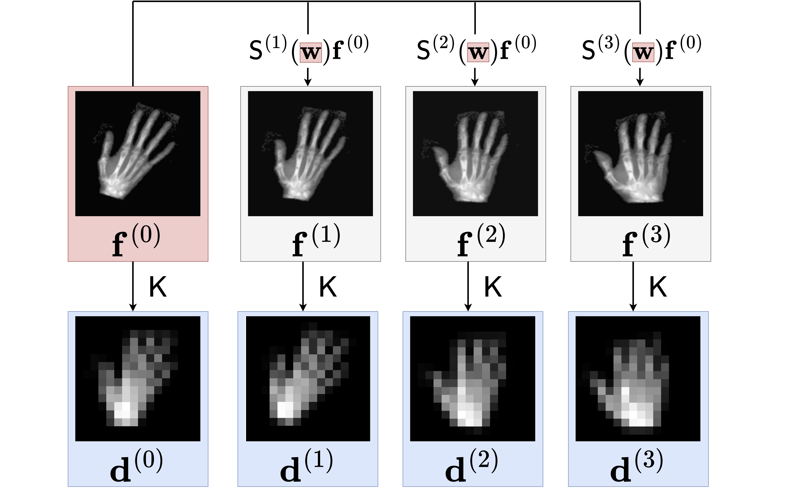
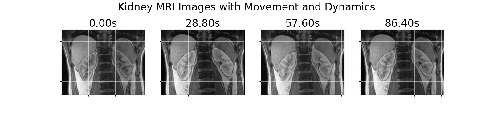
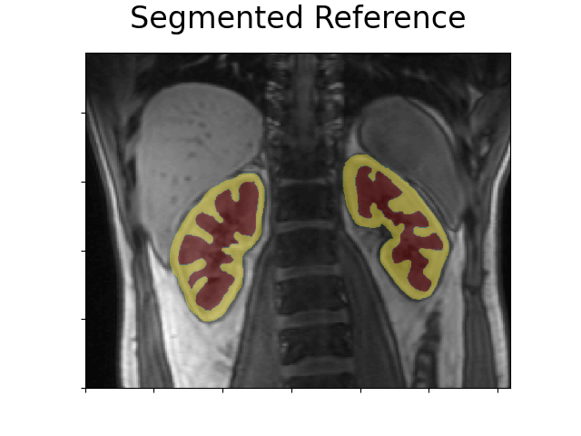
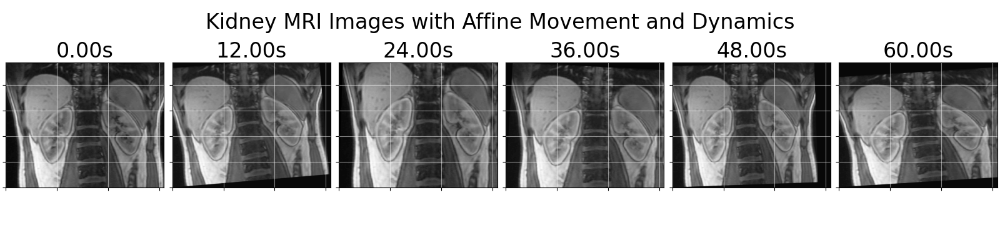
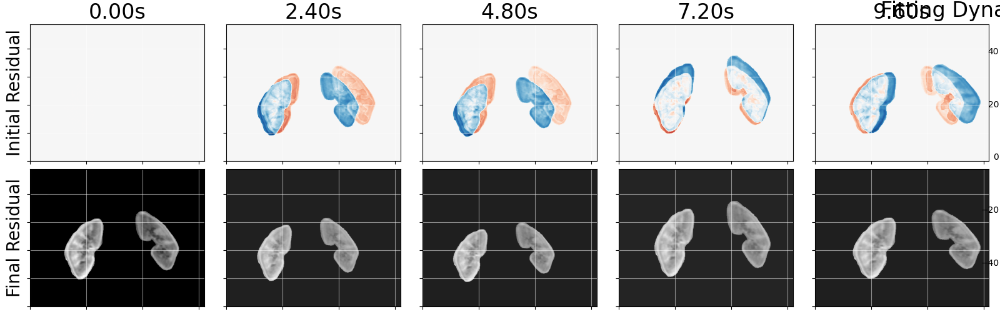
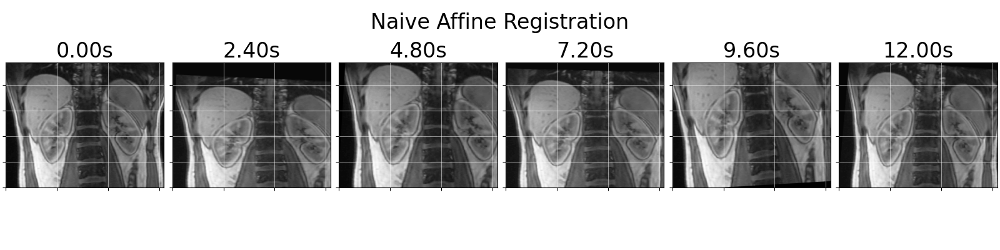
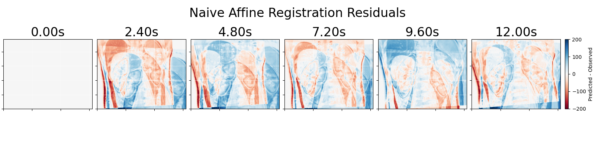
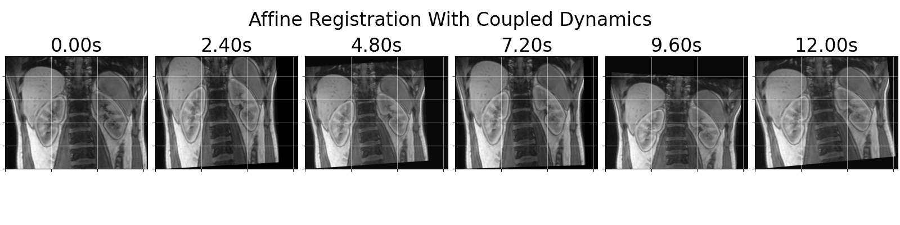
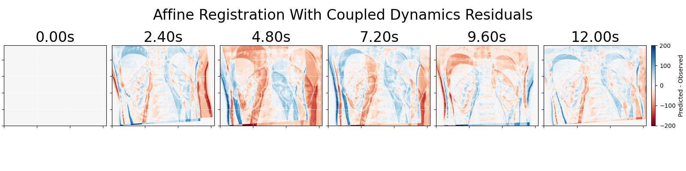

**Authors:**

- **Cash Cherry**
  *Department of Applied Mathematics and Statistics, Colorado School of Mines*

- **Rachelle Lang**
  *Department of Mathematics, University of Wisconsin-Madison*

- **Warin Watson**
  *Department of Mathematics, Colorado Mesa University*

**Advisor:**

- **Lars Ruthotto**
  *Associate Professor of Mathematics and Computer Science, Emory University*

## What is image registration?

Arising often in the context of medical images, image registration is the problem of finding a transformation which "aligns" two images. A simple example is given above. *Registering* a "template" image with a "reference" image is the process of mathemically aligning the "template" image with the "reference." Some direct impacts of registration include

* Medical Imaging: Accurate diagnosis, treatment planning, and monitoring of diseases
<!--  @misc{viergever2016survey,
  title={A survey of medical image registration--under review},
  author={Viergever, Max A and Maintz, JB Antoine and Klein, Stefan and Murphy, Keelin and Staring, Marius and Pluim, Josien PW},
  journal={Medical image analysis},
  volume={33},
  pages={140--144},
  year={2016},
  publisher={Elsevier}
}-->
* Remote sensing: Analyze changes in the environment, such as deforestation, urbanization, and disaster assessment
<!--

-->
* Computer Vision and Robotics: Object recognition, 3D reconstruction, and augmented reality applications

  

### Affine Registration

Affine transformations are those which preserve lines by allowing for rotation, scaling, translation, and shearing. For two dimensional images, it is possible to represent any affine transformations with only 6 parameters. The simplicity of an affine transformation can also be restrictive on many real world problems. The figure below shows registration with an affine transformation on a more realistic problem. Although largely registered well, the details with the fingers could be better. And so its of great interest to use transformations that have more freedom.

### Registration with Neural ODE

One approach that allows for greater freedom in addition to other nice properties is to construct the transformation as a flow field (see this [paper](https://pubmed.ncbi.nlm.nih.gov/29097881/)). This involves describing how the transformation changes over time, starting from a state that does nothing (the identity transformation), and using a velocity function to explain the changes. By observing the transformation at a specific time, in this case time 1, we get our final transformation. Neural networks, which are [great function approximators](https://en.wikipedia.org/wiki/Universal_approximation_theorem), can be used to approximate the velocity function. When this is done, it's referred to as a neural ordinary differential equation (neural ODE). The figure below illustrates registration with a neural ode and how it manages to create a complex and accurate registration.

### Solving an Image Registration Problem

The problem of image registration can be phrased as minimizing an objective function that quantifies the error in the registration. This amounts to finding the parameters of the neural network velocity function that minimizes the objective. An effective method to avoid getting non-ideal solutions is by using a multi-scale approach (more [explanation](https://archive.siam.org/books/fa06/)). This involves solving the registration problem when the template and reference are "blurred", and then starting from that solution, solve successively less blurred versions of the problem until the blurring is gone. The figure below illustrates the multiscale approach. 

#### Homotopy Optimization 

Our team has explored homotopy optimization methods, experiencing both successes and challenges. Homotopy optimization aims to achieve what multiscale methods accomplish but operates on a continuous scale by tracing the path of a global minimizer. This technique leverages second-order optimization methods, starting with securing a minimizer for the blurry registration problem. However, integrating it effectively with neural ODE registration has proven to be difficult since hihgly blurred versions of the problem are still highly non-convex.

<!--
## References

[1] A. Mang and L. Ruthotto. A lagrangian gauss–newton–krylov solver for mass-and intensity-
preserving diffeomorphic image registration. SIAM Journal on Scientific Computing,
39(5):B860–B885, 2017.

[2] 
-->

## Super Resolution
Suppose you have a sequence of low resolution images of your subject in motion and need a single high resolution image. For example, you need a detailed image of a heart, but all you can get are low resolution images taken at different points in time as the heart beats.

The super-resolution problem is like the image registration problem in that we are finding transformations that align each template image, one of the low resolution images, with the reference image, which is the high resolution image. But since the reference image is unkown, we construct it at the same time, optimizing for both the transformations and the high resolution image together.

In the diagram above, the given low resolution images are labeled by the letter d. These each have a high resolution counterpart labeled by the letter f, which we find through our optimization. The goal of super-resolution is to find the first of these high resolution images.

### Super Resolution with Neural ODEs
Our template images each are taken at a specific, known time, and we can use neural ODEs to take advantage of the time dependency. Neural ODEs represent a function changing continuously through time, so we can use one to model the continuous transformation of our initial image. Evaluating the neural ODE at time t will tell you how the initial image changes after t seconds. That way, instead of finding an individual transformation for each low resolution image, we find one transformation that describes the entire sequence. 

### Solving the Optimization Problem
We are still working on finding the most efficient and effective methods to solve the super-resolution problem. We are using advanced optimization techniques such as variable projection. 

## Registration with Intensity Dynamics

> Above figure shows synthetic data with a breathing motion and tracer dynamics added. The original MRI is from Figure 4 of [Registration of Dynamic Contrast Enhanced MRI with Local Rigidity Constraint](https://doi.org/10.1007/978-3-642-31340-0_20).

In medical imaging, a [contrast agent](https://www.ncbi.nlm.nih.gov/books/NBK557794/) is often injected at the beginning of a sequence of images taken over time. This leads to observable *dynamics* - intensity changes over time - which contain [medically relevant information](https://link.springer.com/article/10.1007/s00330-003-2108-0). Correctly observing these dynamics requires tracking the same region through each image, which makes image registration important for this problem. However, to solve a registration problem, we have relied on the assumption that intensity is preserved- that is, that no such dynamics are present.

### Example Problem - Kidney Contrast MRI

> The above figure shows the same MRI image as before. The interior of the kidney is displayed in red, and the cortex is displayed in yellow.

To illustrate the difficulties inherent in registering images with dynamics, we consider a test problem with kidney MRIs and affine transformations. In this case, the kidney cortex and interior of the kidney experience different [simulated dynamics](https://www.sciencedirect.com/science/article/abs/pii/S0025556411000940), while the rest of the image is intensity preserving. 

> The test dataset used with affine transformations of the MRI image from (CITE) with simulated dynamics.

### Fitting Dynamics Without Registration

Fitting the dynamics without registering the images leads to incorrect observations of the dynamics.

> The above figures shows concentration over time for the true dynamics, and the fit under the assumption of no movement in the images. The result accumulates errors from the motion.

### Registration Without Fitting Dynamics

Registering the images without handling the dynamics leads to incorrect registrations.

> This is the result of registering the images while assuming no dynamics.

Plotting the residual images (the difference between the data and the registration result) shows that the registration result is mostly wrong.

> The residual plot visualizes the errors in the registration- ideally, the errors should be close to zero and the above images should not have positive (blue) or negative (red) values, as these both consitute errors in the registration.

### Solving for Registration and Dynamics Together

Solving for both at the same time, we have been able get a result which is much closer to the correct one. As in super resolution, variable projection is useful here.

> This is the predicted data from the registration and dynamic fitting result.

> As can be seen in the residuals of this case, the result is a closer (but still imperfect) fit to the data.

> This is the result of fitting the dynamics at the same time as the registration. The dynamics estimation show similar improvements to the registration.