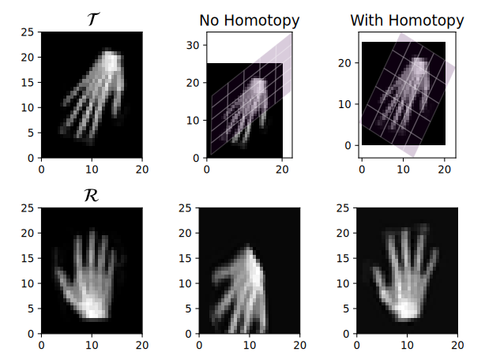

This blog post was written by Cash Cherry, Warin Watson, and Rachelle Lang and published with minor edits. The team was advised by [Lars Ruthotto](https://www.math.emory.edu/~lruthot/). In addition to this post, the team has also given a [midterm presentation](), filmed a [poster blitz video](https://youtu.be/8O9S8zm2N-E), created a [poster](/resources/Image_Registration_Poster.png) and written a [manuscript](../../publications/watson-et-al-2024/). 

## Image Registration

<!--  -->

Image registration is the problem of finding a transformation which best "aligns" one image with another image. See [FAIR](https://archive.siam.org/books/fa06/) for more detail on the problem. Some direct impacts of registration include

* Medical Imaging: Accurate diagnosis, treatment planning, and monitoring of diseases.

* Remote sensing: Analyze changes in the environment, such as deforestation, urbanization, and disaster assessment.

* Computer Vision and Robotics: Object recognition, 3D reconstruction, and augmented reality applications.

  

## Our Contributions

Over the course of the eight-week REU program, our team successfully implemented a multitude of image registration tools into working code. The variety of tools we implemented showcases how machine learning frameworks like PyTorch and JAX simplify code and saves programming time. Particularily, we highlight how auto-differentiation makes programs simpler. Below, we outline three different projects we pursued during the program.

### Homotopy Optimization

> The far left column shows the template $\mathcal{T}$, to be aligned with the reference $\mathcal{R}$. The middle column shows a non-ideal solution, a local minimizer. The far right column shows how with homotopy, a global minimizer can be obtained.

The main challenge in image registration is that the problem often lacks a clear or unique solution, and the approach to solving it is not straightforward. However, the problem becomes simpler when the images are blurred or smoothed. Computing the best transformation, or global minimizer, for a highly smoothed version of the image is more straightforward. Homotopy methods take advantage of this by first finding a global minimizer when the images are very smooth, and then tracing the path of the global minimizer through more and more detailed versions of the image back to the original problem. The figure above demonstrates that without homotopy optimization, we find a non-ideal transformation, but with homotopy omptimization, we can achieve a satisfactory one.

The difficulty with implementing homotopy optimization for image registration lies in having to compute a Hessian matrix, which is a laborious process to derive. However, this is made simpler with automatic-differentiation.

<!-- ### Registration with Neural ODE

One approach that allows for greater freedom in addition to other nice properties is to construct the transformation as a flow field (see this [paper](https://pubmed.ncbi.nlm.nih.gov/29097881/)). This involves describing how the transformation changes over time, starting from a state that does nothing (the identity transformation), and using a velocity function to explain the changes. By observing the transformation at a specific time, in this case time 1, we get our final transformation. Neural networks, which are [great function approximators](https://en.wikipedia.org/wiki/Universal_approximation_theorem), can be used to approximate the velocity function. When this is done, it's referred to as a neural ordinary differential equation (neural ODE). The figure below illustrates registration with a neural ode and how it manages to create a complex and accurate registration.

### Solving an Image Registration Problem

The problem of image registration can be phrased as minimizing an objective function that quantifies the error in the registration. This amounts to finding the parameters of the neural network velocity function that minimizes the objective. An effective method to avoid getting non-ideal solutions is by using a multi-scale approach (more [explanation](https://archive.siam.org/books/fa06/)). This involves solving the registration problem when the template and reference are "blurred", and then starting from that solution, solve successively less blurred versions of the problem until the blurring is gone. The figure below illustrates the multiscale approach. 

#### Homotopy Optimization 

Our team has explored homotopy optimization methods, experiencing both successes and challenges. Homotopy optimization aims to achieve what multiscale methods accomplish but operates on a continuous scale by tracing the path of a global minimizer. This technique leverages second-order optimization methods, starting with securing a minimizer for the blurry registration problem. However, integrating it effectively with neural ODE registration has proven to be difficult since hihgly blurred versions of the problem are still highly non-convex. -->

<!--
## References

[1] A. Mang and L. Ruthotto. A lagrangian gauss–newton–krylov solver for mass-and intensity-
preserving diffeomorphic image registration. SIAM Journal on Scientific Computing,
39(5):B860–B885, 2017.

[2] 
-->

### Super Resolution
Given a sequence of low resolution images of a subject in motion, the goal of super-resolution is to constructa high resolution of the first frame of the sequence. For example, a super resolution algorithm would be able to construct a high resolution image of a heart given only low resolution images taken at different points in time as the heart beats.

The super-resolution problem is like the image registration problem in that the goal is to transformations that align images. Particularily, we find a transformation for each low resolution image that aligns it with the high resolution image. But since the high-res image is unkown, we construct it simultaneously, optimizing for both the transformations and the high resolution image together.
<figure>
    
    <figcaption>Given low resolution images $\mathbf{d}$, these each have a high resolution counterpart labeled by the letter $\mathbf{f}$, which we find through our optimization.
    </figcaption>
</figure>

<!--
Using Neural Ordinary Differential Equations ([Neural ODEs](https://arxiv.org/pdf/1806.07366)), we model the continuous transformation of the image over time, which allows for a single transformation function to describe the entire sequence. 
-->
We employ advanced techniques like variable projection to enhance the optimization process, improving the accuracy and efficiency of super-resolution.

### Registration with Intensity Dynamics

In medical imaging, a [contrast agent](https://www.ncbi.nlm.nih.gov/books/NBK557794/) is often injected at the beginning of a sequence of images taken over time. This leads to observable *dynamics* - intensity changes over time - which contain [medically relevant information](https://link.springer.com/article/10.1007/s00330-003-2108-0). Correctly observing these dynamics requires tracking the same region through each image, which makes image registration important for this problem. However, to solve a registration problem, we have relied on the assumption that intensity is preserved- that is, that no such dynamics are present (There are some [interesting math](https://www.ams.org/journals/notices/202405/rnoti-p613.pdf) connections between intensity preservation and Neural ODEs). 

> The synthetic data in the above figure shows the data typical of this problem- the medulla and cortex of the kidneys experience different intensity changes over time after the injection of contrast. The original MRI is from Figure 4 of [Registration of Dynamic Contrast Enhanced MRI with Local Rigidity Constraint](https://doi.org/10.1007/978-3-642-31340-0_20).

This problem is of the same mathematical form as the Super Resolution problem. [Previous work](https://www.mic.uni-luebeck.de/fileadmin/mic/publications/2017/ediss1862.pdf) has used similar techniques as in super-resolution to estimate maps of parameters in various dynamical models. We are working on estimating the intensity changes directly. 

## Conclusion
In implementing three image-registration related problems with python machine learning tools, we have demonstrated the benefits of using these tools to further improve the state of image-registration. We have laid the groundwork for using homotopy methods for image registration, and have implemented variable projection with automatic differentiation. We hope that image registration researchers continue to take advantage of these tools in the future.