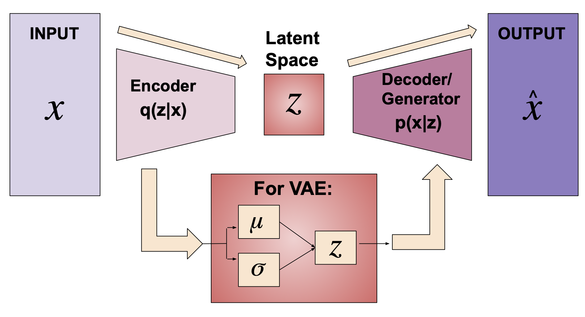
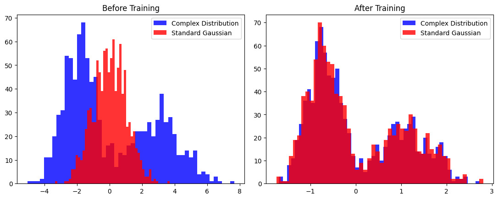
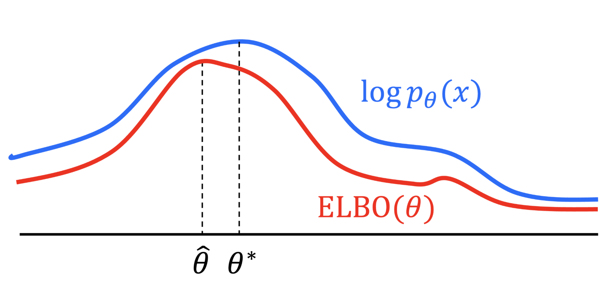

# Imporving Variational Autoencoder with Flexible Normalizing Flows

This post was written by Callihan Bertley, Claire Gan, Rishi Leburu, and Malia Walewski and published with minor edits. The team was advised by Dr. Deepanshu Verma. In addition to this post, the team has also created [slides](./Team-VAE-Midterm-pres.pdf) for a midterm presentation, a poster blitz video, and a poster.

### Project Overview: 

In the past few years, deep learning generative models have gained more attention and significant improvement. These models, such as variational autoencoder (VAE), generative adversarial networks (GANs), and diffusion models, have shown incredible ability to generate realistic images. In our project, we focus on VAE and improving the accuracy of the VAE model by using different types of normalizing flow, such as the Inverse Autoregressive Flow (IAF) and the Partially Convex Potential Map (PCP-Map).

#### What is VAE?
Variational Autoencoder (VAE) is a neural network architecture that learns a simple representation of the input data through an encoder and reconstructs new data through a decoder. As the input passes through the encoder, it will go through a series of layers to reduce its dimensions to achieve a compressed latent vector $z$. In VAE, the encoder will output the mean and the standard deviation for each latent variable, then the latent vector is sampled from this mean and standard deviation based on a standard Gaussian distribution. The Architecture of VAE can be visualize as follow:

 Figure 1: Architecture of Variational Autoencoder visualization

Even though the standard VAE can produce reconstruction images, it has limited representative power to match with a more complex shape of the true posterior due to Gaussian distribution. 

#### How to improve VAE?
Now you may wonder how can we improve VAE to better represent complex distribution. To accomplish this, we can use a method called normalizing flows (NFs). Normalizing flows apply a series of invertible and differentiable functions to a simple distribution of the latent space. It transforms the simple distribution into more complex ones by learning via data. 

The figure below demonstrate how normalizing flow is able to transform into a more complex distribution. The left figure shows the input complex distribution in blue and the standard gaussian distribution in red before training. After training using normalizing flows, you can see both distribution aligned closely on the right side of the figure.

 Figure 2: Comparison between before (on the left) and after (on the right) of training using NFs.

Our goal is to show models with normalizing flows can perform better than standard VAE.

### Methods
To address this challenge, we compare three different models with VAE using labels 1 to 4 of the MNIST handwriting dataset. In our experiment, we follow a similar implementation as [L. Midgley's](https://github.com/lollcat/Autoencoders-deep-dive/blob/Pytorch/Report.pdf) standard VAE and IAF VAE. 
1. **Standard VAE**
    As mentioned above, the standard VAE does not use normalizing flows. The input data x is fed into the encoder where it reduces its dimensions to achieve a compressed latect vector $z$. As the encoder outputs the mean and the standard deviation for each latent variable, then the latent vector will sampled from the mean and standard deviation. This sample will fed to the decoder to reconstruct the input. The latent distribution of the standard VAE is a Gaussian distribution.
2. **Inverse Autoregressive Flow**
    IAF applies a series of invertible, autoregressive transformations to a base distribution to a VAE. An autoregressive transformation is a sequence of variables. Each variable is dependent only on the previously indexed variables. When a random sample $z_{0}$ passed through a function, the pdf of the transformed sample is as below:

    $$
    \begin{equation}
        q_{\psi}(z_{1}|x) = q_{\psi}(z_{0}|x) \left|\det\left(\frac{dz_{0}}{dz_{1}}\right)\right|
    \end{equation}
    $$ &nbsp;
    $$
    \begin{equation}
        \log(q_{\psi}(z_{1}|x)) = \log(q_{\psi}(z_{0}|x)) -  \log\left(\left|\det\left(\frac{dz_{1}}{dz_{0}}\right)\right|\right)
    \end{equation}
    $$

    After applying T transformations sequentially: 
    &nbsp;
    $$
    \begin{equation}
        \log(q_{\psi}(z_{T}|x)) = \log(q_{\psi}(z_{0}|x)) -  \sum_{t=1}^T \log\left(\left|\det\left(\frac{dz_{t}}{dz_{t-1}}\right)\right|\right)
    \end{equation}
    $$

    Then we multiply a sample by $\sigma$ and add $\mu$, they are the outputs of an autoregressive neural network. The network is built such that the parameters $\sigma$ and $\mu$ for $j^{th}$ dimension of the transformed variable only depend on the $[0, j-1]$ inputs and the context vector $h$. Since $\sigma$ and $\mu$ have no dependence on the current variables in our sequence, thus, the Jacobian becomes lower triangular.

    $$
    \begin{equation}
        \frac{dz_{1}}{dz_{0}} = 
        \begin{bmatrix}
        \sigma^1 & 0 & 0 & 0 \\
        \cdots & \sigma^2 & 0 & 0\\
        \cdots & \cdots & \cdots & 0\\
        \cdots & \cdots & \cdots & \sigma^K
        \end{bmatrix}
    \end{equation}
    $$

    If T transformation are applied dequentially:
    $$
    \begin{equation}
        \log(q_{\psi}(z_{T}|x)) = \log(q_{\psi}(z_{0}|x)) -  \sum_{t=1}^T \sum_{k=1}^K\log\left(\sigma^k_t\right)
    \end{equation}
    $$
     The figure below shows adding a bunch of IAF transforms after the latent variables $z$. A context $h$ is additionally generated from the encoder and passed into the IAF step. Overall, the IAF can retain most of the properties of a standard Gaussian and is easy to compute and parallelizable for high dimensional $z$.

    &nbsp;
    Figure 3: Architecture of IAF VAE visualization (Image Source: https://arxiv.org/abs/1606.04934)

 3. **Partially Convex Potential Map**
    some explanation for PCP map

**Optimizing Evidence Lower Bound (ELBO)**
For us to measure the goodness of the model, we used the KL-Divergence loss function. The KL-Divergence function measures the dissimilarity between two probability distributions. The KL divergence is defined below. In our case, we measure the "closeness" between $q(z_{i})$ and $p_{\theta}(z_{i}| x_{i})$. The goal is to minimize the KL divergence, which is equivalent to maximizing the ELBO. The ELBO is a lower bound on the marginal log-likelihood $p_{\theta}(x_{1}, ..., x_{n})$. Therefore, if we maximize the ELBO with respect to $\theta$, it increases the lower bound of log-likelihood and the distance between these two distribution will decrease. The figure shows how the KL divergence is measured. 

 
Figure 4: Understanding of the KL-Divergence (Image Source: https://mbernste.github.io/posts/vae/)

In addition, we want to monitor both the reconstruction term and regularization term in ELBO. The reconstruction term describes the probability of the input data given the latent variable $z$. An increase in the reconstruction term means $q(z)$ is better predicting data $x$. The regularization term is the KL-divergence between our posterior and latent variable $p(z)$. For us to maximize ELBO, this term is pushing more toward 0. 

$$
\begin{equation}
D_{kl}\left(q_\psi(\mathbf{z}|\mathbf{x}) \| p_\theta(\mathbf{z}|\mathbf{x})\right) = \log p_\theta(\mathbf{x}) - \text{ELBO}
\end{equation}
$$ &nbsp;

$$
\begin{equation}
   \text{ELBO} = \underbrace{\mathbb{E}_{z \sim q_{\psi}(z|x)} \left[\log p_{\theta}(x|z) \right]}_\text{reconstruction term} - \underbrace{D_{kl}\left(q_{\psi}(z|x)\|p(z)\right)}_\text{regularization term}
\end{equation}
$$

We will implement functions to compute the marginal value of the KL-divergence, the ELBO, and both terms in the ELBO. We will also compare reconstructed images and plots for analysis for all three models. 

### Results and Conclusion

## More About Our Team
- [Callihan Bertley](https://www.linkedin.com/in/cbertley/)
- [Claire Gan](https://www.linkedin.com/in/claire-gan-758630293/)
- [Rishi Leburu](https://www.linkedin.com/in/rishi-leburu-751430298/)
- [Malia Walewski](https://www.linkedin.com/in/maliawalewski/) 

## References
D. P. Kingma and M. Welling, “Auto-Encoding Variational Bayes,” 2014.

D. P. Kingma, T. Salimans, R. Jozefowicz, X. Chen, I. Sutskever, and M. Welling, “Improving variational inference with inverse autoregressive flow,” 2017

L. Midgley, “Improving variational inference with inverse autoregressive flow,” University of Cambridge, Tech. Rep. 2021. [Online]. Available: https://github.com/lollcat/Autoencoders-deep-dive/blob/Pytorch/Report.pdf

L. Ruthotto and E. Haber, “An introduction to deep generative modeling,” GAMM-Mitt., vol. 44, no. 2, pp. Paper No.e202 100 008, 24, 2021. [Online]. Available: https://doi.org/10.1002/gamm.202100008

Z. O. Wang, R. Baptista, Y. Marzouk, L. Ruthotto, and D. Verma, “Efficient neural network approaches for conditional optimal transport with applications in bayesian inference,” 2023. [Online]. Available: https://arxiv.org/abs/2310.16975

## Acknowledgements

- Firstly, we'd like to thank our mentor Dr. Deepanshu Verma who has kept us on schedule, debugged our code, and, ulimately, helped us become stronger researchers.
- We would also like to thank Dr. Lars Ruthotto, the lead professor of this REU, for answering any and all of our questions and allowing us this amazing opportunity.
- A special thanks to the National Science Foundation for funding our project under Award No. 2349534
- Lastly, we thank the rest of the REU mentors and participants for the fun we've had this summer!

</body>
</html>