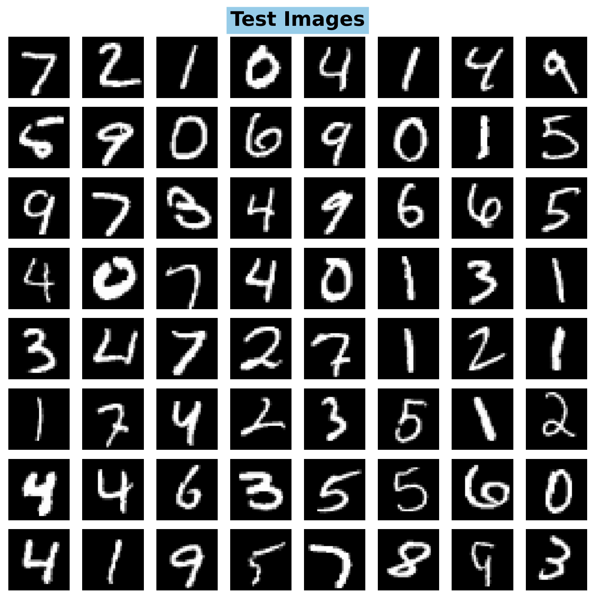
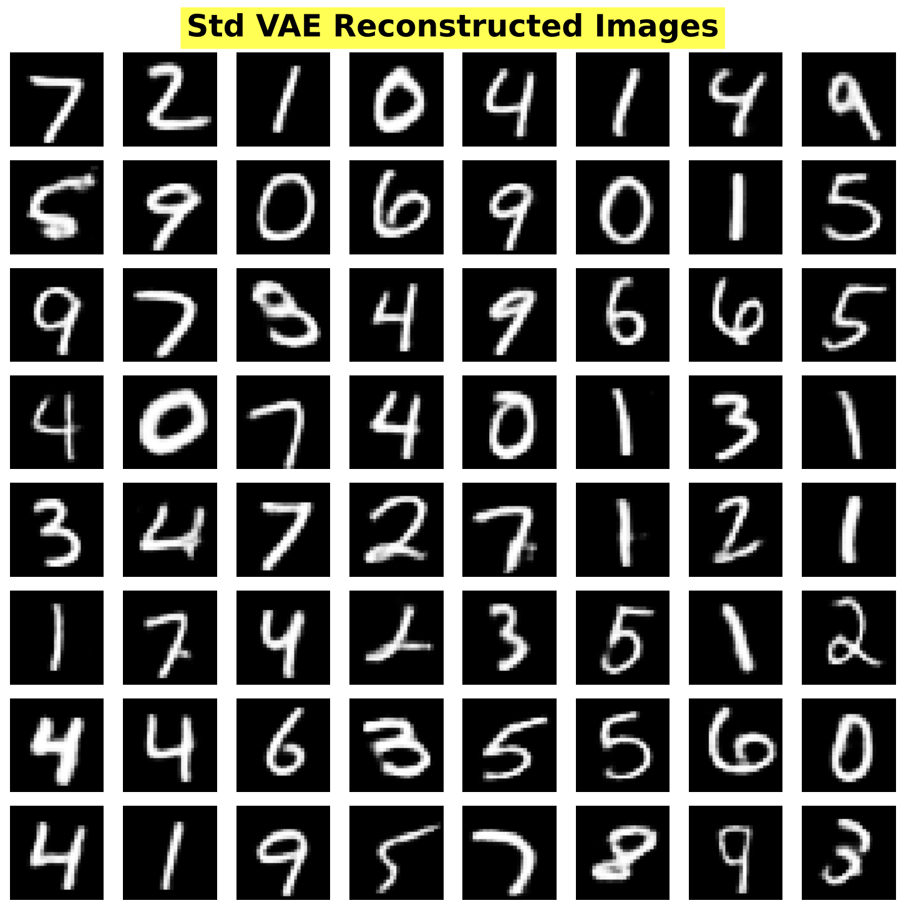
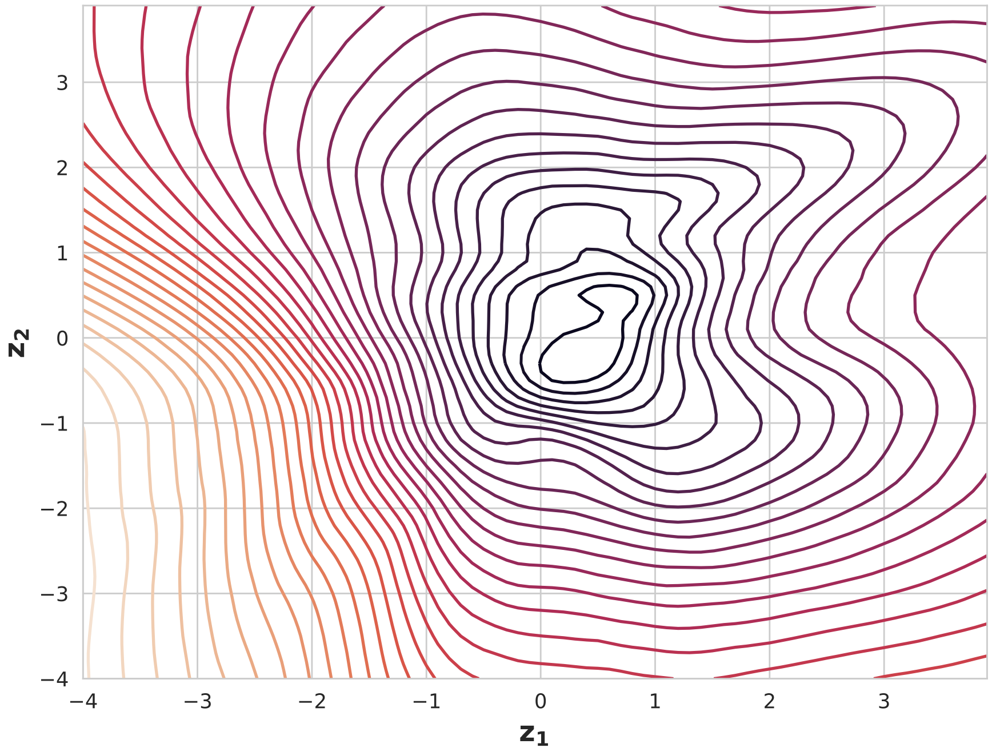
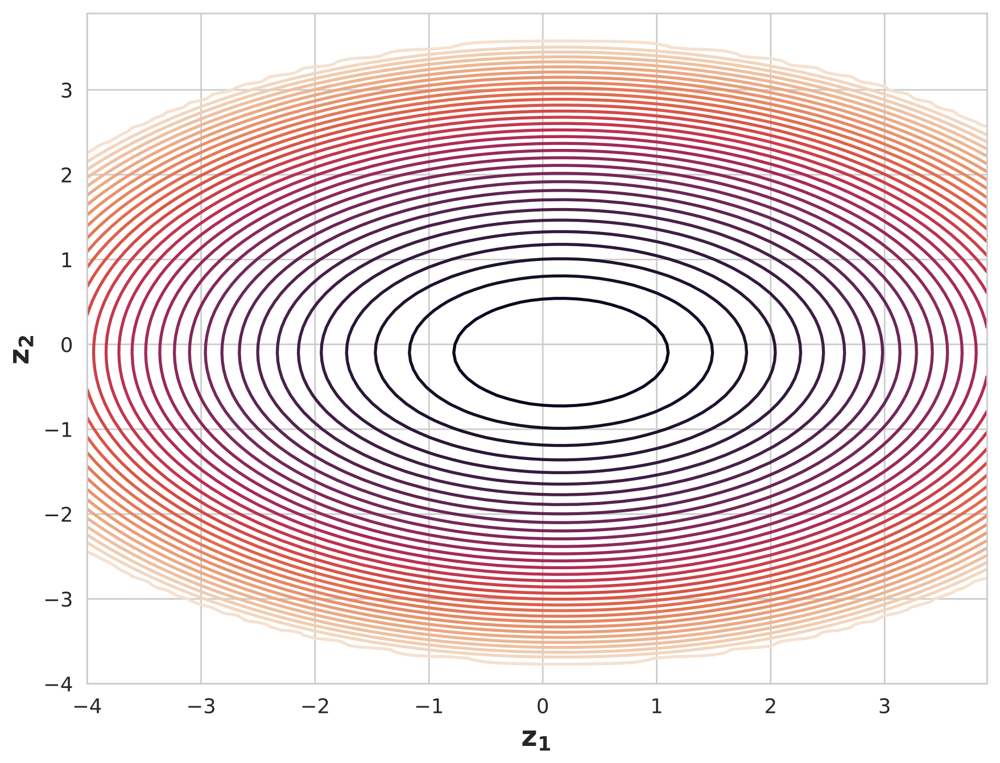
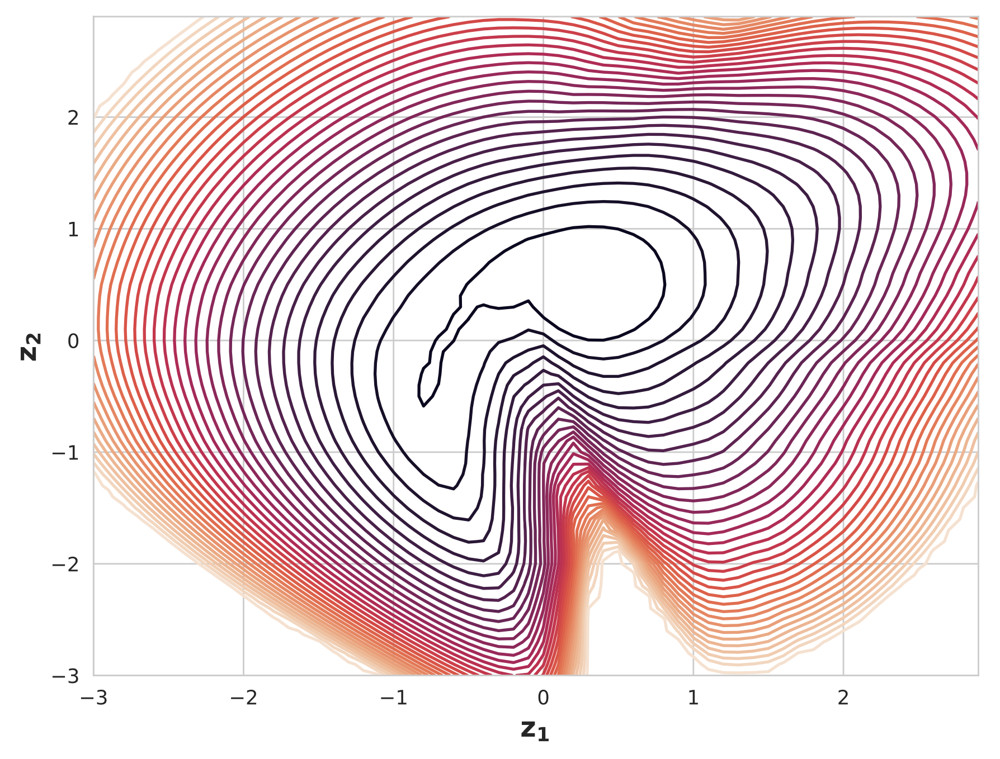

This post was written by [Callihan Bertley](https://www.linkedin.com/in/cbertley/), [Claire Gan](https://www.linkedin.com/in/claire-gan-758630293/), [Rishi Leburu](https://www.linkedin.com/in/rishi-leburu-751430298/), and [Malia Walewski](https://www.linkedin.com/in/maliawalewski/). The team was advised by Dr. Deepanshu Verma. In addition to this post, we have also created [slides](./Team-VAE-Midterm-pres.pdf) for a midterm presentation, a [poster blitz video](https://youtu.be/qmQ--692cvc), and a [poster](./Poster.pdf).

### Project Overview: 

Variational Autoencoders (VAEs) have emerged as powerful deep generative models in recent years. Our project aims to improve the expressiveness of VAEs by incorporating different types of normalizing flows, specifically Inverse Autoregressive Flows (IAFs) and Partially Convex Potential Maps (PCP-Maps).

#### What are VAEs?
VAEs use neural network architectures to learn a compact representation of input data through an encoder and generate new data through a decoder. The encoder compresses the input into a latent vector, outputting a mean and standard deviation for each latent variable to approximate the true latent representation (posterior distribution). Samples from this distribution should resemble the input when passed through the decoder.

*Figure 1: Architecture of Variational Autoencoder visualization*

VAEs typically use a Gaussian approximation for the posterior distribution. 
**However, since the true posterior distribution often deviates from normality, we aim to find a more expressive posterior.**

#### How to improve VAEs?
To improve VAEs, we can apply normalizing flows (NFs) to the Gaussian approximated posterior distribution from the encoder.  NFs apply a series of invertible transformations, parameterized by neural networks that can be optimized during VAE training.

The figure below demonstrate how normalizing flow are able to transform into a simple distribution to a more complex distribution.

*Figure 2: Comparison between before (left) and after (right) of training using NFs.*

Our goal is to show  that models with normalizing flows can perform better than standard VAEs.

### Methods
To address this challenge, we compare three different models with VAE using the MNIST handwriting dataset. In our experiment, we follow a similar implementation to [L. Midgley's](https://github.com/lollcat/Autoencoders-deep-dive/blob/Pytorch/Report.pdf) standard VAE and IAF VAE. Then we implemented the PCP-Map. 
1. **Standard VAE**
    The standard VAE uses a Gaussian approximation for both the encoder and latent distribution. For further details, see [1](https://arxiv.org/abs/1312.6114) and [4](https://arxiv.org/abs/2103.05180).
2. **Inverse Autoregressive Flow (IAF) VAE**
    The IAF VAE applies a series of invertible, autoregressive transformations to the Gaussian approximated distribution in the encoder. For each transformation, an autoregressive neural network takes in the input latent sample and a conditional vector dependent on the given inputs and outputs mean and standard deviation of the tranfromation.

    The Jacobian matrices of the transformation are lower triangular, which makes computing the determinant, and hence the loss, not expensive.

    
    *Figure 3: Architecture of IAF VAE visualization*

 3. **Partially Convex Potential Map**
    The PCP-Map VAE is another way to transform the input, Gaussian distribution to a more complex distribution. This is achieved by parameterizing a transformation as the gradient of a scalar-valued partially input convex neural network. These maps are constructed to have a triangular Jacobian matrix. This structure allows the Jacobian to be computed as the Hessian of the PICNN.

**Optimizing Evidence Lower Bound (ELBO)**
We use the KL-Divergence loss function to measure model performance, aiming to minimize the KL divergence between our approximate posterior and the true posterior by minimizing the negative Evidence Lower Bound (ELBO). The figure belwo shows how ELBO is measured. 

 
*Figure 4: Understanding of the KL-Divergence (Image Source: https://mbste.github.io/posts/vae/)*

We compare the models using negative ELBO loss, reconstructed images, and contour plots.

### Results and Conclusion

After training for approximately 2000 epochs, the IAF VAE produced slightly better reconstructed images than the standard VAE. The contour plot for the IAF VAE showed a non-Gaussian distribution more similar to the input data distribution, suggesting improved expressiveness.

|  |  |  |
|:--------------------------:|:--------------------------------------------:|:--------------------------------------------:|
|        |                           |                           |

## References
[1] D. P. Kingma and M. Welling, "Auto-Encoding Variational Bayes," 2014.

[2] D. P. Kingma, T. Salimans, R. Jozefowicz, X. Chen, I. Sutskever, and M. Welling, "Improving variational inference with inverse autoregressive flow," 2017

[3] L. Midgley, "Improving variational inference with inverse autoregressive flow," University of Cambridge, Tech. Rep. 2021. [Online]. Available: https://github.com/lollcat/Autoencoders-deep-dive/blob/Pytorch/Report.pdf

[4] L. Ruthotto and E. Haber, "An introduction to deep generative modeling," GAMM-Mitt., vol. 44, no. 2, pp. Paper No.e202 100 008, 24, 2021. [Online]. Available: https://doi.org/10.1002/gamm.202100008

[5] Z. O. Wang, R. Baptista, Y. Marzouk, L. Ruthotto, and D. Verma, "Efficient neural network approaches for conditional optimal transport with applications in bayesian inference," 2023. [Online]. Available: https://arxiv.org/abs/2310.16975

