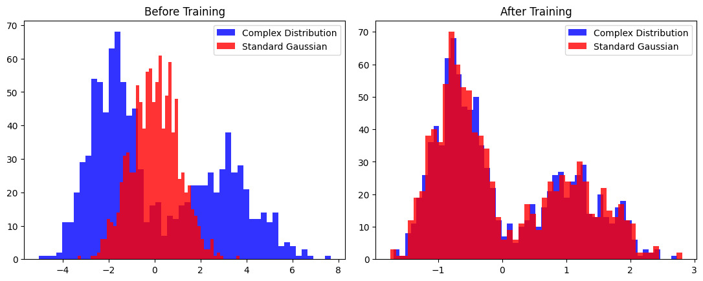

This post was written by Callihan Bertley, Claire Gan, Rishi Leburu, and Malia Walewski. The team was advised by Dr. Deepanshu Verma. In addition to this post, we have also created [slides](./Team-VAE-Midterm-pres.pdf) for a midterm presentation, a [poster blitz video](https://youtu.be/qmQ--692cvc), and a [poster](./Poster.pdf).

### Project Overview: 

Recently, Variational Autoencoders (VAE), a type of deep generative model, have garnered attention. In our project, we focus on improving the accuracy of VAEs by using different types of normalizing flows, such as the Inverse Autoregressive Flow (IAF) and the Partially Convex Potential Map (PCP-Map).

#### What are VAEs?
VAEs use neural network architectures to learn a simple representation of input data through an encoder and generates new data through a decoder. The input first passes through a series of layers in the encoder to achieve a compressed latent vector. The encoder outputs a mean and standard deviation for each latent variable, approximating the true latent representation of an input (the posterior distribution). Samples from this distribution should resemble the input when passed through a decoder.

*Figure 1: Architecture of Variational Autoencoder visualization*

To approximate the posterior distribution, VAEs default to a Gaussian.  
**However, since the true posterior distribution often deviates from normality, we aim to find a more expressive approximation.**

#### How to improve VAEs?
To improve VAEs, we can apply normalizing flows (NFs) to the Gaussian approximated posterior distribution from the encoder. NFs apply a series of invertible transformations, and in our case these transforms will be parametrized by a neural network so they can be optimized in the VAEs training. 

The figure below demonstrate how normalizing flow are able to transform into a simple distribution to a more complex distribution.

*Figure 2: Comparison between before (left) and after (right) of training using NFs.*

Our goal is to show models with normalizing flows can perform better than standard VAEs.

### Methods
To address this challenge, we compare three different models with VAE using the MNIST handwriting dataset. In our experiment, we follow a similar implementation to [L. Midgley's](https://github.com/lollcat/Autoencoders-deep-dive/blob/Pytorch/Report.pdf) standard VAE and IAF VAE. Then we implemented the PCP-Map. 
1. **Standard VAE**
    The standard VAE uses a Gaussian approximation for both the encoder and latent distribution. For further details, see [1](https://arxiv.org/abs/1312.6114) and [4](https://arxiv.org/abs/2103.05180).
2. **Inverse Autoregressive Flow VAE**
    The IAF VAE applies a series of invertible, autoregressive transformations to the Gaussian approximated distribution in the encoder. For each transformation, an autoregressive neural network takes in the input latent sample and a conditional vector dependent on the given inputs and outputs mean and standard deviation of the tranfromation.

    The Jacobian matrices of the transformation are lower triangular, which makes computing the determinant, and hence the loss, not expensive.

    
    *Figure 3: Architecture of IAF VAE visualization*

 3. **Partially Convex Potential Map**
    The PCP-Map VAE is another way to transform the input, Gaussian distribution to a more complex distribution. This is achieved by parameterizing a transformation as the gradient of a scalar-valued partially input convex neural network. 

**Optimizing Evidence Lower Bound (ELBO)**
We used the KL-Divergence loss function to measure the goodness of the model. The goal is to minimize the KL divergence between our approximate posterior and the true posterior, which is accomplished by mimimizing the negative ELBO. The figure belwo shows how ELBO is measured. 

 
*Figure 4: Understanding of the KL-Divergence (Image Source: https://mbste.github.io/posts/vae/)*

We will compare the negative ELBO loss, reconstructed images and contour plots for analysis and comparison of all three models. 

### Results and Conclusion

After training about 2000 epochs, the reconstructed images for the best model is displayed below. The IAF VAE produced slightly better images than standard VAE. Based on the contour plot, the IAF VAE has a not normal distribution and more similar to the input data distribution. 

|  |  |  |
|:--------------------------:|:--------------------------------------------:|:--------------------------------------------:|
|        |                           |                           |

PCP-Map, to be continued...

In addition, the IAF VAE demonstrates a lower negative ELBO loss compared to the standard VAE, indicating better performance in terms of reconstruction quality and latent space representation.

## More About Our Team
- [Callihan Bertley](https://www.linkedin.com/in/cbertley/)
- [Claire Gan](https://www.linkedin.com/in/claire-gan-758630293/)
- [Rishi Leburu](https://www.linkedin.com/in/rishi-leburu-751430298/)
- [Malia Walewski](https://www.linkedin.com/in/maliawalewski/) 

## References
[1] D. P. Kingma and M. Welling, "Auto-Encoding Variational Bayes," 2014.

[2] D. P. Kingma, T. Salimans, R. Jozefowicz, X. Chen, I. Sutskever, and M. Welling, "Improving variational inference with inverse autoregressive flow," 2017

[3] L. Midgley, "Improving variational inference with inverse autoregressive flow," University of Cambridge, Tech. Rep. 2021. [Online]. Available: https://github.com/lollcat/Autoencoders-deep-dive/blob/Pytorch/Report.pdf

[4] L. Ruthotto and E. Haber, "An introduction to deep generative modeling," GAMM-Mitt., vol. 44, no. 2, pp. Paper No.e202 100 008, 24, 2021. [Online]. Available: https://doi.org/10.1002/gamm.202100008

[5] Z. O. Wang, R. Baptista, Y. Marzouk, L. Ruthotto, and D. Verma, "Efficient neural network approaches for conditional optimal transport with applications in bayesian inference," 2023. [Online]. Available: https://arxiv.org/abs/2310.16975

## Acknowledgements

- Firstly, we'd like to thank our mentor Dr. Deepanshu Verma who has kept us on schedule, debugged our code, and, ulimately, helped us become stronger researchers.
- We would also like to thank Dr. Lars Ruthotto, the lead professor of this REU, for answering any and all of our questions and allowing us this amazing opportunity.
- A special thanks to the National Science Foundation for funding our project under Award DMS-2349535 and DMS-2038118.
- Lastly, we thank the rest of the REU mentors and participants for the fun we've had this summer!