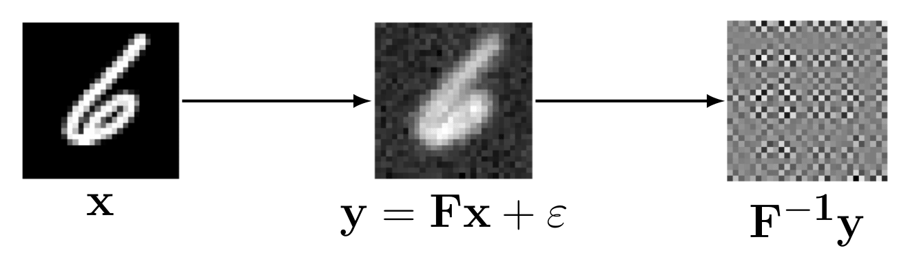
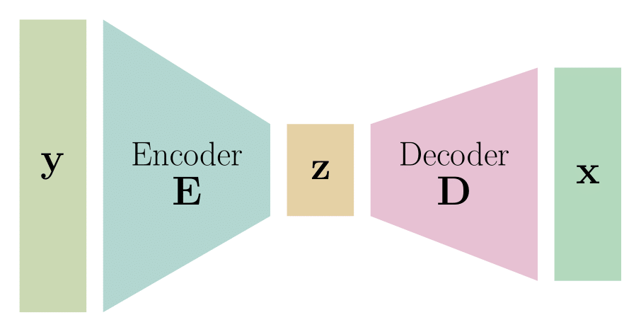
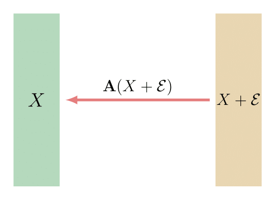
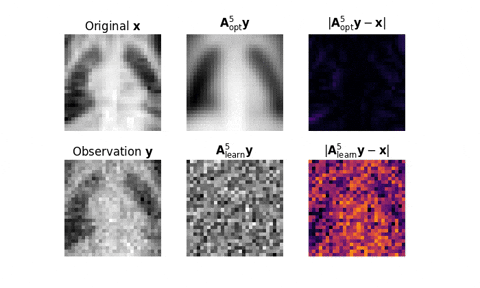
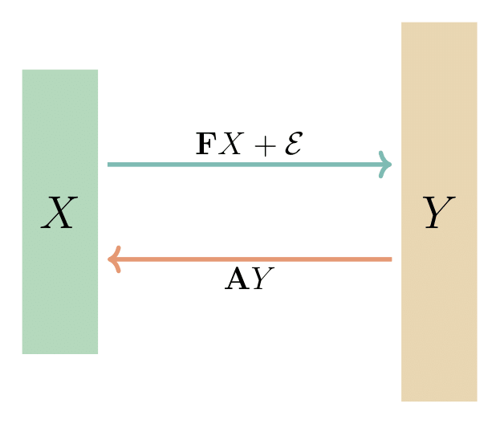
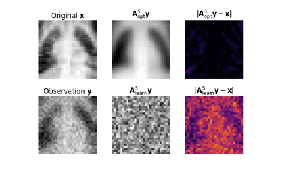

This blog post was written by [Alexander DeLise](https://www.linkedin.com/in/alexanderdelise/), [Kyle Loh](https://www.linkedin.com/in/kyle-loh-a2a3272a9/), [Krish Patel](https://www.linkedin.com/in/krish-patel-1a8804224/), and [Meredith Teague](https://www.linkedin.com/in/meredithcteague/) and published with minor edits. The team was advised by Andrea Arnold and Matthias Chung. In addition to this post, the team has also created a [poster](https://drive.google.com/file/d/1kZ1RPy-E8zGCxs_8ntEbNDc42YKNFbQ0/view?usp=sharing) and filmed a [poster blitz video](https://youtu.be/sEYCTWnZ3pM?si=L2fmIEY2AUwPl54Z).

## Introduction

Inverse problems arise naturally whenever we want to recover hidden information from indirect, often noisy measurements. Mathematically, an inverse problem usually takes the form:

$$
\mathbf{y} = \mathbf{F}(\mathbf{x}) + \varepsilon,
$$

where:

* $\mathbf{x}$ represents unknown parameters we aim to determine,
* $\mathbf{F}$ is a known process (forward operator) that describes how these parameters produce observable data,
* $\mathbf{y}$ are the observed measurements,
* $\varepsilon$ is noise or error in the measurement.

## Why Inverse Problems are Difficult

Inverse problems are critically important because their solutions drive decisions across science and engineering. However, solving inverse problems directly is notoriously challenging and often impossible due to several inherent issues:

* **Ill-posedness:** Solutions may not exist, be unique, or depend continuously on the input data.
* **Noise Sensitivity:** Small errors or noise in measurements can lead to significantly inaccurate solutions.
* **Computational Difficulty:** Direct inversion of the operator $\mathbf{F}$ is frequently computationally infeasible or unstable.

Because of these difficulties, traditional methods often fail, motivating the search for more robust and insightful approaches.

 

## Neural Networks as a Potential Solution and the "Black Box" Issue

Machine learning, particularly neural networks, has emerged as a promising solution. Neural networks can implicitly learn complex relationships from data, providing accurate approximations without needing explicit inversion.

However, a major drawback is their "black box" nature: they provide little to no insight into why and how they work. In fields where reliability and interpretability are crucial, this lack of understanding severely limits their practical adoption.

## Our Approach: Linear Encoder-Decoder Networks

To address this interpretability gap, we investigate **linear encoder-decoder (ED) networks**. Linear ED networks simplify neural network architecture while maintaining the capacity to model inverse problems effectively:

* $\mathbf{E}$ - **Encoder:** Compresses the input data into a lower-dimensional representation. This is our latent variable $\mathbf{z}$
* $\mathbf{D}$ - **Decoder:** Attempts to reconstruct the original data from this reduced representation.

The linearity of these networks allows us to derive clear mathematical expressions and theoretical insights.

 

## How Do We Decide What's Best?

Choosing a way to measure success is crucial. We use **Bayes risk minimization** because it explicitly minimizes the expected reconstruction error:

$$
\min_{\operatorname{rank}(\mathbf{A}) \leq r} \ \mathbb{E} \left\|\mathbf{A}Y - X \right\|_2^2 ,
$$

where:

* $\mathbf{A}$ is the mapping (network) we want to learn,
* $Y$ are the observed measurements,
* $X$ is the true unknown data.

Note that $X, Y$ are now **random variables**, and their realizations can be thought of as our datapoints. Bayes' Risk Minimization helps us systematically find solutions that are expected to perform best.

## Our Results in Action

Let's take a look at two common scenarios in inverse problems and compare how our theoretical optimal mappings perform against the learned mappings by our ED networks.

### Linear Denoising

#### The Theory

The **Linear Denoising Problem** is one of the simplest yet most informative cases of an inverse problem. Here, we aim to recover the original signal $X$ from noisy observations $Y$ that are direct perturbations of $X$, i.e., there is no intermediate transformation like a forward operator. Mathematically, we assume

$$
Y = X + \mathcal{E},
$$

where $\mathcal{E}$ is a random noise term.

Our goal is to find a **low-rank linear map** $\mathbf{A}$ that minimizes the expected squared reconstruction error between the predicted and true signals:

$$
\min_{\operatorname{rank}(\mathbf{A}) \leq r} \ \mathbb{E} \ \left\| \mathbf{A} Y - X \right\|_2^2.
$$

This optimization is framed through the lens of **Bayes' Risk Minimization**, which allows us to derive closed-form solutions for the optimal map. Just like in more complex inverse problems, we assume that $X$ and $\mathcal{E}$ are random variables with finite second moments, and we use symmetric matrix decompositions to analyze the structure of their variability.

 

To do this, we compute the second-moment matrices:

- $\mathbf{\Gamma}_X = \mathbb{E}[XX^\top]$ for the clean data,
- $\mathbf{\Gamma}_{Y} = \mathbb{E}[YY^\top]$ for the noise.

These are decomposed symmetrically, for instance via [Cholesky decomposition](https://en.wikipedia.org/wiki/Matrix_decomposition#Cholesky_decomposition) or [eigendecomposition](https://en.wikipedia.org/wiki/Matrix_decomposition#Eigendecomposition), into:

$$
\mathbf{\Gamma}_X = \mathbf{L}_X \mathbf{L}_X^\top, \quad \mathbf{\Gamma}_{Y} = \mathbf{L}_{Y} \mathbf{L}_{Y}^\top,
$$

where $\mathbf{L}_X$ and $\mathbf{L}_{Y}$ need not be full rank. The solution to the linear denoising optimization problem is given by

$$
\mathbf{A}_{\text{opt}}^r = \left( \mathbf{\Gamma}_X \mathbf{L}_Y^{\dagger \, \top} \right)_r \mathbf{L}_Y^{\dagger},
$$

where $(\cdot)_r$ denotes the [rank-$r$ truncated Singular Value Decomposition](https://en.wikipedia.org/wiki/Singular_value_decomposition#Low-rank_matrix_approximation) (SVD) of a matrix. This provides a clean analytic expression for the best low-rank denoiser under the assumed distributions.

#### The Experiment

In our experimental setup, we consider biomedical image data drawn from the [MedMNIST dataset](https://medmnist.com/). Each image is first vectorized to form a column vector $\mathbf{x}_j \in \mathbb{R}^{784}$. To simulate the denoising problem, we add Gaussian white noise to each vector:

- The noise is drawn independently from a zero-mean Gaussian distribution with standard deviation $\sigma = 0.05$.
- This yields the observed measurement:

$$
\mathbf{y}_j = \mathbf{x}_j + \varepsilon_j, \quad \text{where } \varepsilon_j \sim \mathcal{N}\left( \mathbf{0}, \ 0.05^2 \cdot \mathbf{I} \right).
$$

We then concatenate these entries into the matrices $\mathbf{X}, \mathbf{Y}$ for our data and observations, respectively. This setup allows us to test how well both learned and theoretical low-rank mappings can remove noise and recover the original image signals.

#### The Results

We compare our **Bayes-optimal mappings** $\mathbf{A}_{\text{opt}}^r$ against **learned linear encoder-decoder mappings** $\mathbf{A}_{\text{learn}}^r$ trained using gradient descent to minimize empirical reconstruction error. As expected, the theoretical mappings consistently outperform the learned ones, particularly at **low ranks**, where the model must compress the data most aggressively.

 

This demonstrates that even in a simplified setting, our analytic solutions are highly efficient at recovering the true signal from noisy observations using only a small number of latent features.

### Inverse End-to-End Problem

#### The Theory

The **Inverse End-to-End Problem** is a more general formulation of the data denoising problem, and it refers to the task of recovering the original unknown parameters $X$ from indirect, noisy observations $Y$ that have been passed through a known forward process $\mathbf{F}$ and perturbed by some noise $\mathcal{E}$. Mathematically, we observe

$$
Y = \mathbf{F} X + \mathcal{E},
$$

and seek to find a low-rank linear map $\mathbf{A}$ that best approximates the inverse mapping, i.e., recovers $X$ from $Y$ by minimizing the expected reconstruction error:

$$
\min_{\operatorname{rank}(\mathbf{A}) \leq r} \ \mathbb{E} \ \left\| \mathbf{A} Y - X \right\|_2^2.
$$

 

Our theoretically optimal mapping has the form

$$
\mathbf{A}_{\text{opt}}^r = \left( \mathbf{\Gamma}_X \mathbf{F}^\top \mathbf{L}_Y^{\dagger \, \top} \right)_r \mathbf{L}_Y^{\dagger},
$$

where $\mathbf{\Gamma}_X$ is the second-moment matrix of the random variable $X$, $\mathbf{L}_Y$ comes from a symmetric decomposition of the second-moment matrix of the random variable $Y$ (i.e. $\mathbf{\Gamma}_Y = \mathbf{L}_Y \mathbf{L}_Y^\top$), and $(\cdot)_r$ denotes the rank-$r$ truncated SVD of a matrix, as mentioned before.

#### The Experiment

In this numerical experiment, we define the forward process $\mathbf{F}$ as a full rank **Gaussian blur operator**. Specifically:

- The blur is implemented using a $5 \times 5$ **Gaussian kernel** with standard deviation $\sigma = 1.0$.
- This is followed by the addition of **Gaussian white noise** with standard deviation $\sigma = 0.05$.

Again, our data comes from the MedMNIST dataset. Our observed data is thus generated by:

$$
\mathbf{y}_j = \mathbf{F}\mathbf{x}_j + \varepsilon_j, \quad \text{where } \varepsilon_j \sim \mathcal{N}\left( \mathbf{0}, \ 0.05^2 \cdot \mathbf{I} \right).
$$

Again, we then concatenate these entries into the matrices $\mathbf{X}, \mathbf{Y}$ for our data and observations, respectively.

#### The Results

The animation below provides a clear demonstration of how the optimal rank-$r$ mapping $\mathbf{A}_{\text{opt}}^r$ consistently outperforms the learned $\mathbf{A}_{\text{learn}}^r$, especially at very low ranks.

 

Once again, this means that, even at very low ranks, our Bayes' Risk-derived mappings recover the original parameters $X$ more accurately than the learned mappings, and hence do a better job of extracting what we truly care about from noisy, indirect measurements.

## Acknowledgements

This work was conducted as part of the NSF REU Computational Mathematics for Data Science program at Emory University. The authors acknowledge NSF DMS-2349534 for support of this research.
