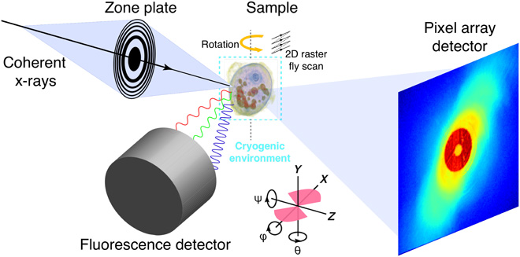

## Ptychographic Reconstruction Part

In the traditional way, we use separate methods for ptychographic and fluorescence reconstruction. We consider a ptychography experiment where the observed data $d\_i$ is modeled as:

$$
d\_i = \vert\mathcal{F}(\mathbf{P}\_i \mathbf{z})\vert^2 + \epsilon\_i
$$

where:
- $\mathcal{F}$: 2D discrete Fourier transform operator
- $\mathbf{P}\_i$: Probe matrix
- $z\_i$: the object itself which can be written as $z = x + y\_i$

## Reconstruction Problem

The reconstruction loss function is formulated as the following:

$$
\min\_{\mathbf{P},\mathbf{z}} \Phi(\mathbf{P},\mathbf{z}) = \frac{1}{2} \sum\_{j=1}^{N} \Vert \vert \mathcal{F}(\mathbf{P}\_j \mathbf{z})\vert - \sqrt{d\_j} \Vert\_2^2
$$

## X-ray Fluorescence Reconstruction

X-ray fluorescence reconstruct the real part of the image $x$ using a deconvolution method:

$$
\min\_{\mathbf{w},\mathbf{P}} \sum\_{e=1}^{N\_e} \Vert \vert\mathbf{P}\vert^2 * \mathbf{w}\_e - D\_e \Vert\_2^2
$$

where $\mathbf{w}$ represents elemental concentration maps. $D\_e$ corresponds to the experimental flourescence map of element $e$.

## Separate Optimization Framework

Separate optimization of ptychographic and fluorescence reconstruction may lead to the results:

$$
\min\_{\mathbf{P},\mathbf{z}} \Phi(\mathbf{P},\mathbf{z}) + \min\_{\mathbf{w},\mathbf{P}} \sum\_{e=1}^{N\_e} \Vert \vert\mathbf{P}\vert^2 * \mathbf{w}\_e - D\_e \Vert\_2^2
$$

where $\alpha$ is a scaling parameter balancing between the two objectives.

## Joint Optimization Framework

We propose a simultaneous optimization approach:

$$
\min\_{\mathbf{w},\mathbf{P},\mathbf{z}} \sum\_{e=1}^{N\_e} \Vert \vert\mathbf{P}\vert^2 * \mathbf{w}\_e - D\_e \Vert\_2^2 + \alpha \sum\_{j=1}^{N} \Vert \vert \mathcal{F}(\mathbf{P}\_j (\sum\_e \mathbf{w}\_e + i \beta))\vert - \sqrt{d\_j} \Vert\_2^2
$$

By using joint method, the loss function is consistently less than the original loss function from the separate method.

## Absorption Coefficient Connection

The absorption coefficient relates to elemental concentrations via:

$$
\mathbf{z} = \delta + i \beta, \quad \delta = \sum\_e \mathbf{w}\_e \mu\_e
$$

## Conclusion

This joint framework aims to enhance both ptychographic and fluorescence data processing, leveraging their complementarity for improved reconstruction.

## Reference

[1] Deng, J., Vine, D.J., Chen, S. et al. X-ray ptychographic and fluorescence microscopy of frozen-hydrated cells using continuous scanning. Sci Rep 7, 445 (2017). https://doi.org/10.1038/s41598-017-00569-y
